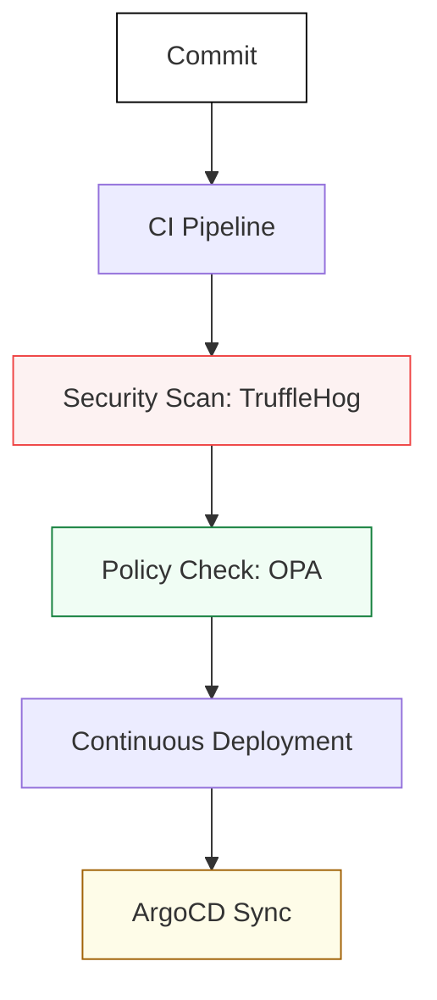

# 🚢 Delivery & Governance: The Guardrail Assembly Line

> **"Listen up, Junior. Speed is irrelevant if you're heading in the wrong direction. In this module, you learn to build the steering wheel (Governance) and the engine (CI/CD) of the production highway."**

---

## 🧠 The Mental Model: The Guardrail Assembly Line

**The Junior Struggle**: "I can just run `git push` and then `docker build` on the server. Why do I need a 10-stage pipeline with security scans and OPA policies?"

**The Senior Solution**: You realize that human error is the #1 cause of outages. An automated **Assembly Line** ensures that every piece of code is scrutinized before it touches production.
- **CI/CD**: The robotic arms that build and test the product.
- **Security Scans**: The X-ray machines that look for hidden flaws (Vulnerabilities/Secrets).
- **Governance (OPA)**: The legal department that ensures the product meets all regulations (Compliance).
- **GitOps**: The inventory manager that ensures what's on the shelf (Production) matches the catalog (Git).

---

## 🆚 Junior Way vs. Senior Way

| Feature | The Junior Way (Problematic) | The Senior Way (Architected) |
|:---|:---|:---|
| **Deployments** | Manual `kubectl apply` | **GitOps Reconciliation** (ArgoCD) |
| **Security** | "I'll scan it later" | **Shift-Left** (Automated scanning in pipeline) |
| **Secrets** | Hardcoded in YAML (Yikes!) | **External Secrets** / Vault Integration |
| **Compliance** | Checking boxes on a spreadsheet | **Policy-as-Code** (OPA/Gatekeeper) |
| **Tests** | "It built, so it's fine" | **Automated Integration & Smoke Tests** |

---

## 🏗️ Visual: The Production Highway

---

## 🗺️ Curriculum Path

### 1. [CI/CD Pipelines](./01-CI-CD-Pipelines/README.md)
*Junior, keep your hands off the production servers.* 
Master Jenkins, GitHub Actions, and artifact management. Build pipelines that fail fast and give clear feedback.

### 2. [GitOps Mastery](./02-GitOps-Mastery/README.md)
*Git is the only source of truth.* 
Deep dive into ArgoCD and Flux. Learn how to manage cluster state without ever running a direct command.

### 3. [Governance & Policy](./03-Governance-and-Policy/README.md)
*Automate your 'No'.* 
Implementing OPA Gatekeeper and Kyverno. Ensure no developer (including you, Junior) can deploy an unencrypted volume or a public LoadBalancer by mistake.

### 4. [Security Automation](./04-Security-Automation/README.md)
*Hackers don't wait for your 'Security Review'.* 
Container scanning, SBOM management, and automated vulnerability patching.

---

## 🏆 Real-World DevOps Story: The 3 AM Rollback

**The Scenario**: A Junior engineer accidentally pushed a config change that caused a 20% latency spike.
**The Crisis**: In the old manual world, they would have to find the faulty commit, revert it, and push again—taking 15 minutes while the site crawled. 
**With GitOps Standards**: The engineer just clicked "Rollback" in ArgoCD, and the system returned to the previous known-good state in **10 seconds**.
**The Lesson**: **Junior, the fastest way to fix a fire is to have a fire extinguisher already aimed at the door.**

---

## 🎤 Interview Preparation (Delivery & Governance)

1. **Q: Junior, what does 'Shift Left' mean?**
   - *A: It means moving tasks like security testing and quality checks earlier in the development lifecycle (to the 'left' of the timeline) to catch issues before they reach production.*

2. **Q: Explain the 'Source of Truth' in GitOps.**
   - *A: In GitOps, the Git repository is the ONLY source of truth. The actual state of the cluster is automatically reconciled to match the desired state defined in Git.*

3. **Q: What is the difference between Continuous Delivery and Continuous Deployment?**
   - *A: **Delivery** means code is always in a ready-to-deploy state (but may require a manual trigger). **Deployment** means every change that passes the tests is automatically pushed to production.*

4. **Q: Why use OPA (Open Policy Agent)?**
   - *A: It provides a unified, tool-agnostic way to write policies. You can use the same Rego language to govern Kubernetes, Terraform, or API gateways.*

5. **Q: What is a 'DAG' in a pipeline context?**
   - *A: Directed Acyclic Graph. it defines the dependencies between tasks (e.g., 'Don't Deploy until Test is Done').*

6. **Q: Explain 'Secret Scanning' and why it's critical.**
   - *A: It's the process of searching code for API keys or passwords before they are committed. Once a secret is in Git history, it is compromised forever.*

7. **Q: What is a 'Canary Deployment'?**
   - *A: Routing a small percentage of traffic (e.g., 5%) to the new version of an app to verify its health before rolling it out to 100% of users.*

8. **Q: What is an 'SBOM' (Software Bill of Materials)?**
   - *A: A complete list of every library and component used in your software, used to track security vulnerabilities in third-party code.*

9. **Q: How does ArgoCD handle 'Drift'?**
   - *A: It constantly compares the cluster state with the Git state. If it detects a manual change (Drift), it can either alert the team or automatically 'Sync' it back to the Git state.*

10. **Q: Junior, what is the risk of using 'Inline Scripts' in a pipeline?**
    - *A: They are hard to test, hard to version, and hard to reuse. Professional pipelines use modular, versioned actions or templates.*

---

## 📝 Knowledge Check

1. **Which tool is a standard for GitOps on Kubernetes?**
   - [x] ArgoCD.

2. **Where should security scans be performed in a modern workflow?**
   - [x] In the CI Pipeline (as early as possible).

3. **What does 'OPA' stand for?**
   - [x] Open Policy Agent.

4. **True/False: In GitOps, you should use `kubectl apply` for production changes.**
   - [x] **False**. (Changes should be made in Git).

5. **What is 'Rego'?**
   - [x] The policy language used by OPA.

6. **Which deployment strategy sends traffic to a small group of users first?**
   - [x] Canary.

7. **What is the purpose of a 'Docker Lint' stage?**
   - [x] To ensure Dockerfiles follow security and performance best practices.

8. **Which tool can scan Git history for leaked secrets?**
   - [x] TruffleHog.

9. **What is a 'State Reconciliation Loop'?**
   - [x] The process of constantly checking if actual state matches desired state.

10. **Why are 'Short-lived Tokens' better than permanent passwords?**
    - [x] If they are leaked, they expire quickly, limiting the window of attack.

---

## 🔗 Next Steps
Junior, the assembly line is secure. Now let's learn how to monitor it.
1. Proceed to: **[Part 3: Modern Operations](../03-Modern-Operations/README.md)** →
2. Return to: **[Phase 2 Hub](../README.md)** →
