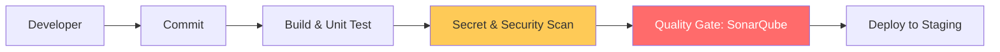

# CI/CD: Continuous Integration & Deployment

CI/CD is the heart of DevOps, bridging the gap between development and operations by automating the software delivery lifecycle. This module focuses on building resilient, automated pipelines that ensure code quality and security.

## 🏗️ Module Roadmap

| Stage | Topic | Objective |
| :--- | :--- | :--- |
| **01** | **[CI/CD Fundamentals](./01-CI-CD-Fundamentals/README.md)** | Core theory, Workflows, and Strategies. |
| **02** | **[Jenkins Mastery](./02-Jenkins-Mastery/README.md)** | Pipelines-as-Code, Shared Libraries, and Scaling. |
| **03** | **[Secret Scanning](./03-Secret-Scanning-TruffleHog/README.md)** | Preventing credential leaks with TruffleHog. |
| **04** | **[Code Quality](./04-Static-Code-Analysis-SonarQube/README.md)** | Static analysis and Quality Gates with SonarQube. |

---

## 🏗️ The "Shift-Left" Philosophy

Moving security and testing to the earliest possible stage in the development lifecycle.

---

## 📖 Real-Life Scenarios

### Scenario 1: The "API Key" Leak
**Problem**: A developer accidentally committed an AWS Secret Key to a public repository.
**Crisis**: Automated bots found the key in 30 seconds and launched $10,000 worth of Bitcoin miners.
**Solution**: Implemented **TruffleHog** as a pre-commit hook and in the CI pipeline.
**Result**: Credentials are now automatically blocked before they leave the developer's laptop.

### Scenario 2: The "Spaghetti code" Deployment
**Problem**: A critical bug made it to production because the developer skipped local unit tests.
**Action**: Implemented a mandatory **SonarQube Quality Gate**.
**Result**: The CI pipeline now automatically fails if code coverage is below 80% or if "Security Hotspots" are found.

---

## ❓ Interview Prep & Resources
- **[Interview Questions & Quizzes](./05-Interview-Questions-and-Quizzes/README.md)**
- **[Real-Life War Stories](./06-Real-Life-Scenarios/README.md)**

---
*Build it, test it, ship it. Automatically.*