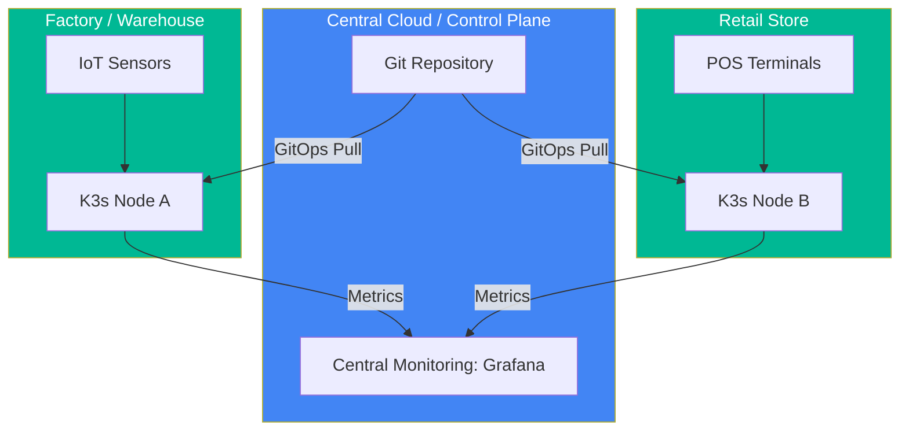

# 📡 Edge Computing with K3s (Intermediate)

> **"Kubernetes is heavy. K3s is the lightweight distribution for the frontier."**

## 📚 Overview

Edge computing brings computation and data storage closer to the location where it is needed, to improve response times and save bandwidth. K3s is a highly available, certified Kubernetes distribution designed for production workloads in unattended, resource-constrained, remote locations or inside IoT appliances.

## 🎯 Learning Objectives

- ✅ Understand the difference between **K8s (Heavy)** and **K3s (Light)**.
- ✅ Learn how to install K3s on a single node or small cluster.
- ✅ Manage resource constraints (RAM/CPU) for Edge workloads.
- ✅ Implement local-path provisioning for storage at the Edge.

## 🗺️ Module Structure

1. **[🟢 01-K3s-Installation](./01-K3s-Installation/)**
   - Single-node setup with `curl -sfL https://get.k3s.io | sh -`.
   - Managing `kubeconfig` and node tokens.
2. **[🟢 02-Resource-Constraints](./02-Resource-Constraints/)**
   - Disabling unnecessary features (Traefik, ServiceLB).
   - Tuning the K3s server for low-memory environments (< 512MB RAM).

---

## 🏗️ Visual: Edge-to-Cloud Architecture

## 📋 Professional Pattern: "Kube-Light"
When deploying to Edge, always strip out default addons you don't use. Use `--disable traefik` during K3s installation if you plan to use an Nginx ingress or if you don't need a load balancer at the edge.

---
**Next Step**: Start with [K3s Installation](./01-K3s-Installation/) 🚀
