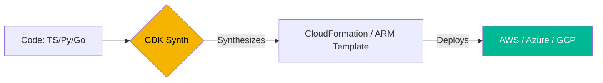

# ☁️ Serverless Infrastructure as Code (Intermediate)

> **"Write code, not configuration. Build infrastructure using the languages you already love."**

## 📚 Overview

Modern IaC follows two paths: **Declarative** (HCL/YAML like Terraform) and **Imperative/Construct-based** (TypeScript/Python like AWS CDK and Pulumi). This module focuses on using real programming languages to define and deploy cloud infrastructure.

## 🎯 Learning Objectives

- ✅ Master the **AWS CDK** Construct library.
- ✅ Understand the difference between **Synthesis** and **Deployment**.
- ✅ Deploy resources using **Pulumi** with Python.
- ✅ Implement Serverless patterns (Lambda + S3 + API Gateway) purely in code.

## 🗺️ Module Structure

1. **[🟢 01-AWS-CDK-Python](./01-AWS-CDK-Python/)**
   - Installing `aws-cdk`.
   - Creating stacks and nested constructs.
2. **[🟢 02-Pulumi-Foundations](./02-Pulumi-Foundations/)**
   - State management in Pulumi Cloud.
   - Resource mapping and secret encryption.

---

## 🏗️ Visual: The Synthesis Lifecycle



---

## 🛠️ Code: AWS CDK S3 Bucket (Python)

```python
from aws_cdk import (
    aws_s3 as s3,
    core
)

class MyServerlessStack(core.Stack):
    def __init__(self, scope: core.Construct, id: str, **kwargs) -> None:
        super().__init__(scope, id, **kwargs)

        # Create a private S3 bucket
        s3.Bucket(self, "MyFirstBucket",
            versioned=True,
            removal_policy=core.RemovalPolicy.DESTROY,
            auto_delete_objects=True
        )
```

## 📋 Professional Pattern: "Infrastructure as Software"
Treat your IaC like a regular software project. Use unit tests (e.g., `pytest` for CDK) to verify that your synthesized templates contain the expected security groups and tags before they ever reach the cloud.

---
**Next Step**: Start with [AWS CDK with Python](./01-AWS-CDK-Python/) 🚀
