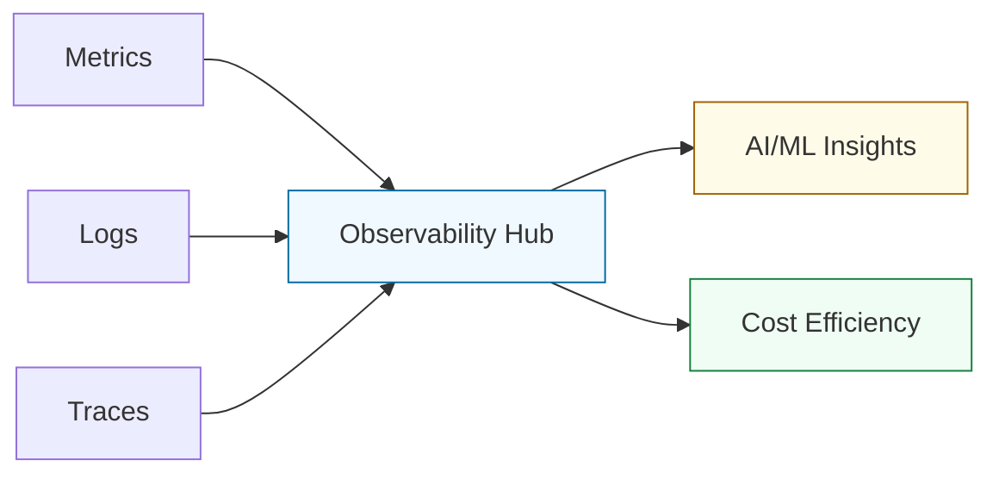

# 🧠 Part 3: Modern Operations

> **"Observability is not just about histograms and logs; it's about being able to answer questions you didn't know you had."**

## 📖 Overview

Part 3 represents the "Advanced" end of Phase 2. We explore the high-level paradigms of the modern SRE: observability at scale, leveraging AI for operations, managing the financial impact of cloud-native systems, and the cutting edge of Edge/Serverless computing.

## 🎓 Learning Objectives

- **The Three Pillars**: Master metrics, logging, and distributed tracing for microservices.
- **AIOps Integration**: Use LLMs to diagnose complex production failures and generate automation.
- **Unit Economics**: Treat cloud cost as a technical metric through FinOps.
- **Distributed Computing**: Deploy workloads on the Edge (K3s) and master Serverless IaC.

## 🔑 Key Modules

### 1. [Observability](./01-Observability/README.md)
Prometheus, Grafana, ELK/PLG stacks, and OpenTelemetry.

### 2. [AI Operations](./02-AI-Operations/README.md)
Prompt engineering for DevOps, LLM-driven incident response, and AI-assisted coding.

### 3. [FinOps & Cost Management](./03-FinOps-Cost-Management/README.md)
Cloud cost visibility, budgeting, and "Cost-as-Code" (Infracost).

### 4. [Edge & Serverless](./04-Edge-Computing/README.md) & [./05-Serverless-Architecture/README.md]
Lightweight Kubernetes (K3s) and modern event-driven serverless architectures.

---

## 🚀 Career Impact: From Engineer to Architect

Part 3 skills are what separate a "Cloud Engineer" from a "Solutions Architect." Being able to talk about **MTTR (Mean Time to Repair)** and **Cloud Unit Economics** is essential for leadership in the DevOps space.

---

## ❓ Knowledge Check

1. **What is the difference between Monitoring and Observability?**
   - Monitoring tells you *if* a system is working (Up/Down). Observability tells you *why* it's working that way (Internal state from externally visible data).

2. **How does AI help in a 'Prompt Engineering for DevOps' context?**
   - AI can synthesize millions of log lines to find the "needle in the haystack" or generate boilerplate Terraform code that would take a human hours to write.

---

## 🏁 Phase Complete
You have completed Phase 2. You are now ready for the final ascent into Distributed Systems and High Fidelity Orchestration.

Proceed to: **[Phase 3: High Fidelity Orchestration](../../03-Phase-3/README.md)** →
