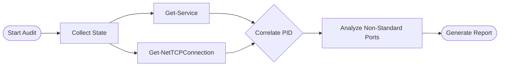

# Intermediate: Network & Service Profiling

> **Auditing the "Living" System: Services and Connections**

At this level, we move beyond static hardware to the dynamic state of the machine. An Auditor needs to know *what is running* and *who is talking to whom*. This module covers service profiling and network listener maps.

## 🎯 Learning Objectives

1.  Identify locally running services and correlate them with process IDs (PIDs).
2.  Map active network ports to the services that own them.
3.  Audit scheduled tasks for hidden persistency mechanisms.

## 🔄 The Audit Workflow

## 🛠️ Practical Exercises

### 1. Network Service Map
Run `Audit-NetworkServices.ps1` to see exactly which services are listening on your network interfaces.

### 2. Task Scheduler Inspector
Use `Get-TaskAudit.ps1` to dump a list of all non-Microsoft scheduled tasks, a common hiding spot for bloatware or persistence scripts.

---

**[⬅️ Back to Beginner Auditing](../../../../../1-Beginner/01-Phase-1/03-Windows-Basics/Auditing/README.md)** | **[Next Level: Advanced Security](../../../../../3-Advanced/03-Phase-3/08-Infrastructure-Security/Auditing/README.md)**
