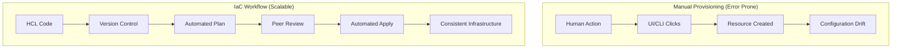

Infrastructure as Code is the management of infrastructure (networks, virtual machines, load balancers, and connection topology) in a descriptive model, using the same versioning as DevOps teams use for source code.

## Core IaC Principles

1.  **Idempotency**: Running the same code multiple times should result in the same state every time.
2.  **Immutability**: Instead of modifying existing infrastructure, tear it down and create new ones.
3.  **Declarative over Procedural**: Express *what* the result should be, not *how* to achieve it.
4.  **Version Control**: Software engineers treat infra code like application code.

## Benefits of IaC

- **Consistency**: Eliminate "it works on my machine" for infrastructure.
- **Speed**: Provision an entire environment in minutes.
- **Lower Cost**: Reduce manual labor and optimize resource usage.
- **Reduced Risk**: Automated testing and peer reviews.

## IaC vs Manual Workflow

---

## 🏗️ Real-Life Scenarios

### Scenario 1: The Snowflake Server
**Problem**: An engineer manually updated a production server's security group to allow a new port. Six months later, the server crashed and was rebuilt via a legacy script. The manual change was lost, causing a service outage.
**Solution**: By moving to IaC, all changes are versioned. If a server needs a new port, it's added to the Terraform code, reviewed, and applied. When the server is rebuilt, it inherits all the correct settings from the code.

### Scenario 2: The "Works on My Machine" Environment
**Problem**: A development team struggled with "environment disparity." A feature worked in Dev but failed in Production because the Prod Load Balancer had a different timeout setting that nobody remembered changing manually.
**Solution**: Use the **exact same code** to provision Dev, Staging, and Production. Variables are used for scaling (e.g., `t3.micro` in Dev vs `t3.large` in Prod), but the configuration logic is identical, eliminating hidden disparities.

### Scenario 3: The 2 AM Disaster Recovery
**Problem**: A regional cloud outage took down the entire infrastructure. The manual recovery plan was a 40-page PDF that would take 12 hours to execute.
**Solution**: With Terraform, the team simply pointed their code at a different region, updated the region variable, and ran `terraform apply`. The entire stack was restored in 15 minutes.

---

## ❓ Interview Questions

1.  **Explain the difference between Declarative and Procedural IaC.**
    - *Answer*: Declarative (Terraform) defines the end state, and the tool calculates the steps. Procedural (Ansible) defines the specific steps to be taken in order.
2.  **What is "Configuration Drift"?**
    - *Answer*: It's when the actual state of infrastructure deviates from the desired state defined in code, usually due to manual changes.
3.  **What is Idempotency in the context of IaC?**
    - *Answer*: Idempotency ensures that running the same operation multiple times results in the same outcome. If the infrastructure already matches the code, Terraform does nothing.
4.  **How does "Immutability" improve infrastructure reliability?**
    - *Answer*: Instead of patching or updating existing servers (which can fail or leave residue), immutable infrastructure replaces them entirely. This ensures a clean, predictable state every time.
5.  **What are the risks of manual infrastructure changes?**
    - *Answer*: Lack of audit trail, configuration drift, "snowflake" servers that are impossible to replicate, and difficulty in disaster recovery.
6.  **Can you use IaC for multi-cloud environments?**
    - *Answer*: Yes, tools like Terraform use "Providers" to interact with different APIs (AWS, Azure, GCP) using the same consistent HCL language.

---

## 🧠 Comprehensive Quiz (25 Questions)

<b>1. Which principle ensures a script produces the same result no matter how many times it's run?</b>

Show Answer

Answer: B** - Idempotency ensures the target state is reached regardless of the starting state.

<b>2. What is the primary characteristic of "Declarative" IaC?</b>

Show Answer

Answer: B** - Declarative tools like Terraform focus on the "What" rather than the "How."

<b>3. What is "Configuration Drift"?</b>

Show Answer

Answer: C** - Manual "hotfixes" are the leading cause of drift.

<b>4. True/False: Immutable infrastructure focuses on patching existing servers.</b>

Show Answer

Answer: B** - Immutability favors replacing resources rather than modifying them.

<b>5. Which of these is a benefit of Version Control for IaC?</b>

Show Answer

Answer: B** - Git history allows you to see who changed what and revert if needed.

<b>6. Why is IaC considered "Software Engineering for Infrastructure"?</b>

Show Answer

Answer: B

<b>7. "Snowflake Servers" are a result of:</b>

Show Answer

Answer: B** - Each snowflake is unique and impossible to recreate exactly.

<b>8. What happens if you run an idempotent script on a system that is already in the desired state?</b>

Show Answer

Answer: C

<b>9. Which tool is most famous for Declarative IaC?</b>

Show Answer

Answer: C

<b>10. What does "Single Source of Truth" refer to in IaC?</b>

Show Answer

Answer: B

<b>11. Peer review of IaC code helps prevent:</b>

Show Answer

Answer: A

<b>12. Disaster Recovery is faster with IaC because:</b>

Show Answer

Answer: B

<b>13. In the "IaC Workflow," what follows "Automated Plan"?</b>

Show Answer

Answer: B

<b>14. Multi-environment consistency means:</b>

Show Answer

Answer: B

<b>15. What is "Infrastructure Disposal" in immutability?</b>

Show Answer

Answer: B

<b>16. Which of these is NOT an IaC principle?</b>

Show Answer

Answer: B

<b>17. Auditability in IaC is achieved through:</b>

Show Answer

Answer: B

<b>18. "Day 0" operations typically refer to:</b>

Show Answer

Answer: B

<b>19. What is a "Snowflake" in technical terms?</b>

Show Answer

Answer: B

<b>20. Declarative code says:</b>

Show Answer

Answer: B

<b>21. Why is mutability considered "Bad" for scaling?</b>

Show Answer

Answer: C

<b>22. "Time to Market" is reduced by IaC through:</b>

Show Answer

Answer: B

<b>23. Which lifecycle stage follows "Peer Review"?</b>

Show Answer

Answer: B

<b>24. GitOps is a practice that uses:</b>

Show Answer

Answer: A

<b>25. Does IaC replace the cloud provider's UI?</b>

Show Answer

Answer: B

