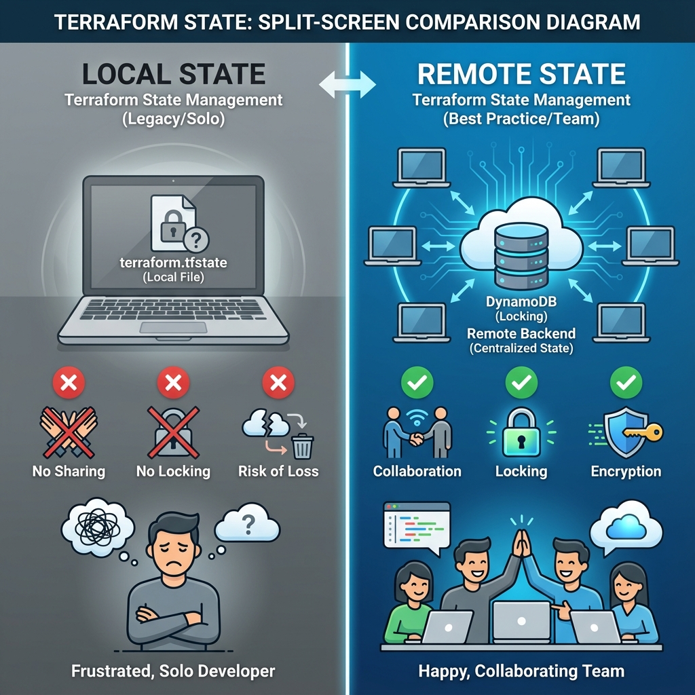

# Choosing Your Architecture
Deciding where to store your state file is a critical architectural decision. It defines how your team collaborates, how your data is secured, and how your infrastructure scales.
## � Architecture Comparison

### The Two Approaches

| Feature | **Local State** (Default) | **Remote State** (Best Practice) |
| :--- | :--- | :--- |
| **Storage Location** | Your local disk (`./terraform.tfstate`) | Cloud Storage (S3, Azure Blob, GCS, TFC) |
| **Collaboration** | ❌ Impossible (Manual file sharing required) | ✅ Seamless (Shared access) |
| **Locking** | ❌ None (Risk of race conditions) | ✅ Supported (DynamoDB, Blob Lease) |
| **Security** | ❌ Plain text on laptop (High risk) | ✅ Encrypted at Rest & In Transit |
| **History** | ❌ Dependent on local Git commits | ✅ Built-in Versioning (S3 Bucket Versioning) |
| **Use Case** | Learning, Testing, Solo Hobby Projects | **Production**, Teams, CI/CD Pipelines |

---
## 🛠️ Configuration Guide: Setting up S3 Backend
To enable remote state, you adds a <font color="#ffc000">backend</font> block to your <font color="#ffc000">terraform</font> configuration.
### 1. The Configuration (**<font color="#ffc000">backend.tf</font>**)
```hcl
terraform {
  backend "s3" {
    bucket         = "my-company-terraform-state" # Must be globally unique
    key            = "prod/app-name/terraform.tfstate" # Path inside the bucket
    region         = "us-east-1"
    
    # Locking Configuration
    dynamodb_table = "terraform-state-lock"
    
    # Security Configuration
    encrypt        = true
  }
}
```

### 2. The Migration Process
Transitioning from Local to Remote is a standard Terraform workflow:
1.  **Write the Code**: Add the `backend` block (as above) to your TF files.
2.  **Initialize**: Run `terraform init`.
3.  **Approve Migration**: Terraform will detect the change and ask:
    > *"Do you want to copy existing state to the new backend?"*
4.  **Confirm**: Type `yes`. Your local `terraform.tfstate` is uploaded to S3 and deleted locally.

---

## 🏗️ Real-Life Scenarios

### Scenario 1: The "Loner" Laptop Disaster
**Problem**: A startup's lead developer was the only person managing the cloud. They stored the state file locally on their MacBook Pro.
**Crisis**: The laptop was stolen at a coffee shop. 
**Outcome**: The company had no backup of the state file. When they tried to run Terraform from a new machine, Terraform didn't "know" about the 50+ existing production instances and tried to recreate them, leading to massive resource duplication and downtime.
**Solution**: Use **Remote State (S3)** from Day 1. Remote state persists independently of any individual developer's hardware.
**Result**: The team can now work from any machine, and a lost laptop is just a hardware replacement, not a production catastrophe.
### Scenario 2: The "Double-Apply" Corruption
**Problem**: Two engineers (Alice and Bob) were working on a critical database update using a shared network drive for local state storage.
**Crisis**: Alice ran `terraform apply`. Five seconds later, Bob (not knowing Alice had started) also ran `terraform apply`.
**Outcome**: Since "Local" state (even on a network drive) has no locking mechanism, both processes wrote to the file at the same time. The JSON became malformed and corrupted.
**Solution**: Implement **Remote State Locking** with DynamoDB.
**Result**: When Bob tried to run his apply, he received an error: `Error: Error acquiring the state lock`. The second process was blocked until Alice finished, preserving state integrity.

### Scenario 3: The "Credential Leak" Audit
**Problem**: An internal security audit found that the company was storing state files in a public S3 bucket without encryption.
**Crisis**: The auditor demonstrated they could download the state file and see the plain-text password for the production RDS instance.
**Outcome**: The company failed its SOC2 compliance audit.
**Solution**: Configured the **S3 Backend with `encrypt = true`** and strict IAM policies. 
**Result**: State is now encrypted at rest with KMS, and only the specific CI/CD IAM role has the "Get" permission. The company passed the follow-up audit.

---
## 🛡️ Best Practices
1.  **Enable Versioning**: Always enable S3 Bucket Versioning. If state gets corrupted, you can simply download a previous version from the S3 console.
2.  **Use Flexible Config**: Don't hardcode the `bucket` and `key` if you reuse code. Use `terraform init -backend-config=config.hcl` for dynamic environments.
3.  **Least Privilege**: The CI/CD runner should be the **only** entity with `s3:DeleteObject` (or even `s3:PutObject`) permissions on the state bucket. Developers should only have `read` access if possible.
4.  **State Isolation**: Use different Keys (paths) or even different Buckets for `dev`, `stage`, and `prod` to reduce blast radius.
---
## ❓ Interview Questions

1.  **What are the three main problems solved by Remote State?**
    <details>
    <summary>Answer</summary> 
    1. **Collaboration**: Multiple users can share a single source of truth.<br>
    2. **Locking**: Prevents two people from modifying state simultaneously.<br>
    3. **Security/Durability**: State is encrypted at rest and backed up (versioned) automatically in the cloud.
    </details>

2.  **How do you migrate from Local state to Remote state?**
    <details>
    <summary>Answer</summary> 
    1. Add a `backend` block to your Terraform configuration.<br>
    2. Run `terraform init`.<br>
    3. Terraform will detect the change and ask to migrate the existing state.<br>
    4. Type 'yes' to upload the local state to the remote backend.
    </details>

3.  **Explain the significance of 'terraform_remote_state' data source.**
    <details>
    <summary>Answer</summary> It allows one Terraform project to read the *outputs* of another project's state. This is essential for building "Tiered Infrastructure" (e.g., an App project reading the VPC ID from a separate Networking project).
    </details>

4.  **What happens if a backend doesn't support locking?**
    <details>
    <summary>Answer</summary> If the backend (like a raw HTTP backend without specific lock support) doesn't lock, multiple users could run `apply` simultaneously. This leads to race conditions where the state file can become corrupted or infrastructure can get into an inconsistent "Ghost" state.
    </details>

5.  **Can you use 'Variables' inside a `backend` configuration block?**
    <details>
    <summary>Answer</summary> No. The `backend` block is processed very early in the Terraform lifecycle, before variables are loaded. You must use hardcoded values, or use a "Backend Config File" (`-backend-config=path/to/file`) during `terraform init`.
    </details>

6.  **Why should you enable 'Versioning' on your S3 state bucket?**
    <details>
    <summary>Answer</summary> State management is high-risk. If a state file becomes corrupted or you make a mistake that deletes half your infrastructure from state, S3 Versioning allows you to instantly "roll back" the state file to a previous healthy version.
    </details>
---
## 🧠 Comprehensive Quiz (25 Questions)

<b>1. Where is local state stored by default?</b>
- A) In the `.terraform` directory
- B) In the file `terraform.tfstate` in the current directory
- C) In `/var/lib/terraform`
- D) In the user's home directory
<details>
<summary>Show Answer</summary>
Answer: B
</details>

<b>2. True/False: Local state supports automatic concurrency locking.</b>
- A) True (using OS file locks)
- B) False (no native locking mechanism)
- C) True (but only on Linux)
- D) False (unless you use a wrapper script)
<details>
<summary>Show Answer</summary>
Answer: B
</details>

<b>3. Which command is used to transition from local to remote state?</b>
- A) terraform migrate
- B) terraform init
- C) terraform apply
- D) terraform state push
<details>
<summary>Show Answer</summary>
Answer: B
</details>

<b>4. Remote state allows teams to share a single _____ of Truth.</b>
- A) Database
- B) Source
- C) File
- D) Version
<details>
<summary>Show Answer</summary>
Answer: B
</details>

<b>5. Which AWS service works with S3 to provide state locking?</b>
- A) RDS
- B) DynamoDB
- C) Lambda
- D) SQS
<details>
<summary>Show Answer</summary>
Answer: B
</details>

<b>6. 'terraform_remote_state' is used to:</b>
- A) Copy state files
- B) Read outputs from another state file
- C) Delete remote state
- D) Encrypt state files
<details>
<summary>Show Answer</summary>
Answer: B
</details>

<b>7. True/False: You can use HCL variables (var.name) inside a backend block.</b>
- A) False (Backend initialization happens before variable loading)
- B) True (Variables are fully supported)
- C) True (But only for strings)
- D) False (Unless you use Terraform Cloud)
<details>
<summary>Show Answer</summary>
Answer: A
</details>

<b>8. Which backend is managed by HashiCorp and provides a GUI?</b>
- A) S3
- B) Terraform Cloud (TFC) / Terraform Enterprise
- C) Azure Blob Storage
- D) Consul
<details>
<summary>Show Answer</summary>
Answer: B
</details>

<b>9. In an S3 backend, the 'key' attribute defines:</b>
- A) The encryption key
- B) The file path/name of the state file within the bucket
- C) The AWS Access Key
- D) The locking table name
<details>
<summary>Show Answer</summary>
Answer: B
</details>

<b>10. What is the biggest danger of storing state on a local laptop?</b>
- A) It uses too much disk space
- B) Loss of data (Hardware failure/Theft) and lack of collaboration
- C) It is slower than S3
- D) It requires internet access
<details>
<summary>Show Answer</summary>
Answer: B
</details>

<b>11. Which attribute ensures state is encrypted in S3?</b>
- A) secure = true
- B) encrypt = true
- C) kms = enabled
- D) lock = true
<details>
<summary>Show Answer</summary>
Answer: B
</details>

<b>12. True/False: You can use Git as a Terraform backend.</b>
- A) False (Git is for code, not locking state storage)
- B) True (It is a supported backend type)
- C) False (But you can use GitHub Actions)
- D) True (But only for small projects)
<details>
<summary>Show Answer</summary>
Answer: A (While you *can* commit state to git, it is NOT a backend and is strongly discouraged due to security/locking issues)
</details>

<b>13. Which command allows you to provide backend config via an external file?</b>
- A) terraform init -backend-config=...
- B) terraform apply -var-file=...
- C) terraform config -load...
- D) terraform init -config=...
<details>
<summary>Show Answer</summary>
Answer: A
</details>

<b>14. If two people run 'apply' on S3 without DynamoDB, what might happen?</b>
- A) The second one is queued
- B) Race condition/State corruption
- C) Terraform merges the changes automatically
- D) S3 rejects the second write
<details>
<summary>Show Answer</summary>
Answer: B
</details>

<b>15. 'Partial Configuration' in backends means:</b>
- A) Only initializing half the providers
- B) Omitting credentials or specific details from the .tf file and providing them at init time
- C) Using half a state file
- D) Configuring only read access
<details>
<summary>Show Answer</summary>
Answer: B
</details>

<b>16. True/False: Terraform Cloud supports state locking natively.</b>
- A) True
- B) False
- C) True (But costs extra)
- D) False (Requires DynamoDB)
<details>
<summary>Show Answer</summary>
Answer: A
</details>

<b>17. Which resource type does 'terraform_remote_state' belong to?</b>
- A) Resource
- B) Data Source
- C) Provider
- D) Module
<details>
<summary>Show Answer</summary>
Answer: B
</details>

<b>18. Why should state storage be kept separate from application code repos?</b>
- A) To save space
- B) Security (Secrets in state) and Logical Separation (Infrastructure vs App Code)
- C) It is faster
- D) Backends don't support git
<details>
<summary>Show Answer</summary>
Answer: B
</details>

<b>19. 'State Migration' moves state from _____ to _____.</b>
- A) One project to another
- B) One backend to another (e.g., Local to S3)
- C) One region to another
- D) Code to Cloud
<details>
<summary>Show Answer</summary>
Answer: B
</details>

<b>20. True/False: S3 backends support 'Workspaces'.</b>
- A) True (By creating different state files per workspace)
- B) False
- C) True (But only one workspace)
- D) False (Workspaces are TFC only)
<details>
<summary>Show Answer</summary>
Answer: A
</details>

<b>21. A 'Bucket Policy' should be used to:</b>
- A) Configure locking
- B) Restrict who can access/delete the state file
- C) Enable versioning
- D) Set the state file name
<details>
<summary>Show Answer</summary>
Answer: B
</details>

<b>22. 'Standard S3 Backend' requires which two components for full safety?</b>
- A) S3 Bucket + EC2
- B) S3 Bucket (Storage) + DynamoDB Table (Locking)
- C) S3 Bucket + EBS Volume
- D) S3 Bucket + IAM User
<details>
<summary>Show Answer</summary>
Answer: B
</details>

<b>23. Which command verifies if the current backend is healthy?</b>
- A) terraform init
- B) terraform validate
- C) terraform check
- D) terraform backend
<details>
<summary>Show Answer</summary>
Answer: A
</details>

<b>24. Remote state is the '_____ of Collaboration' for teams.</b>
- A) Backbone
- B) Enemy
- C) Barrier
- D) Cost
<details>
<summary>Show Answer</summary>
Answer: A
</details>

<b>25. Without remote state, professional DevOps is _____ .</b>
- A) Easy
- B) Dangerous and Unscalable
- C) Recommended
- D) Faster
<details>
<summary>Show Answer</summary>
Answer: B
</details>
