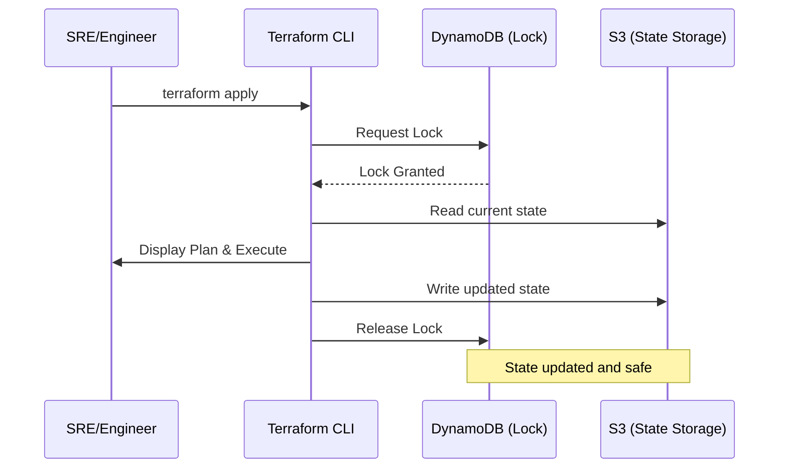

# Remote State Backends: Cloud Storage & Locking

A backend defines where Terraform stores its state file and how it performs operations. Choosing and configuring the right backend is the foundation of a production-grade infrastructure team.

---

## 🛠️ Architecture Visualization (S3 + DynamoDB)

For AWS, state storage and locking are handled by two different services to ensure high availability and data integrity.

---

## 🏗️ Real-Life Scenarios

### Scenario 1: The "Manual Bucket Removal" Disaster

**Problem**: An over-eager engineer cleaned up what they thought was an "unused" S3 bucket named `tf-state-123`.
**Crisis**: This bucket actually contained the state file for the company's entire production network.
**Outcome**: Terraform could no longer plan or apply. The link between code and reality was destroyed.
**Solution**: Enable **S3 Object Versioning** and **MFA Delete**. These features ensure that even if a file is deleted, it can be recovered instantly from the S3 console.
**Result**: The team recovered the state file in 10 minutes from the S3 version history, avoiding a manual "import-everything" nightmare.

### Scenario 2: The "Cross-Cloud" Reliability Hit

**Problem**: A company with a "Multi-Cloud" strategy used an AWS S3 backend for their Azure infrastructure.
**Crisis**: AWS had a regional outage in `us-east-1` (where the bucket lived). 
**Outcome**: Even though Azure was 100% fine, the team could NOT scale or update their Azure clusters because Terraform couldn't read the state from AWS.
**Solution**: Store state in the **Same Cloud** as the resources (use `azurerm` backend for Azure, `gcs` for Google, etc.) to minimize cross-provider failure dependencies.
**Result**: The team migrated to Azure Blob storage for state, ensuring their management layer shared the same fate as their infrastructure.

### Scenario 3: The "Dynamic Workspace" Scaling Issue

**Problem**: A company was managing 100 identical customer environments. They tried to hardcode 100 different backend blocks.
**Crisis**: The HCL became unmaintainable, and developers frequently made copy-paste errors, creating resources in the wrong customer's account.
**Outcome**: Data leak risk and high operational overhead.
**Solution**: Use **Partial Configuration**. Define one generic backend block with an empty `bucket` and `key`, and pass the customer-specific info during `terraform init -backend-config="customer-pro.tfvars"`.
**Result**: One clean code base now supports 100+ customers with 100% isolation.

---

## ❓ Interview Questions

1.  **Why can't you use 'Variables' or 'Locals' inside a `backend` block?**
    - *Answer*: Terraform needs to initialize the backend *before* it can load variables or evaluate locals (chicken-and-egg problem). To solve this, you use "Partial Configuration" by passing settings via the CLI during `terraform init`.
2.  **Explain the difference between 'Standard' backends and 'Enhanced' backends.**
    - *Answer*: **Standard** backends (like S3, GCS, AzureRM) only store state. Tasks like `plan` and `apply` run on your local machine. **Enhanced** backends (like Terraform Cloud) store state AND can execute the Terraform logic on their own remote infrastructure.
3.  **What is the 'DynamoDB Lock' schema?**
    - *Answer*: When using S3, you must use a DynamoDB table with a Partition Key named `LockID` (string). This specific schema allows Terraform to write a unique ID representing the currently running process to the table.
4.  **How do you handle a 'Stuck Lock' where the process died but the lock remains?**
    - *Answer*: You should first verify that no one is actually running Terraform. Then use `terraform force-unlock <LOCK_ID>`. You can find the Lock ID in the error message when you try to run a plan.
5.  **Explain 'State Storage' vs. 'Local Backend' from a security perspective.**
    - *Answer*: Local state is stored on disk and is often unencrypted and available to anyone with OS access. Remote backends support encryption-at-rest (AES-256) and granular IAM access controls, ensuring only specific users or CI/CD roles can even "see" the file.
6.  **What happens if you run `terraform init` twice with different backend configs?**
    - *Answer*: Terraform will detect the conflict and ask if you want to **reconfigure** (create a new state) or **migrate** (copy the existing state to the new location). Using the `-reconfigure` flag will ignore the migration prompt and just start fresh.

---

## 🧠 Comprehensive Quiz (25 Questions)

<b>1. Which AWS service is the primary storage for 'Standard' backends?</b>

Show Answer

Answer: B

<b>2. True/False: S3 backends support state locking natively without extra services.</b>

Show Answer

Answer: A

<b>3. The standard partition key name for a DynamoDB lock table is:</b>

Show Answer

Answer: B

<b>4. Which Azure service is used for the 'azurerm' backend?</b>

Show Answer

Answer: B

<b>5. 'GCS' stands for:</b>

Show Answer

Answer: B

<b>6. To provide backend settings via the command line, you use:</b>

Show Answer

Answer: B

<b>7. True/False: If a backend is 'Enhanced', it can run 'apply' on a remote server.</b>

Show Answer

Answer: A

<b>8. Which attribute in an S3 backend enforces server-side encryption?</b>

Show Answer

Answer: B

<b>9. What command updates your local environment to use a new backend?</b>

Show Answer

Answer: B

<b>10. 'Partial Configuration' allows you to avoid:</b>

Show Answer

Answer: B

<b>11. Which backend type is used by default if no block is specified?</b>

Show Answer

Answer: B

<b>12. Azure and GCS backends support locking _____ .</b>

Show Answer

Answer: B

<b>13. A 'Lock ID' is found in which location during a failure?</b>

Show Answer

Answer: A

<b>14. True/False: You can use AWS as a backend for managing Google Cloud resources.</b>

Show Answer

Answer: A

<b>15. Which character is used to escape values in -backend-config if they contain spaces?</b>

Show Answer

Answer: B

<b>16. 'MFA Delete' on S3 helps prevent:</b>

Show Answer

Answer: A

<b>17. What is the 'Prefix' attribute in a GCS backend?</b>

Show Answer

Answer: B

<b>18. True/False: terraform init will automatically create the S3 bucket if it's missing.</b>

Show Answer

Answer: A

<b>19. Which command allows switching to a new backend without migrating the old state?</b>

Show Answer

Answer: A

<b>20. 'State Versioning' should be enabled on:</b>

Show Answer

Answer: B

<b>21. terraform force-unlock should be used as a _____ .</b>

Show Answer

Answer: B

<b>22. Which backend is most suitable for a one-person project?</b>

Show Answer

Answer: B

<b>23. 'HTTPS' is used for state transfers to ensure encryption in _____ .</b>

Show Answer

Answer: B

<b>24. A well-organized backend is the '_____ Gate' for team safety.</b>

Show Answer

Answer: C

<b>25. Without a backend, teams will _____ each other's work.</b>

Show Answer

Answer: B

