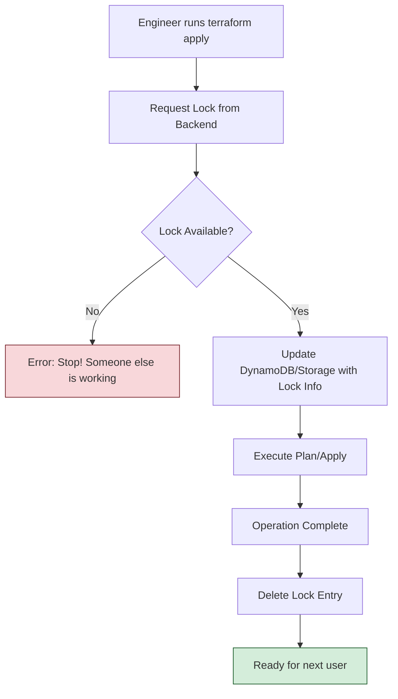

# State Locking: Protecting Concurrency

State locking is the fundamental safety mechanism that prevents two engineers (or two CI/CD pipelines) from modifying the same infrastructure at the same time. Without it, your state file would inevitably become corrupted, leading to phantom resources and broken deployments.

---

## 🏗️ State Locking Lifecycle

---

## 🏗️ Real-Life Scenarios

### Scenario 1: The "Kill -9" Ghost Lock
**Problem**: An engineer was running a 30-minute infrastructure overhaul on their local machine. Mid-way through, their laptop battery died, and the computer shut down abruptly.
**Crisis**: When the engineer rebooted and tried to continue, they received: `Error: Error acquiring the state lock`. 
**Outcome**: No one in the company could run any Terraform commands for that project because the "Lock" was still present in DynamoDB, but the process that owned it was dead.
**Solution**: Verify the PID/User in the lock info, confirm the process is gone, and run `terraform force-unlock <ID>`.
**Result**: The project was unlocked in 2 minutes, and work resumed safely.

### Scenario 2: The "Concurrent Pipeline" Clash
**Problem**: A Jenkins server was misconfigured to trigger a deployment every time a developer pushed a branch, regardless of whether a deployment was already in progress.
**Crisis**: Two developers pushed code within 10 seconds of each other. 
**Outcome**: Job A grabbed the lock and proceeded. Job B failed immediately with a locking error.
**Solution**: This is **Working As Intended**. Locking prevented Job B from interfering with Job A's partially-created resources, which could have led to duplicate database instances or overlapping network CIDRs.
**Result**: The team realized locking saved them from a major outage and updated Jenkins to "throttle" concurrent jobs for the same environment instead.

### Scenario 3: The "Local Backend" Team Attempt
**Problem**: A small team of 3 developers shared a network drive (SMB) to store their `terraform.tfstate`. 
**Crisis**: They didn't realize the `local` backend doesn't support distributed locking. Two developers ran `apply` simultaneously.
**Outcome**: The SMB drive's file locking was insufficient. The state file was written by both, resulting in a malformed JSON file that Terraform could no longer read ("Error loading state").
**Solution**: Migrated to the **S3 + DynamoDB** backend immediately.
**Result**: The team gained a real locking mechanism and automatic state versioning, preventing future data loss.

---

## ❓ Interview Questions

1.  **What specifically happens in DynamoDB when Terraform acquires a lock?**
    - *Answer*: Terraform creates a new item in the DynamoDB table with a Partition Key named `LockID`. The value of this item contains a JSON string with the ID of the operation, the user's name, the start time, and the Terraform version.
2.  **Why is `terraform force-unlock` considered a 'Dangerous' command?**
    - *Answer*: If you use it while someone else *actually* is running an apply, you will remove their protection. Terraform might then allow a second process to start, resulting in two processes writing to the same state file, leading to corruption or infrastructure duplication.
3.  **DoesEvery backend support locking? Give examples.**
    - *Answer*: No. The `local` backend has very limited locking, and many older backends (like `artifactory` or simple `http`) may not support it. `S3` (via DynamoDB), `AzureRM`, `GCS`, and `Terraform Cloud` are the gold standards for locking support.
4.  **What information is stored inside a 'Lock Item'?**
    - *Answer*: 1. **ID**: The unique transaction ID. 2. **Who**: The user/machine running the command. 3. **Operation**: Whether it's a Plan or Apply. 4. **Created**: Timestamp for when the lock started. 5. **Version**: The Terraform version being used.
5.  **How do you find the ID needed for `force-unlock`?**
    - *Answer*: It is prominently displayed in the error message output when a lock acquisition fails. For example: `ID: d9d0628e-xxxx-xxxx`.
6.  **Can you disable locking? If so, why would you (rarely) ever do that?**
    - *Answer*: Yes, using the `-lock=false` flag. You might only do this in a "Break Glass" scenario where the locking backend (DynamoDB) itself is down and you have 100% certainty that no one else is using the state, or for read-only operations where you don't mind the risk.

---

## 🧠 Comprehensive Quiz (25 Questions)

<b>1. What is the primary purpose of state locking?</b>

Show Answer

Answer: B

<b>2. True/False: By default, 'local' state on different machines supports locking.</b>

Show Answer

Answer: A

<b>3. Which command is used to clear a 'Stale' lock manually?</b>

Show Answer

Answer: B

<b>4. When using S3, which service provides the locking capability?</b>

Show Answer

Answer: B

<b>5. What is the Partition Key name required for the Lock table?</b>

Show Answer

Answer: A

<b>6. Which flag disables state locking entirely for a single run?</b>

Show Answer

Answer: B

<b>7. True/False: Terraform Cloud supports locking natively.</b>

Show Answer

Answer: A

<b>8. If you get a 'Lock Error', the output will show 'Who' has the lock.</b>

Show Answer

Answer: A

<b>9. What happens if Terraform has a network timeout while trying to acquire a lock?</b>

Show Answer

Answer: B

<b>10. 'force-unlock' requires which identifier from the user?</b>

Show Answer

Answer: B

<b>11. Which data type is the 'LockID' key in DynamoDB?</b>

Show Answer

Answer: B

<b>12. True/False: You should use 'force-unlock' every time you see a locking error.</b>

Show Answer

Answer: A

<b>13. A 'Stale Lock' occurs when:</b>

Show Answer

Answer: B

<b>14. Which backend does NOT require any extra configuration for locking?</b>

Show Answer

Answer: B

<b>15. 'Locking' ensures that the state file is always _____ .</b>

Show Answer

Answer: B

<b>16. True/False: You can use a Lock table that doesn't have the key 'LockID'.</b>

Show Answer

Answer: A

<b>17. What is the 'Created' field in the lock info used for?</b>

Show Answer

Answer: A

<b>18. Which command is used to verify who has a current lock without trying to run a plan?</b>

Show Answer

Answer: A

<b>19. 'Lease Blob' is the locking mechanism for which cloud?</b>

Show Answer

Answer: B

<b>20. True/False: Disabling locks can lead to resource duplication.</b>

Show Answer

Answer: A

<b>21. 'Concurrency' refers to:</b>

Show Answer

Answer: A

<b>22. Which HTTP status code might indicate a lock is held by another user in a custom backend?</b>

Show Answer

Answer: B

<b>23. 'force-unlock' is essentially which operation in DynamoDB?</b>

Show Answer

Answer: B

<b>24. State locking is the '_____ Guard' for your data.</b>

Show Answer

Answer: B

<b>25. Reliable automation requires _____ locking.</b>

Show Answer

Answer: B

