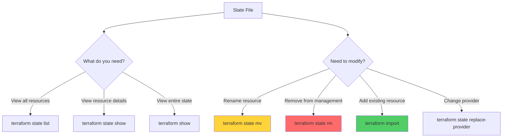

# State Operations: Mastering the CLI

Mastering the CLI commands used to inspect and manipulate your state file is essential for effective infrastructure management. These commands allow you to refactor code, import legacy resources, and recover from management errors without affecting the actual cloud infrastructure.

---

## 🏗️ State Operations Workflow

---

## 🏗️ Real-Life Scenarios

### Scenario 1: The "Rename-Destroy" Panic
**Problem**: An engineer renamed a core database resource in the HCL from `resource "aws_db_instance" "master"` to `resource "aws_db_instance" "production"`. 
**Crisis**: When they ran `terraform plan`, Terraform announced it would **DESTROY** the old database and **CREATE** a new one, causing 4 hours of downtime and data loss.
**Solution**: Use `terraform state mv`. By running `terraform state mv aws_db_instance.master aws_db_instance.production`, Terraform simply renames the record in its "Memory" (the state file).
**Result**: The next `terraform plan` showed "No changes," and the production database remained untouched.

### Scenario 2: The "Shadow IT" Adoption
**Problem**: A rogue team created 10 EC2 instances and 5 S3 buckets manually via the Amazon Console. Management now wants them brought under strict Terraform control.
**Crisis**: Writing the HCL code from scratch and running `apply` would fail because the resources already exist in AWS.
**Solution**: Use **Declarative Import (Terraform 1.5+)**. The team wrote an `import {}` block for each resource and used `terraform plan -generate-config-out=generated.tf`.
**Result**: Terraform automatically generated the HCL code and adopted the resources into the state file in a single, safe operation.

### Scenario 3: The "Split-Brain" State Migration
**Problem**: A monolithic Terraform project became too slow and risky (High Blast Radius). The team decided to move the "Network" resources to a separate state file.
**Crisis**: They needed to remove resources from the "App" state without actually deleting the VPCs in AWS.
**Outcome**: Using `terraform destroy` was impossible.
**Solution**: Use `terraform state rm`. They ran `terraform state rm module.vpc` in the old project, then used `terraform import` in the new "Network" project.
**Result**: The resources were successfully "moved" between state files with zero downtime.

---

## ❓ Interview Questions

1.  **What is the difference between `terraform state rm` and `terraform destroy`?**
    - *Answer*: `terraform state rm` only removes the resource from the state file (management); the resource continues to exist in the cloud. `terraform destroy` deletes the resource from the cloud entirely.
2.  **When would you use `terraform state mv`?**
    - *Answer*: When you rename a resource in your HCL code or move it into/out of a module. It ensures that Terraform maps the existing cloud resource to the new code address instead of trying to delete and recreate it.
3.  **How do you fix a 'Malformed' or 'Corrupted' state file?**
    - *Answer*: 1. Stop all operations. 2. Use `terraform state pull > backup.json`. 3. Attempt to fix the JSON manually (or restore a versioned backup from S3). 4. Use `terraform state push` to upload the corrected file.
4.  **How does 'Declarative Import' (Terraform 1.5+) differ from the old CLI import?**
    - *Answer*: The old CLI import was an imperitave command that required you to write HCL first. The new `import` block is part of your code, which allows for `-generate-config-out`. This makes the import process version-controlled and allows Terraform to write most of the HCL for you.
5.  **You want to see the specific IP address of an instance stored in state. Which command do you use?**
    - *Answer*: `terraform state show <resource_address>`. This displays every attribute Terraform currently knows about that specific resource.
6.  **Explain the danger of `terraform state push`.**
    - *Answer*: It is an overwrite operation. If you push an incorrect or older version of the state file over the current one, you might lose track of newly created resources or cause Terraform to attempt to delete real infrastructure during the next run.

---

## 🧠 Comprehensive Quiz (25 Questions)

<b>1. Which command lists all resource addresses tracked in the state?</b>

Show Answer

Answer: B

<b>2. True/False: 'terraform state rm' triggers an API call to delete cloud resources.</b>

Show Answer

Answer: A

<b>3. Which command is used to rename a resource in the state file?</b>

Show Answer

Answer: B

<b>4. To adopt an existing AWS S3 bucket into Terraform, you use:</b>

Show Answer

Answer: B

<b>5. Which flag generates HCL code from an import block (v1.5+)?</b>

Show Answer

Answer: B

<b>6. 'terraform show' displays:</b>

Show Answer

Answer: B

<b>7. True/False: 'terraform state rm' is a safe way to 'forget' a resource.</b>

Show Answer

Answer: A

<b>8. Which command downloads remote state to your terminal?</b>

Show Answer

Answer: B

<b>9. Why do you use 'quotes' in `terraform state rm 'module.vpc[0]'`?</b>

Show Answer

Answer: B

<b>10. What happens if you run 'mv' without updating your HCL code?</b>

Show Answer

Answer: B

<b>11. Which command shows attributes like 'private_ip' for a single resource?</b>

Show Answer

Answer: B

<b>12. True/False: 'terraform import' modifies your .tf files automatically (v1.4 and below).</b>

Show Answer

Answer: A

<b>13. 'state push' should be preceded by:</b>

Show Answer

Answer: B

<b>14. Which command helps migrate from one provider to another?</b>

Show Answer

Answer: B

<b>15. 'State Operations' are performed at which 'Danger Level'?</b>

Show Answer

Answer: B

<b>16. True/False: You can use regex in 'terraform state list'.</b>

Show Answer

Answer: A

<b>17. What is the 'id' in a `terraform import` command?</b>

Show Answer

Answer: B

<b>18. 'terraform state mv' across different modules is:</b>

Show Answer

Answer: B

<b>19. Which command is used to verify that no drift exists?</b>

Show Answer

Answer: B

<b>20. True/False: 'terraform state rm' can remove several resources at once using wildcards.</b>

Show Answer

Answer: A

<b>21. If you import a resource, you must eventually add its _____ to your code.</b>

Show Answer

Answer: B

<b>22. Which command shows what Terraform intends to do without actually doing it?</b>

Show Answer

Answer: B

<b>23. 'JSON' is the format used when doing a:</b>

Show Answer

Answer: B

<b>24. The CLI is your '_____ Tool' for state management.</b>

Show Answer

Answer: B

<b>25. Refactoring is safe only if you master _____ .</b>

Show Answer

Answer: B

