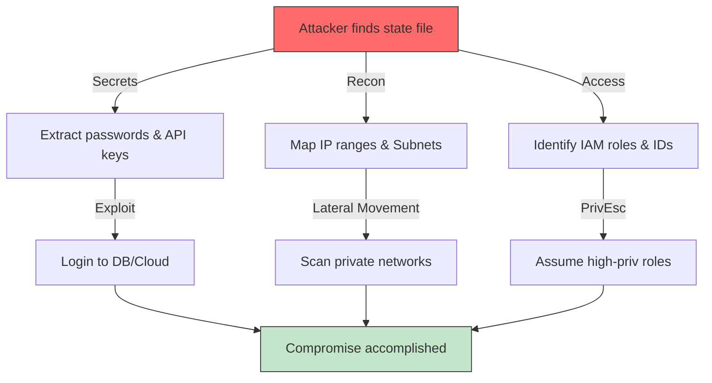

# State Security: Protecting the Source of Truth

The Terraform state file is arguably the most sensitive file in your entire infrastructure codebase. It acts as the source of truth for your resources but effectively stores a "plaintext" representation of your environment, often including secrets, keys, and metadata that attackers crave.

---

## 🛡️ The Threat Model: Attack Workflow

Attackers target state files because they are high-value targets containing everything needed to compromise a cloud environment.

---

## 🏗️ Real-Life Scenarios

### Scenario 1: The "Git-Committed" Disaster
**Problem**: A junior engineer accidentally committed `terraform.tfstate` to a public GitHub repo.
**Crisis**: The state contained a root database password and an AWS IAM Access Key. 
**Outcome**: Within 10 minutes, a bot discovered the key, logged in, and started mining Bitcoin, costing the company $30,000 in one hour.
**Solution**: Rotate credentials immediately! Use **Remote Backends** and a strict `.gitignore`. Run tools like `trufflehog` to scan Git history for leaks.
**Result**: The company implemented an "Air-Gapped" CI/CD pipeline where local state files are never created.

### Scenario 2: The "Shadow IT" Reconnaissance 
**Problem**: An attacker breached a developer's machine and found a local state file for a "Legacy" project.
**Crisis**: Even though the credentials were old, the state file contained a full list of all private IP addresses and subnets in the production VPC.
**Outcome**: The attacker used this "Map" to bypass discovery phases and directly target the most sensitive internal servers via a VPN bridge.
**Solution**: Use **Encryption at Rest (KMS)**. Even if the state file is downloaded, it remains encrypted and useless without access to the KMS key.
**Result**: The team moved all legacy states to an encrypted S3 bucket with least-privilege IAM policies.

### Scenario 3: The "Accidental Public" Bucket
**Problem**: An S3 bucket used for Terraform state was misconfigured with "Public Read" access during a migration.
**Crisis**: A security researcher found the bucket and demonstrated they could read the AWS configuration of the entire company.
**Outcome**: A major PR crisis and a failed compliance audit.
**Solution**: Enable **S3 Block Public Access** at the account level and use **Bucket Policies** to deny any requests that don't originate from a specific IAM Role or VPC Endpoint.
**Result**: The company passed its SOC2 audit by proving that state access is physically impossible from the public internet.

---

## ❓ Interview Questions

1.  **If I mark an output as 'sensitive', is it encrypted in the state file?**
    - *Answer*: No. `sensitive = true` only hides the value from the terminal output during a plan or apply. In the `terraform.tfstate` JSON file, the value is stored in plain text.
2.  **Explain the 'Least Privilege' concept for a Terraform backend.**
    - *Answer*: The IAM Role running Terraform should have `List/Get/Put` permissions *only* for its specific state bucket and `Encrypt/Decrypt` for its specific KMS key. It should NOT have permissions to manage the bucket itself or other projects' states.
3.  **Why should you use SSE-KMS instead of SSE-S3 for state files?**
    - *Answer*: SSE-KMS allows for Customer Managed Keys (CMKs). This provides a separate audit trail in CloudTrail (you can see exactly who decrypted the state) and lets you revoke access to the key independently of the file access.
4.  **What is 'Man-in-the-middle' (MITM) in state management?**
    - *Answer*: This occurs when state data is intercepted while being sent to the remote backend. To prevent this, always enforce TLS (HTTPS) via S3 bucket policies or transport-layer security in your CI/CD runners.
5.  **How do you handle 'Secrets' properly so they never enter the state file?**
    - *Answer*: Use **Dynamic Secrets**. Instead of passing a password as a variable, have Terraform create a resource (like an RDS instance) and store its password in **AWS Secrets Manager**. Terraform only stores the ARN (pointer) in the state, while the actual secret remains in the secure vault.
6.  **Can an attacker use a state file for 'Lateral Movement'?**
    - *Answer*: Yes. State files contain detailed information about the internal network (VPC IDs, Subnet CIDRs, Security Group rules). An attacker can use this "Map" to identify targets and vulnerable entry points without triggering traditional network discovery alarms.

---

## 🧠 Comprehensive Quiz (25 Questions)

<b>1. Where are 'sensitive' values stored in a local state file?</b>

Show Answer

Answer: B

<b>2. True/False: 'terraform.tfstate' should always be in your .gitignore.</b>

Show Answer

Answer: A

<b>3. Which AWS service is best for encrypting state files with a custom key?</b>

Show Answer

Answer: B

<b>4. 'Least Privilege' means an IAM user only has permissions to:</b>

Show Answer

Answer: B

<b>5. Which tool can be used to scan for secrets in Git history?</b>

Show Answer

Answer: B

<b>6. 'SSE-S3' encryption is managed by:</b>

Show Answer

Answer: B

<b>7. True/False: You can audit who decrypted your state file using CloudTrail logs.</b>

Show Answer

Answer: A

<b>8. Which S3 feature prevents accidental deletion by requiring a code?</b>

Show Answer

Answer: B

<b>9. Storing state in S3 with Public access is a:</b>

Show Answer

Answer: B

<b>10. 'Transport Encryption' (TLS) protects data in:</b>

Show Answer

Answer: B

<b>11. Which data source should be used to fetch secrets at runtime?</b>

Show Answer

Answer: B

<b>12. 'State Reconstruction' is the process of:</b>

Show Answer

Answer: B

<b>13. A 'KMS Key Policy' controls:</b>

Show Answer

Answer: B

<b>14. True/False: Terraform Cloud automatically encrypts state at rest.</b>

Show Answer

Answer: A

<b>15. Which character marks the start of an AWS IAM Access Key (often found in leaked states)?</b>

Show Answer

Answer: A

<b>16. 'Bucket Policies' are used to:</b>

Show Answer

Answer: B

<b>17. What is the risk of an attacker seeing 'VPC ID' and 'Subnet IDs' in state?</b>

Show Answer

Answer: B

<b>18. True/False: You should use different KMS keys for Dev and Prod states.</b>

Show Answer

Answer: A

<b>19. Which command helps you check if state security has been compromised recently?</b>

Show Answer

Answer: B

<b>20. 'Secret Redaction' in Terraform output is achieved using:</b>

Show Answer

Answer: A

<b>21. A 'Pre-commit' hook can:</b>

Show Answer

Answer: B

<b>22. Which service handles state in 'Air-Gapped' environments?</b>

Show Answer

Answer: B

<b>23. 'Rotating Credentials' means:</b>

Show Answer

Answer: B

<b>24. State security is the _____ priority for an SRE.</b>

Show Answer

Answer: B

<b>25. If state is the mind of Terraform, security is its _____ .</b>

Show Answer

Answer: B

