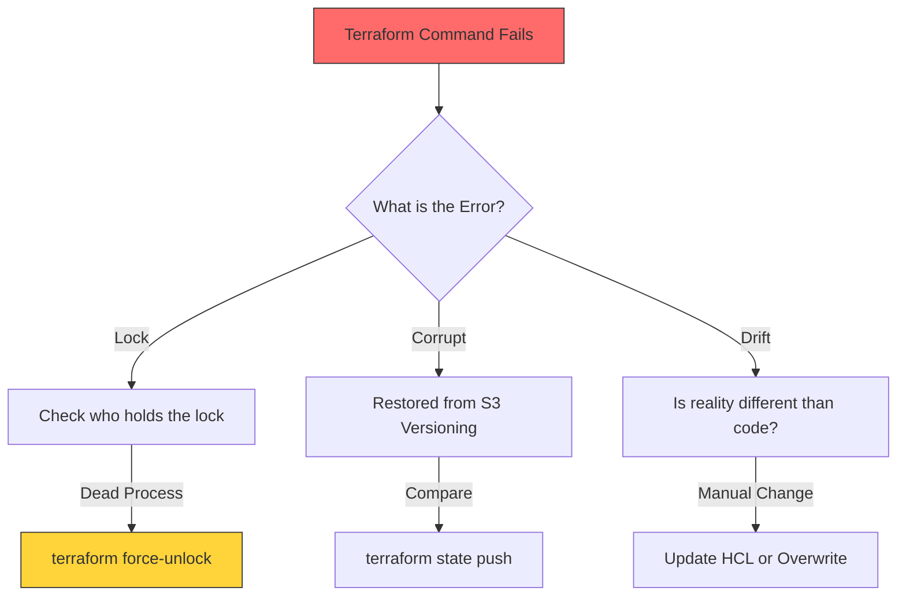

# State Troubleshooting: Fixing the "Ghost in the Machine"

Infrastructure at scale is never perfectly static. Handling common errors like corrupted state, lost locks, drift detection, and recovery operations is essential for maintaining reliable infrastructure. Troubleshooting state issues is the ultimate "Senior SRE" skill.

---

## 🔍 Troubleshooting Flow

---

## 🏗️ Real-Life Scenarios

### Scenario 1: The "Ghost Lock" Deadlock
**Problem**: An engineer was running a migration when their home internet cut out. Terraform crashed before it could talk to DynamoDB to release the lock.
**Crisis**: For the next 3 hours, the entire team was blocked. Every command failed with: `Error: Error acquiring the state lock`.
**Outcome**: High-pressure environment as a production hotfix needed to go out, but the "Lock" was held by a non-existent process.
**Solution**: Verify the Lock ID from the error message, confirm the engineer's machine is no longer running Terraform, and run `terraform force-unlock <LOCK_ID>`.
**Result**: The project was unlocked, and the hotfix was deployed.

### Scenario 2: The "Console Ninja" Drift
**Problem**: During a midnight database outage, a lead engineer manually changed an RDS instance type from `t3.medium` to `r5.large` via the AWS Console to save the site.
**Crisis**: No one updated the Terraform code. Two days later, a junior engineer ran `terraform apply` for a different service. Terraform detected the "Drift" and tried to "Downgrade" the database back to `t3.medium`.
**Outcome**: Potential for a second outage if the database was throttled.
**Solution**: Run `terraform plan`. Observe the drift. Update the HCL code to match the new `r5.large` reality, then run `terraform apply`.
**Result**: The state was synchronized with the manual emergency fix without causing a downgrade.

### Scenario 3: The "Import-Already-Exists" Error
**Problem**: A team decided to move a manually created S3 bucket into Terraform. They wrote the code and ran `apply`, but received: `Error: bucket-xyz already exists`.
**Crisis**: They didn't realize they needed to "Mind-Meld" the existing resource with the state file first.
**Outcome**: Frustration as they couldn't progress.
**Solution**: Use `terraform import aws_s3_bucket.my_bucket bucket-xyz`.
**Result**: Terraform successfully adopted the bucket into its "Memory," and the next `apply` showed "No changes."

---

## ❓ Interview Questions

1.  **What is 'Drift' and how do you find it?**
    - *Answer*: Drift is when the real world (Cloud) changes outside of Terraform's control. You find it by running `terraform plan`. Terraform compares your Code vs. State vs. Real World and reports any differences.
2.  **How do you handle 'Error acquiring state lock'?**
    - *Answer*: 1. Identify who has the lock (from the error message). 2. Check if they are actually running a command. 3. If the process is dead, use `terraform force-unlock <ID>`.
3.  **Explain a scenario where you would use `terraform plan -refresh-only`.**
    - *Answer*: If you suspect drift but don't want to make any infrastructure changes yet, `-refresh-only` updates the state file to match the real world without proposing any creations or deletions based on your HCL code.
4.  **What does 'State Corruption' look like?**
    - *Answer*: It usually manifests as a JSON parsing error when you run any command, or Terraform reporting that resources are missing even though they are clearly in the cloud and were previously managed.
5.  **How do you fix a 'Malformed' state JSON?**
    - *Answer*: The safest way is to go to your S3 backend's **Version History**, find the last version that was not corrupted, download it, and use `terraform state push` to restore it.
6.  **Why should you NEVER run `terraform apply -lock=false` in production?**
    - *Answer*: It disables the only safety mechanism preventing two people from writing to the state file at once. This almost always leads to a race condition where the state file becomes corrupted or resources are managed incorrectly.

---

## 🧠 Comprehensive Quiz (25 Questions)

<b>1. A 'Stale Lock' occurs when Terraform crashes before _____ .</b>

Show Answer

Answer: B

<b>2. True/False: 'terraform plan' always refreshes your local state from the cloud by default.</b>

Show Answer

Answer: A

<b>3. Which command is used to clear a stuck lock?</b>

Show Answer

Answer: B

<b>4. If Terraform says a resource 'already exists' but isn't in state, you should use:</b>

Show Answer

Answer: B

<b>5. 'Drift' describes the difference between _____ and _____ .</b>

Show Answer

Answer: B

<b>6. Which tool is excellent for manually inspecting the state JSON for errors?</b>

Show Answer

Answer: B

<b>7. True/False: If you lose your state file and have NO backups, you must manually re-import everything.</b>

Show Answer

Answer: A

<b>8. What happens if you run 'terraform refresh'?</b>

Show Answer

Answer: B

<b>9. 'Segmentation Fault' in Terraform CLI often indicates:</b>

Show Answer

Answer: B

<b>10. To troubleshoot network issues during backend initialization, use:</b>

Show Answer

Answer: A

<b>11. Which flag allows you to skip state refresh for a faster plan?</b>

Show Answer

Answer: B

<b>12. True/False: Resource 'Tainting' forces recreation on the next apply.</b>

Show Answer

Answer: A

<b>13. In modern Terraform (v0.15+), 'taint' is replaced by:</b>

Show Answer

Answer: B

<b>14. If a 'Lock ID' is not found in the error message, where else can you find it?</b>

Show Answer

Answer: A

<b>15. 'State Push' is a _____ risk operation.</b>

Show Answer

Answer: B

<b>16. True/False: Drift detection should be automated in production.</b>

Show Answer

Answer: A

<b>17. When code matches state, but state does NOT match the cloud, that's called _____ .</b>

Show Answer

Answer: B

<b>18. Which command verifies your HCL syntax before you even touch state?</b>

Show Answer

Answer: B

<b>19. 'Orphaned' resources are those that exist in the cloud but are _____ in state.</b>

Show Answer

Answer: B

<b>20. True/False: You can use 'force-unlock' without the Transaction ID.</b>

Show Answer

Answer: A

<b>21. 'State Pull' is great for _____ .</b>

Show Answer

Answer: B

<b>22. If a provider is failing due to 'API Rate Limiting', Terraform will _____ .</b>

Show Answer

Answer: B

<b>23. 'Manual State Editing' should be a _____ .</b>

Show Answer

Answer: B

<b>24. A healthy state is a _____ infrastructure.</b>

Show Answer

Answer: B

<b>25. Without a clear troubleshooting path, one mistake can lead to _____ .</b>

Show Answer

Answer: B

