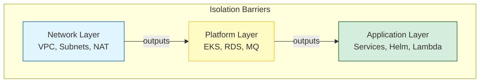

# Advanced State Patterns: Scaling to the Enterprise

As infrastructure grows from a single app to a global enterprise, "Basic" state management (one file, one backend) breaks down. Advanced state patterns enable decoupled teams, multi-environment isolation, and a reduced blast radius where errors are contained within small "cells."

---

## 🏗️ Multi-Layer Architecture (The "Golden Record")

Instead of one giant file, infrastructure is split into logical layers. Each layer has its own state file and "exports" information via outputs that other layers can "consume."

---

## 🏗️ Real-Life Scenarios

### Scenario 1: The "Micro-State" Migration
**Problem**: An e-commerce company had one 50MB state file representing 2,000 resources. Running `terraform plan` took 15 minutes and failed 50% of the time due to AWS API rate limiting.
**Crisis**: A developer accidentally deleted a small test bucket, but because it was in the giant state, Terraform tried to refresh *everything*, timing out and leaving the state locked for hours.
**Solution**: Split the state into **Micro-States** (Network, Database, Frontend, Backend). Used `terraform_remote_state` to link them.
**Result**: Plan times dropped to 30 seconds, and developers could update the "Frontend" without even touching the "Database" state.

### Scenario 2: The "Workspace" Confusion
**Problem**: A DevOps team used **Workspaces** (e.g., `terraform workspace select prod`) to manage different environments.
**Crisis**: A senior engineer thought they were in the `dev` workspace and ran `terraform destroy`. They were actually in `prod`. 
**Outcome**: Production was deleted because workspaces share the same code and backend bucket, making it "too easy" to make a fatal mistake.
**Solution**: Moved to **Directory-Based Separation**. Each environment has its own folder (`envs/dev`, `envs/prod`) and its own dedicated backend bucket.
**Result**: Accidental deletion became nearly impossible as you have to physically change directories and AWS credentials to access production.

### Scenario 3: The "Cross-Account" Handshake
**Problem**: The "Security Team" manages an AWS account for shared DNS (Route53), but the "Web Team" needs to create records in that account from their own "App Account."
**Crisis**: The Web Team doesn't have permissions to write to the Security Team's state file.
**Outcome**: Manual tickets for every DNS change, delaying launches by weeks.
**Solution**: Use a **Read-Only Remote State**. The Security Team granted "S3:Get" permissions on their state bucket to the Web Team's IAM role. 
**Result**: The Web Team can now "Read" the Hosted Zone ID from the Security state and automate their DNS records safely.

---

## ❓ Interview Questions

1.  **When should you use 'Workspaces' vs. 'Directories' for environments?**
    - *Answer*: Use **Workspaces** for temporary, identical feature branches or developer sandboxes. Use **Directories** (separate folders and backends) for long-lived environments (Dev, Staging, Prod) to ensure total isolation and prevent accidental "Cross-Pollination."
2.  **Explain the benefit of a 'Layered Infrastructure' strategy.**
    - *Answer*: It reduces the **Blast Radius**. If you make a mistake in the "Application" layer, the "Networking" layer remains safe because they are in separate state files. It also speeds up `terraform plan` because Terraform only has to refresh a subset of resources.
3.  **How do you share data between two different Terraform projects?**
    - *Answer*: Use the `terraform_remote_state` data source. Project A defines an `output`. Project B uses the `data` block to point to Project A's backend and read that output.
4.  **Is 'terraform_remote_state' read-only or read-write?**
    - *Answer*: It is strictly **Read-Only**. It allows you to consume data from another project without the risk of accidentally modifying that project's infrastructure.
5.  **What is the 'Default' workspace used for?**
    - *Answer*: It is the workspace you are in if you haven't created any others. In professional environments, the `default` workspace is often left empty to force engineers to consciously select or create a specific named workspace.
6.  **Why do some teams avoid 'terraform_remote_state' in favor of 'SSM Parameter Store'?**
    - *Answer*: `terraform_remote_state` creates a tight coupling between Terraform projects. Using AWS SSM or Secrets Manager as a "Middle Man" allows projects to scale independently without needing to know the backend details of the other project.

---

## 🧠 Comprehensive Quiz (25 Questions)

<b>1. Workspaces are best suited for which use case?</b>

Show Answer

Answer: B

<b>2. True/False: 'terraform_remote_state' allows you to delete resources in another project.</b>

Show Answer

Answer: A

<b>3. Which command is used to create a new workspace?</b>

Show Answer

Answer: B

<b>4. A 'Layered' architecture primarily reduces which metric?</b>

Show Answer

Answer: B

<b>5. How do you display the current active workspace name?</b>

Show Answer

Answer: B

<b>6. To read an output in `terraform_remote_state`, you must use the _____ block.</b>

Show Answer

Answer: B

<b>7. True/False: Workspaces share the same 'backend' configuration block.</b>

Show Answer

Answer: A

<b>8. Where are workspace-specific state files usually stored in S3?</b>

Show Answer

Answer: B

<b>9. 'Monolithic State' is an anti-pattern because it is _____ .</b>

Show Answer

Answer: B

<b>10. Which HCL variable gives you the current workspace string?</b>

Show Answer

Answer: B

<b>11. 'Cross-Account' state access requires permission in which AWS service?</b>

Show Answer

Answer: B

<b>12. True/False: You can delete a workspace while it still manages resources.</b>

Show Answer

Answer: A

<b>13. 'Service-Based' state organization maps states to _____ .</b>

Show Answer

Answer: B

<b>14. What is the biggest danger of using 'Workspaces' for Prod and Dev?</b>

Show Answer

Answer: B

<b>15. 'Tightly Coupled' projects are those that _____ .</b>

Show Answer

Answer: B

<b>16. True/False: You can use 'terraform_remote_state' to fetch data from a local file while using an S3 backend.</b>

Show Answer

Answer: A

<b>17. What is 'Separation of Concerns'?</b>

Show Answer

Answer: B

<b>18. Which command lists all available workspaces?</b>

Show Answer

Answer: B

<b>19. A 'Shared Services' account is used to _____ .</b>

Show Answer

Answer: A

<b>20. True/False: 'terraform_remote_state' requires you to manage the other project's locking.</b>

Show Answer

Answer: A

<b>21. 'Micro-States' are easier to _____ .</b>

Show Answer

Answer: B

<b>22. Which command is used to delete an empty workspace?</b>

Show Answer

Answer: B

<b>23. 'terraform_remote_state' uses the _____ of the remote project to locate the state.</b>

Show Answer

Answer: B

<b>24. Advanced patterns are the '_____ of Scale' for SREs.</b>

Show Answer

Answer: B

<b>25. Without advanced patterns, enterprise IaC becomes _____ .</b>

Show Answer

Answer: B

