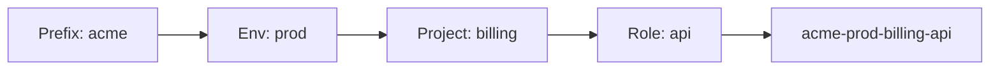

# Naming Conventions

There are only two hard things in Computer Science: cache invalidation and **naming things**. In Terraform, bad naming leads to conflicts, "fear of refactoring," and unclear state files.

## 1. The General Style Guide

Terraform HCL syntax prefers `snake_case`.

| Component | Style | Example | Bad Example |
| :--- | :--- | :--- | :--- |
| **Resources** | `snake_case` | `aws_vpc` | `awsVpc`, `AWS-VPC` |
| **Variables** | `snake_case` | `instance_type` | `instanceType` |
| **Outputs** | `snake_case` | `vpc_id` | `VpcId` |
| **Files** | `snake_case` | `main.tf` | `Main.tf` |

### Allowed Characters
*   Lowercase letters (`a-z`)
*   Numbers (`0-9`) - *Avoid starting with them.*
*   Underscores (`_`) - *Preferred separator.*
*   Hyphens (`-`) - *Only for resource **names** (tags), not internal identifiers.*

---

## 2. Resource Naming Strategy

### The "Internal" Name
This is how you refer to the resource *inside* your code (e.g., `aws_instance.xxx`).

*   **Rule**: Use generic names like `this`, `main`, or the component name.
*   **Why**: It makes refactoring easier. If you rename the internal identifier, Terraform thinks the resource is gone and will try to destroy it (unless you use `moved` blocks).

```hcl
# ✅ Good
resource "aws_security_group" "this" { ... }

# ❌ Bad (Redundant)
resource "aws_security_group" "my_security_group" { ... }
```

### The "External" Name (Name Tag)
This is what appears in the AWS Console.

*   **Rule**: `[Organization]-[Environment]-[Project]-[Role]`
*   **Example**: `acme-prod-billing-db`



---

## 3. Variable & Output Naming

### Variables
Don't stutter. Use specific but concise names.

*   **Good**: `type`, `description`, `name_prefix` (inside `variable "instance" block`)
*   **Bad**: `instance_name_prefix_for_the_instance`

If using a `map` or `object`, name the variable after the object it represents:

```hcl
variable "database" {
  type = object({
    name = string
    port = number
  })
}
```

### Outputs
Outputs should be predictable.

*   **Rule**: `[resource_type]_[attribute]`
*   **Good**: `vpc_id`, `lb_arn`, `db_endpoint`
*   **Bad**: `id`, `my_output`, `the_vpc`

---

## 4. Real-Life Scenarios

### Scenario 1: "The Cryptic Variable"
**Problem**: A module had variables named `s`, `c`, and `p`.
**Consequence**: Users had to read the source code to guess that `s`=size, `c`=count, `p`=port. A user set `c` to "large", causing a crash because it expected a number.
**Fix**: Rename to `size`, `count`, `port`. Add descriptions.

### Scenario 2: "The Resource Collision"
**Problem**: A team named their S3 bucket `logs-bucket`.
**Consequence**: S3 bucket names are **globally unique**. The deployment failed because someone else in the world already owned `logs-bucket`.
**Lesson**: Always include a unique identifier (like Account ID or Org Name) and Environment in S3 names: `acme-prod-logs-1234567890`.

### Scenario 3: "Refactoring Hell"
**Problem**: Code used `resource "aws_instance" "web_server_01"`. The team decided to switch to a generic module named `compute`.
**Outcome**: They renamed it to `resource "aws_instance" "this"`. Terraform Planned to **Destroy** `web_server_01` and **Create** `this`.
**Solution**: Use the `moved` block to tell Terraform it's a rename, not a replacement.
```hcl
moved {
  from = aws_instance.web_server_01
  to   = aws_instance.this
}
```

---

## 5. ❓ Interview Questions

1.  **Why do we use `_` for internal identifiers but `-` for public resource names (usually)?**
    *   **Answer**: Terraform HCL enforces underscores for identifiers (syntactic convention), whereas cloud resources (like DNS names, S3 buckets) often require hyphens and ban underscores.

2.  **What is the "Stuttering" anti-pattern in naming?**
    *   **Answer**: Repeating the resource type in the name. E.g., `resource "aws_route_table" "route_table"`. Just use `this` or `main`.

3.  **Why is `resource "aws_instance" "app"` better than `resource "aws_instance" "tomcat_v9"`?**
    *   **Answer**: Names should reflect **role**, not **implementation details**. If you upgrade to Tomcat v10, you don't want to have to rename the resource (which triggers destroy/recreate).

4.  **How can naming affecting the "Blast Radius"?**
    *   **Answer**: Poor naming (like `test-bucket` in a prod account) leads to human error where operators accidentally delete production resources thinking they are temporary.

5.  **What is the `name_prefix` argument used for in many AWS resources?**
    *   **Answer**: It allows AWS to append a random unique suffix to the name, ensuring uniqueness and allowing zero-downtime replacement (create new before destroy old).

6.  **Does Terraform care about capitalization in identifiers?**
    *   **Answer**: Yes, identifiers are case-sensitive, but HCL convention is strictly lowercase.

7.  **What happens if two resources in the same module have the same name?**
    *   **Answer**: Terraform Validation Error. Identifiers must be unique per resource type within a module.

8.  **How do you standardize naming across a large organization?**
    *   **Answer**: Use a "Label Module" (e.g., Cloud Posse's `null-label`) that takes `namespace`, `stage`, `name` and generates standard IDs and tags for all other resources.

9.  **Why should outputs match the attribute name (e.g., `vpc_id` vs `vpc_identifier`)?**
    *   **Answer**: Consistency reduces cognitive load. Developers know `aws_vpc` has an `id` attribute, so they expect the output to be `vpc_id`.

10. **Is it okay to use emojis in resource tags?**
    *   **Answer**: Technically yes for some providers (AWS supports UTF-8), but it breaks many third-party tools and CLI parsers. Avoid it.

---

## 6. 🧠 Knowledge Check (Quiz)

### Syntax & Style
1.  **The preferred separator for HCL identifiers is:**
    *   [ ] Hyphen (`-`)
    *   [x] Underscore (`_`)
    *   [ ] CamelCase

2.  **Which internal name generates the least refactoring friction?**
    *   [ ] `production_web_server`
    *   [x] `this`
    *   [ ] `web01`

3.  **If `resource "aws_s3_bucket" "b"` exists, how do you reference it?**
    *   [x] `aws_s3_bucket.b.id`
    *   [ ] `aws.s3.b.id`

4.  **Can identifiers start with a number?**
    *   [ ] Yes.
    *   [x] No (syntax error).

5.  **Variable names should be:**
    *   [ ] Short (1 letter).
    *   [x] Descriptive (`instance_count`).

### Scenarios
6.  **To rename a resource without destroying it, use:**
    *   [ ] `rename`
    *   [x] `moved` block
    *   [ ] `terraform import`

7.  **S3 Bucket names must be:**
    *   [ ] Unique to your account.
    *   [x] Globally unique.

8.  **Tagging strategies usually require:**
    *   [x] Environment, Project, Owner, CostCenter.
    *   [ ] Just the Name.

9.  **`name_prefix` helps avoid:**
    *   [x] Naming collisions during replacement.
    *   [ ] Cost overruns.

10. **Using specific versions (`tomcat_v9`) in names is:**
    *   [x] An Anti-Pattern.
    *   [ ] Best Practice.

### General
11. **outputs.tf should usually output:**
    *   [x] IDs, ARNs, and Endpoints.
    *   [ ] The entire state file.

12. **"Stuttering" is:**
    *   [x] `variable "vpc_cidr_block_for_vpc"`
    *   [ ] `variable "cidr"`

13. **Are tags case sensitive in AWS?**
    *   [x] Yes (`Env` != `env`).
    *   [ ] No.

14. **Which is better for Autoscaling Groups?**
    *   [ ] Static naming.
    *   [x] `name_prefix` (allows new ASG to spin up before old one spins down).

15. **Local values (`locals`) names follow:**
    *   [x] The same `snake_case` convention.
    *   [ ] `UPPER_CASE`.

16. **Why avoid `test` as a name prefix?**
    *   [x] It is often ambiguous (Unit test? Integration test? Staging?).
    *   [ ] It's too short.

17. **Consistent header comments in files are:**
    *   [ ] Useless.
    *   [x] Recommended for copyright and brief description.

18. **Can you interpolate variables in resource identifiers?**
    *   [ ] Yes (`aws_instance.${var.name}`).
    *   [x] No (Identifiers must be static strings).

19. **If you have a customized provider, you name it using:**
    *   [x] An `alias`.
    *   [ ] A different file.

20. **The filename `outputs.tf` is:**
    *   [x] A convention (Terraform reads all `.tf` files, but humans expect outputs here).
    *   [ ] A strict requirement.