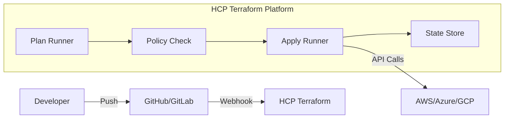

# Terraform Cloud (HCP Terraform) Introduction

Terraform is open-source, but running it at scale requires a platform. **Terraform Cloud (TFC)**, now known as **HCP Terraform**, is HashiCorp's managed service for Terraform.

## 1. Architecture: The "Remote" Paradigm

In OSS, Terraform runs on your laptop and commits state to S3. In TFC, Terraform runs on HashiCorp's servers (or your agents).

### The Flow
1.  **VCS Trigger**: You push code to GitHub.
2.  **Webhook**: GitHub notifies TFC.
3.  **Plan**: TFC spins up a temporary VM (Runner), clones your code, downloads providers, and runs `terraform plan`.
4.  **Policy Check**: Sentinel/OPA checks run against the plan.
5.  **Apply**: If approved, TFC runs `terraform apply`.
6.  **State Storage**: The `.tfstate` is encrypted and stored in TFC (no S3 bucket setup required).



---

## 2. Terraform OSS vs. Cloud vs. Enterprise

| Feature | Open Source (CLI) | Terraform Cloud (HCP) | Terraform Enterprise (TFE) |
| :--- | :--- | :--- | :--- |
| **State Storage** | Manual (S3/GCS) | Managed & Encrypted | Managed (Self-Hosted) |
| **Execution** | Local (Laptop) / DIY CI | Remote Runners | Private Runners |
| **Locking** | Manual (DynamoDB) | Automatic | Automatic |
| **RBAC** | None (IAM Keys) | Team Management | SSO / SAML |
| **Cost Estimation** | Manual (Infracost) | Built-in | Built-in |
| **Policy (Sentinel)** | No | Yes (Plus/Standard) | Yes |
| **Private Registry** | No | Yes | Yes |

---

## 3. Key Concepts

### Workspaces
In OSS, a workspace is just a separate state file. In TFC, a **Workspace** is a full environment container. It holds:
*   The State file.
*   The Variables (`terraform.tfvars`).
*   The Environment Variables (`AWS_ACCESS_KEY_ID`).
*   The Triggers (Git Branch settings).

### Remote Execution
You can run Terraform from your laptop but execute it in the cloud.
```hcl
# backend.tf
terraform {
  cloud {
    organization = "my-org"
    workspaces {
      name = "my-app-prod"
    }
  }
}
```
When you run `terraform apply` locally, it streams the logs from the Cloud Runner to your terminal.

---

## 4. Real-Life Scenarios

### Scenario 1: "State Lock Collision"
**Problem**: Two developers ran `terraform apply` locally at the same time. One got a lock error, the other proceeded but overwrote the first one's changes due to a race condition in the backend logic.
**Solution**: TFC queues runs strictly. If Dev A pushes, Dev B's push waits in a "Pending" state until Dev A finishes.

### Scenario 2: "The Laptop Deploy"
**Problem**: A developer started a large RDS deployment (45 mins) from their laptop. Their WiFi dropped.
**Result**: The local Terraform process died. The RDS was created in AWS, but the state file on the laptop wasn't updated. State corruption.
**Solution**: With TFC Remote Execution, once the run is handed off to the cloud, you can close your laptop. The Runner continues the job safely.

### Scenario 3: "The Auditable Log"
**Problem**: "Who changed the firewall rules last Tuesday?"
**OSS**: Check Git logs? Maybe they applied locally without committing.
**TFC**: Go to the Workspace -> "Runs" tab. See exactly who (User A), what (PR #123), and when. Click "View Plan" to see the exact diff.

---

## 5. ❓ Interview Questions

1.  **What is the difference between specific "Remote Execution" and "Local Execution" in TFC?**
    *   **Answer**: Remote Execution runs the `apply` on TFC's servers. Local Execution uses TFC only for state storage, but runs the `apply` binary on your machine (useful for debugging, but risky).

2.  **Can TFC access resources in my private VPC?**
    *   **Answer**: Not by default. You must use **HCP Terraform Agents** (self-hosted binaries running inside your VPC) to allow TFC to reach private endpoints like non-public Kubernetes clusters.

3.  **How do you migrate from S3 Backend to TFC?**
    *   **Answer**: Change the `backend "s3"` block to `cloud {}`, run `terraform init`. Terraform will ask: "Do you want to copy existing state to the new backend?". Say "Yes".

4.  **What is a "Speculative Plan"?**
    *   **Answer**: A plan that runs on a Pull Request (via Webhook) to show what *would* happen, but cannot be Applied. It is temporary and for review only.

5.  **Explain the "VCS-Driven Workflow".**
    *   **Answer**: You don't run `terraform apply`. You push to Git. TFC sees the commit, plans it, and waits for a GUI approval (or auto-applies on merge).

6.  **Does TFC support Modules?**
    *   **Answer**: Yes, it has a Private Registry where you can upload and version your own module code, making it instantly available to all workspaces.

7.  **What is the cost of HCP Terraform?**
    *   **Answer**: There is a robust Free Tier (State, Remote Runs, Unlimited Users). Standard/Plus tiers add Policy (Sentinel), SSO, and Agents.

8.  **How are secrets handled in TFC?**
    *   **Answer**: Stored as "Sensitive" Workspace Variables. They are encrypted at rest and injected into the Runner VM environment at runtime. They are write-only in the UI.

9.  **What is Run Task?**
    *   **Answer**: A way to integrate 3rd party tools (like Snyk or Datadog) into the TFC workflow between the Plan and Apply stages.

10. **Can you use multiple repositories in one TFC Workspace?**
    *   **Answer**: Generally no. One Workspace = One Repo (or specific subdirectory of a Repo).

---

## 6. 🧠 Knowledge Check (Quiz)

### Architecture
1.  **Where is the `.tfstate` stored in TFC?**
    *   [x] Managed internal storage (Encrypted).
    *   [ ] Your S3 bucket.

2.  **To reach a private database from TFC, use:**
    *   [x] TFC Agents.
    *   [ ] VPC Peering (Hard to setup with SaaS).

3.  **A "Runner" is:**
    *   [x] The ephemeral VM that executes Terraform.
    *   [ ] The developer.

4.  **"HCP" stands for:**
    *   [ ] High Cloud Performance.
    *   [x] HashiCorp Cloud Platform.

### Features
5.  **Which feature is unique to TFC/Enterprise (vs OSS)?**
    *   [ ] `terraform apply`
    *   [x] Private Module Registry & Policy Sets.

6.  **Speculative Plans trigger on:**
    *   [x] Pull Requests.
    *   [ ] Merges to main.

7.  **Cost Estimation in TFC creates:**
    *   [x] An extra view in the Run UI showing hourly/monthly delta.
    *   [ ] An invoice.

8.  **Variable Sets allow you to:**
    *   [x] Share variables (like AWS Creds) across multiple workspaces.
    *   [ ] Set variables in Git.

9.  **Locking in TFC is:**
    *   [x] Automatic.
    *   [ ] Optional.

10. **You can approve a run via:**
    *   [x] The Web UI or API.
    *   [ ] Email only.

### Scenarios
11. **If your laptop dies during a Remote Run:**
    *   [ ] The apply fails.
    *   [x] The apply continues safely in the cloud.

12. **To see previous state files:**
    *   [x] Check the "States" tab in the Workspace.
    *   [ ] Call AWS Support.

13. **VCS Integration requires:**
    *   [x] OAuth connection to GitHub/GitLab.
    *   [ ] SSH Keys.

14. **If a Policy Check fails (Hard Mandatory):**
    *   [x] The run is blocked and cannot be applied.
    *   [ ] You can override it.

15. **Can you manually trigger a run in TFC?**
    *   [x] Yes, "Queue Plan" button.
    *   [ ] No, Git only.

### General
16. **Is TFC free?**
    *   [x] Has a generous Free tier.
    *   [ ] No.

17. **Does TFC encrypt state?**
    *   [x] Yes, always.
    *   [ ] Only on Enterprise.

18. **The `cloud {}` block replaces:**
    *   [x] The `backend "..." {}` block.
    *   [ ] The `provider` block.

19. **Can you use TFC for local testing?**
    *   [x] Yes, `terraform login` allows local runs with remote state.
    *   [ ] No.

20. **Run triggers enable:**
    *   [x] Workspace A to trigger Workspace B after a successful apply (Chaining).
    *   [ ] Scheduled runs.