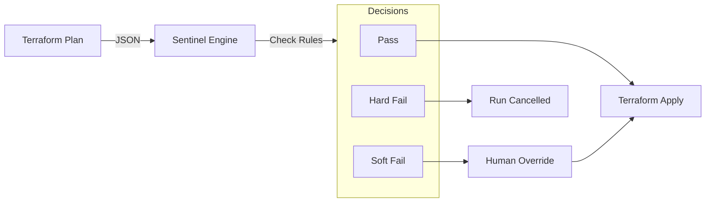

# Policy as Code (Sentinel)

Sentinel is HashiCorp's embedded policy-as-code framework. It runs logic **against the Terraform Plan** to prevent bad infrastructure from being created.

## 1. Guardrails vs Gatekeepers

*   **Gatekeeper**: A human reviewer. Slow, error-prone, sleeps at night.
*   **Guardrail**: Automated policy. Instant, consistent, always on.

Sentinel allows you to move from "Ticket-based" provisioning to "Self-Service" provisioning by embedding the rules into the platform.



---

## 2. Enforcement Levels

You can set the strictness of each policy:

| Level | Behavior | Use Case |
| :--- | :--- | :--- |
| **Advisory** | Warns the user but allows the run to proceed. | Coding standards, deprecation warnings. |
| **Soft Mandatory** | Blocks the run unless an Admin overrides it. | Cost thresholds, non-critical compliance. |
| **Hard Mandatory** | Blocks the run. Cannot be overridden. | Security violations (Open 0.0.0.0/0), Missing Tags. |

---

## 3. Sentinel Language (Basic Syntax)

Sentinel looks like Go or Python but is specialized for data traversal.

**Example: Restrict EC2 Instance Types**

```sentinel
import "tfplan/v2" as tfplan

# Get all aws_instance resources
instances = filter tfplan.resource_changes as _, rc {
    rc.type is "aws_instance" and
    (rc.change.actions contains "create" or rc.change.actions contains "update")
}

# Allowed types
allowed_types = ["t3.micro", "t3.small", "t3.medium"]

# Rule: All instances must use allowed types
main = rule {
    all instances as _, instance {
        instance.change.after.instance_type in allowed_types
    }
}
```

---

## 4. Real-Life Scenarios

### Scenario 1: "The Expensive Instance"
**Problem**: Developers kept spinning up `p3.16xlarge` instances ($24/hr) for "testing" and forgetting them.
**Solution**: A **Soft Mandatory** Sentinel policy restricts instance types to `t3.*` in the Dev environment.
**Outcome**: If a dev *really* needs a GPU instance for ML, they can request an override (providing justification in the override comment), but they can't do it accidentally.

### Scenario 2: "The Friday Deploy"
**Problem**: Deployments on Friday afternoon break production, ruining the weekend.
**Solution**: A **Hard Mandatory** policy that checks the `time` import.
*   Rule: `day_of_week not in ["Friday", "Saturday", "Sunday"]`.
*   Outcome: No Production deploys allowed on weekends.

### Scenario 3: "Mandatory Tags"
**Problem**: Finance couldn't allocate cloud bills because 30% of resources had no `Owner` tag.
**Solution**: **Hard Mandatory** policy checking `rc.change.after.tags` contains `Owner`.
**Outcome**: 100% cost attribution. The pipeline simply won't build untagged resources.

---

## 5. ❓ Interview Questions

1.  **What data does Sentinel access?**
    *   **Answer**: It accesses the `tfplan` (state changes), `tfstate` (current state), `tfrun` (workspace info like Cost estimates), and standard imports like `time`, `http`, and `json`.

2.  **How do you test Sentinel policies?**
    *   **Answer**: Use the `sentinel test` CLI. It allows you to mock the `tfplan` data and assert that your policy passes or fails as expected (Unit Testing for Policy).

3.  **Can Sentinel check costs?**
    *   **Answer**: Yes, by importing `tfrun`, you can access the "Cost Estimation" data and block runs if the `proposed_monthly_cost` exceeds limit.

4.  **Where do you store Sentinel code?**
    *   **Answer**: In a Git repository (Policy Set). TFC connects to the repo exactly like it connects to workspaces.

5.  **Soft vs Hard Mandatory?**
    *   **Answer**: Soft allows override (human judgement), Hard does not (absolute compliance).

6.  **Does Sentinel run before or after `terraform apply`?**
    *   **Answer**: Before. It runs between `Plan` and `Apply`.

7.  **Can Sentinel make HTTP requests?**
    *   **Answer**: Yes, using the `http` import. You could check an external CMDB or ticket system before allowing a deploy.

8.  **What is a "Policy Set"?**
    *   **Answer**: A collection of policies grouped together and applied to specific Workspaces or the whole Organization.

9.  **Sentinal vs OPA?**
    *   **Answer**: Sentinel is HashiCorp proprietary (Enterprise features). OPA is open-source (Rego language). TFC supports both now.

10. **How do you debug a failed Sentinel check?**
    *   **Answer**: TFC UI shows the trace output: which rule returned `false`. You can replicate it locally using `sentinel apply -trace`.

---

## 6. 🧠 Knowledge Check (Quiz)

### Concepts
1.  **Sentinel runs against:**
    *   [x] The Terraform Plan.
    *   [ ] The applied resources.

2.  **Hard Mandatory means:**
    *   [x] Non-negotiable. No overrides.
    *   [ ] Override with Admin permission.

3.  **Advisory policies:**
    *   [x] Do not block the run.
    *   [ ] Block the run.

4.  **A "Policy Set" can be applied to:**
    *   [x] All workspaces or specific workspaces.
    *   [ ] Only one workspace.

### Syntax & Features
5.  **Sentinel looks most like:**
    *   [x] Validating JSON/Objects with rules.
    *   [ ] Bash scripts.

6.  **To block expensive resources, check:**
    *   [x] `tfrun.cost_estimate`.
    *   [ ] `tfplan.resources`.

7.  **Can Sentinel check the time of day?**
    *   [x] Yes (Time import).
    *   [ ] No.

8.  **Overrides require:**
    *   [x] Permissions and usually a comment.
    *   [ ] Just clicking a button.

9.  **Mocking data is used for:**
    *   [x] Testing policies locally.
    *   [ ] Running policies in prod.

10. **Sentinel failure happens:**
    *   [x] Before resources are created.
    *   [ ] After resources are created.

### Scenarios
11. **"Self-Service" relies on:**
    *   [x] Automated Guardrails (Sentinel).
    *   [ ] Trusting developers completely.

12. **If a policy fails Soft Mandatory:**
    *   [x] The "Confirm & Apply" button is disabled until overridden.
    *   [ ] The run is cancelled immediately.

13. **To prevent S3 buckets from being Public:**
    *   [x] Check `aws_s3_bucket` resource for `acl="public-read"`.
    *   [ ] Check Git commit messages.

14. **Can you force tags to follow a Regex?**
    *   [x] Yes (`matches` operator).
    *   [ ] No.

15. **If TFC cannot download the Policy Set from Git:**
    *   [x] The run usually fails (fail closed).
    *   [ ] The run proceeds without policy check.

### General
16. **Is Sentinel Open Source?**
    *   [ ] Yes.
    *   [x] No (HashiCorp proprietary).

17. **Does Standard Tier TFC support Sentinel?**
    *   [x] Yes (but limits may apply compared to Plus).
    *   [ ] No.

18. **Can you use Sentinel for non-Terraform things?**
    *   [x] Yes (Vault, Nomad, Consul).
    *   [ ] No.

19. **The file extension for Sentinel policies is:**
    *   [x] `.sentinel`
    *   [ ] `.policy`

20. **`import "tfplan/v2"` is preferred over `v1` because:**
    *   [x] It is more accurate and future-proof.
    *   [ ] It is faster.