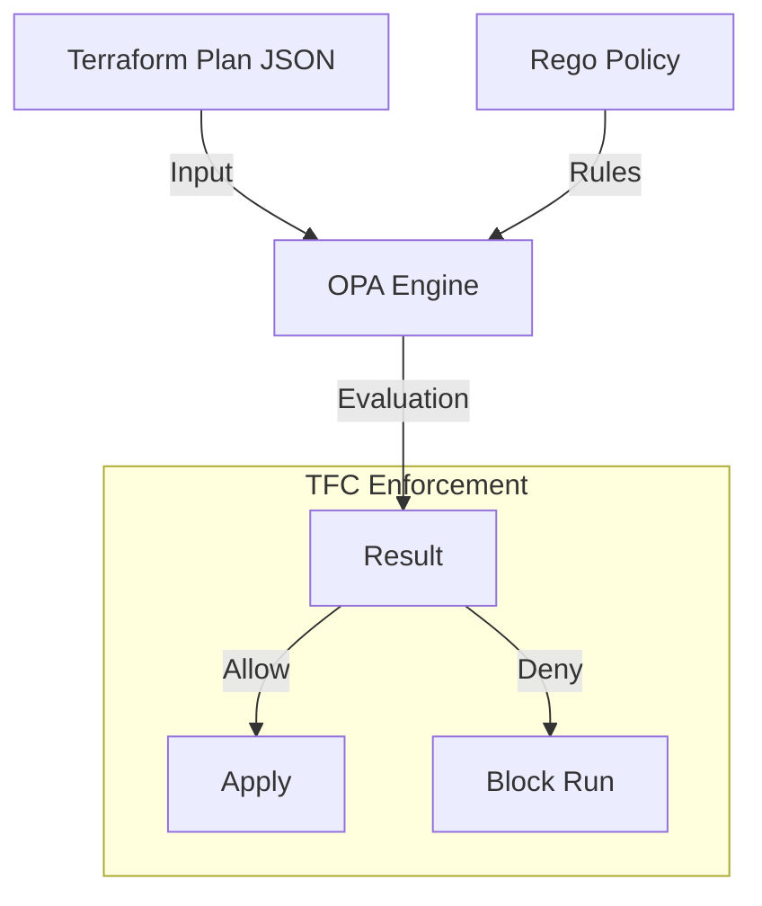

# Policy as Code (OPA)

HashiCorp Sentinel is powerful, but Open Policy Agent (OPA) is the industry standard. TFC supports both.

## 1. OPA vs Sentinel

| Feature | Sentinel | OPA (Open Policy Agent) |
| :--- | :--- | :--- |
| **Language** | Sentinel (Proprietary, Go-like) | Rego (Open Source, Datalog-like) |
| **Ecosystem** | HashiCorp Stack (Vault, Nomad, Consul) | Kubernetes, Envoy, Linux, Kafka, Terraform |
| **Portability** | Locked to HashiCorp | Runs anywhere (CLI, CI/CD, K8s) |
| **Learning Curve** | Low (Imperative) | High (Declarative/Logic-based) |

**Recommendation**: Use OPA if you already use it for Kubernetes or want a portable skill set. Use Sentinel if you want deep integration with TFC features like "Soft Mandatory".

---

## 2. Integration Architecture

TFC runs OPA natively. You connect a "Policy Set" pointing to a Git repo containing `.rego` files.



---

## 3. Rego Language (Basic Syntax)

Rego is declarative. You define *what* a violation looks like.

**Example: Deny Security Groups with 0.0.0.0/0**

```rego
package terraform

import input.tfplan as tfplan

# Rule: Deny if violation found
deny[msg] {
    # 1. Find all resources of type aws_security_group
    r := tfplan.resource_changes[_]
    r.type == "aws_security_group"

# 2. Check each ingress rule
    ingress := r.change.after.ingress[_]
    cidr := ingress.cidr_blocks[_]

# 3. Condition: CIDR is open to world
    cidr == "0.0.0.0/0"

# 4. Message to return
    msg := sprintf("Security Group %v allows open access to world", [r.address])
}
```

---

## 4. Real-Life Scenarios

### Scenario 1: "Portable Policy"
**Problem**: The platform team writes policies for Kubernetes (checking labels) and Terraform (checking tags).
**Old Way**: Maintained Rego for K8s and Sentinel for Terraform. Double work.
**New Way**: Migrated Terraform policies to OPA. Now they share helper libraries for regex validation and cost codes across the entire stack.

### Scenario 2: "Security Group Whitelist"
**Problem**: Developers opened SSH (Port 22) to the world.
**Policy**: a Rego policy that checks `ingress.from_port <= 22` and `ingress.to_port >= 22`. If true, `cidr_blocks` MUST belong to the Corporate VPN IP list.
**Outcome**: Automatic rejection of unsafe firewall rules.

### Scenario 3: "Naming Convention"
**Problem**: S3 Buckets must start with `acme-prod-` or `acme-dev-`.
**Policy**: Rego regex check: `regex.match("^acme-(prod|dev)-.*", bucket_name)`.
**Outcome**: Consistent resource naming enforced at the platform level.

---

## 5. ❓ Interview Questions

1.  **What formats does OPA accept as input?**
    *   **Answer**: Any JSON. For Terraform, we pass the output of `terraform plan -json`.

2.  **Does TFC support "Soft Mandatory" for OPA?**
    *   **Answer**: Initially no (it was binary Pass/Fail), but recent updates allow mapping OPA "warn" rules to Advisory/Soft modes.

3.  **How do you debug Rego?**
    *   **Answer**: The `opa eval` command or the [Rego Playground](https://play.openpolicyagent.org).

4.  **Why is Rego considered "Declarative"?**
    *   **Answer**: You don't write loops (`for i in list`). You write queries (`violation if x in list and x == bad`). OPA searches for data that satisfies the query.

5.  **Can OPA access TFC Cost Estimates?**
    *   **Answer**: Yes, if you configure the TFC Plan to include the cost estimate JSON in the input payload.

6.  **What is `conftest`?**
    *   **Answer**: A popular CLI tool for running OPA policies against config files locally (CI/CD) before sending to TFC.

7.  **What is the `deny` rule?**
    *   **Answer**: The standard entry point. If the `deny` set is empty, the policy passes. If it contains any messages, the policy fails.

8.  **Can OPA make external HTTP calls?**
    *   **Answer**: Rego supports `http.send`, but TFC's OPA runtime might restrict network access for security. Check platform limits.

9.  **How do you unit test OPA policies?**
    *   **Answer**: Rego has a built-in testing framework. create `policy_test.rego` and run `opa test .`.

10. **Sentinel vs OPA for a pure AWS shop?**
    *   **Answer**: It's a toss-up. OPA is better if you also use EKS. Sentinel might be easier if you only use TFC and want simple procedural logic.

---

## 6. 🧠 Knowledge Check (Quiz)

### Concepts
1.  **OPA stands for:**
    *   [x] Open Policy Agent.
    *   [ ] Open Public Access.

2.  **Rego is:**
    *   [x] The query language used by OPA.
    *   [ ] A cloud provider.

3.  **If `deny` contains strings:**
    *   [x] The check fails.
    *   [ ] The check passes.

4.  **OPA inputs are:**
    *   [x] JSON.
    *   [ ] HCL.

### Syntax
5.  **To iterate over a list in Rego:**
    *   [x] `item := list[_]`
    *   [ ] `for item in list`

6.  **Rego policies generally belong to a:**
    *   [x] `package`.
    *   [ ] `class`.

7.  **`spray` or `sprintf` is used for:**
    *   [x] Formatting error messages.
    *   [ ] Networking.

8.  **To import the Terraform plan:**
    *   [x] `import input.tfplan`.
    *   [ ] `import terraform`.

9.  **Are rules evaluated in order?**
    *   [x] No, standard rules are unordered (Declarative).
    *   [ ] Yes.

10. **A "partial rule" returns:**
    *   [x] A set of values (e.g., error messages).
    *   [ ] A boolean.

### Scenarios
11. **Why choose OPA over Sentinel?**
    *   [x] To reuse skills/policies across Kubernetes and Terraform.
    *   [ ] Because it's cheaper.

12. **If a policy fails in TFC:**
    *   [x] The apply is blocked.
    *   [ ] The apply proceeds with a warning.

13. **Can you use Regex in OPA?**
    *   [x] Yes (`regex.match`).
    *   [ ] No.

14. **To verify policies locally:**
    *   [x] Use `opa test` or `conftest`.
    *   [ ] Commit and push to TFC.

15. **If the input JSON is missing a field:**
    *   [x] Rego usually evaluates to "undefined" (not an error, just no match).
    *   [ ] It crashes.

### General
16. **Is OPA a CNCF project?**
    *   [x] Yes (Graduated).
    *   [ ] No, HashiCorp owned.

17. **Does OPA work with `terraform plan`?**
    *   [x] Yes, specifically the JSON output.
    *   [ ] No.

18. **Can OPA replace IAM policies?**
    *   [ ] Yes.
    *   [x] No, OPA checks config; IAM checks permissions. They are complementary.

19. **The file extension for OPA is:**
    *   [x] `.rego`
    *   [ ] `.opa`

20. **Is OPA "Turing Complete"?**
    *   [x] No (guaranteed termination).
    *   [ ] Yes.