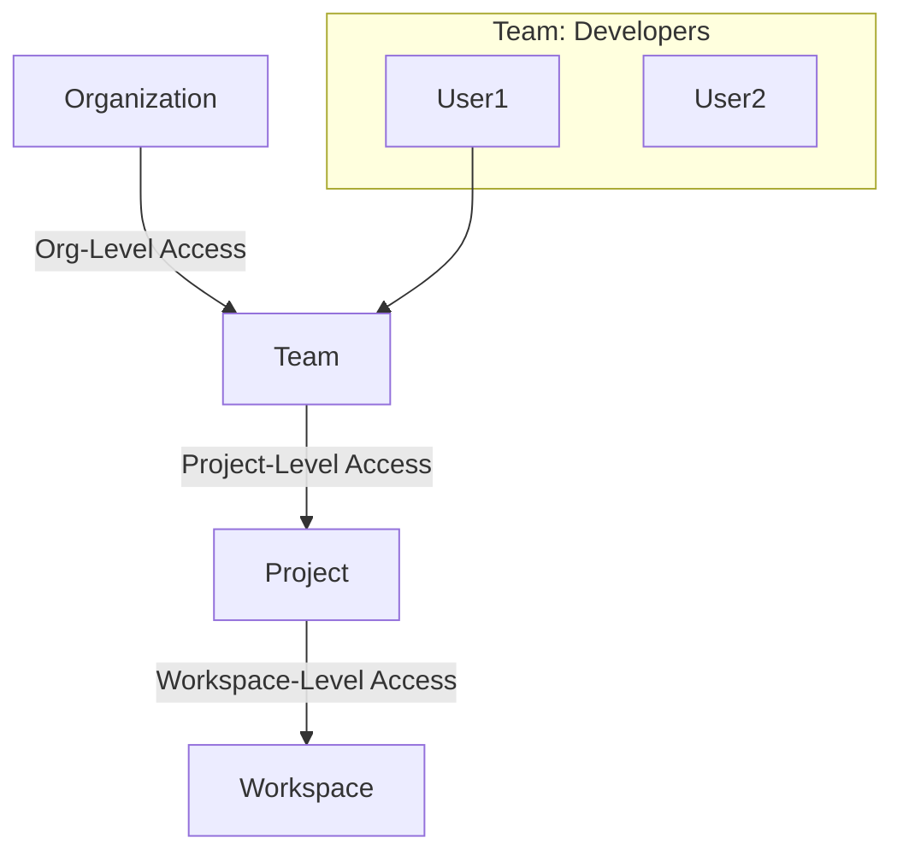

# Governance and RBAC

Scaling Terraform to 50 developers requires structure. You cannot give everyone Admin access.

## 1. The Permission Hierarchy

TFC permissions flow down from the Organization to the Workspace.

## 2. Teams (The Central Unit)

Don't assign permissions to users directly. Assign them to **Teams**.

| Team Role | Description | Typical Use |
| :--- | :--- | :--- |
| **Owners** | Full Admin access. Can manage billing and policies. | DevOps Leads (2-3 people max). |
| **Developers** | Can read/write code, trigger runs in specific workspaces. | App Developers. |
| **Viewers** | Read-only. Can see logs but cannot trigger runs. | Auditors, Managers. |

---

## 3. Workstream RBAC (Projects)

"Projects" are folders for workspaces. You assign Team permissions to a Project, and it cascades to all workspaces inside.

*   **Setup**:
    *   Create Project: `Payments-App`
    *   Assign Team `Payments-Devs` -> **Write** access.
    *   Assign Team `Networking` -> **Read** access.
*   **Result**: The Payments team handles their own infrastructure but can't touch the Networking project.

---

## 4. SSO (Single Sign-On)

Enterprise TFC integrates with your Identity Provider (IdP) via SAML 2.0.

*   **Supported IdPs**: Okta, Azure AD, OneLogin, etc.
*   **Team Mapping**: You map an "AD Group" (e.g., `group-cloud-admins`) to a "TFC Team" (`Owners`).
*   **Benefits**:
    *   JIT (Just-in-Time) provisioning.
    *   Instant revocation: Disable user in Okta -> Disabled in TFC.

---

## 5. Real-Life Scenarios

### Scenario 1: "The Intern"
**Problem**: An intern deleted the Production workspace while trying to clean up their test environment.
**Solution**: Moved interns to a `Viewers` team globally, and gave them `Admin` access ONLY on a specific `Sandbox` Project.
**Outcome**: Safe experimentation.

### Scenario 2: "The Contractor"
**Problem**: A contractor needed access to upgrade the RDS database, but you didn't want them seeing the VPC Networking codes.
**Solution**: Granted the contractor's account Guest access specifically to the `Database-Workspace` only. No access to the rest of the Organization.

### Scenario 3: "Audit Time"
**Problem**: Compliance auditor asked: "Who can decrypt the production database secrets?"
**Solution**: Showed the TFC TeamSettings.
*   Only the `Owners` team has access to the `production` workspace variables.
*   The `Developers` team has `Plan` access but not `Variable` access.
*   Auditor satisfied.

---

## 6. ❓ Interview Questions

1.  **What is the difference between "Project" and "Workspace"?**
    *   **Answer**: A Project is a container (folder) that holds multiple Workspaces. Permissions applied to a Project inherit down to its Workspaces.

2.  **How do you automate Team creation?**
    *   **Answer**: Use the `tfe_team` and `tfe_team_access` resources in the Terraform Provider for specific configuration.

3.  **If a user is in two teams, which permission wins?**
    *   **Answer**: The *highest* permission wins. If Team A has Read and Team B has Admin, the user has Admin.

4.  **Can you force 2FA?**
    *   **Answer**: Yes, Org Admins can enforce 2FA for all members (unless using SSO, where the IdP handles it).

5.  **What is a "Run Task" permission?**
    *   **Answer**: A specific permission level enabling a team to manage third-party integrations (like Snyk) without having full admin rights.

6.  **Does TFC support SCIM?**
    *   **Answer**: Yes (in Business Tier), allowing automatic user provisioning and de-provisioning from the IdP.

7.  **What is an "API Token" owner?**
    *   **Answer**: Every API token belongs to a user or a team. If that user leaves and is deleted, the token stops working. Use "Team API Tokens" for CI/CD systems.

8.  **Can I restrict which modules a team can use?**
    *   **Answer**: Not directly, but you can use Sentinel policies to restrict module sources to the Private Registry only.

9.  **How do you handle "Break Glass" access?**
    *   **Answer**: Create a specific `BreakGlass` team with Admin rights, usually empty. Add users temporarily during incidents, which creates an audit trail.

10. **The "Manage Policies" permission resides where?**
    *   **Answer**: Usually at the Organization level (Policy Owners), separate from Workspace Admins.

---

## 7. 🧠 Knowledge Check (Quiz)

### Structure
1.  **The hierarchy is:**
    *   [x] Org -> Project -> Workspace.
    *   [ ] Workspace -> Org -> Project.

2.  **To manage users at scale:**
    *   [x] Use Teams.
    *   [ ] Assign permissions to each email.

3.  **SSO uses which protocol?**
    *   [x] SAML.
    *   [ ] LDAP.

4.  **Team API Tokens are good for:**
    *   [x] CI/CD Pipelines (Jenkins).
    *   [ ] Individual developers.

### Access Control
5.  **"Plan Only" access allows:**
    *   [x] Running `terraform plan` but not `apply`.
    *   [ ] Applying changes.

6.  **If I remove a user from the IdP (Okta):**
    *   [x] They lose TFC access (if SSO/SCIM is configured).
    *   [ ] They keep access until manually deleted.

7.  **Can you restrict access to specific Variables?**
    *   [x] Yes, permissions separate "Runs" from "Variables".
    *   [ ] No.

8.  **Who can see the State file?**
    *   [x] Anyone with Read access to the workspace (implied).
    *   [ ] Only Admins.

9.  **Project-level permissions:**
    *   [x] Cascade to all contained workspaces.
    *   [ ] Apply only to the folder itself.

10. **2FA Enforcement is:**
    *   [x] An Organization Setting.
    *   [ ] A Personal Setting.

### Scenarios
11. **Best practice for Team naming:**
    *   [x] `Role-Context` (e.g., `Dev-Payments`).
    *   [ ] Just names (`Bob's Team`).

12. **To grant a consultant temporary access:**
    *   [x] Invite them to a restricted Team, then remove later.
    *   [ ] Give them the admin password.

13. **If a run works locally but fails in CI:**
    *   [x] Check the permissions of the CI's API Token.
    *   [ ] Reboot the internet.

14. **Why separate "Policy Admins" from "Infra Admins"?**
    *   [x] Separation of Duties (Compliance).
    *   [ ] No reason.

15. **User Tokens vs Team Tokens:**
    *   [x] User tokens expire when the user leaves; Team tokens persist.
    *   [ ] They are identical.

### General
16. **Is RBAC available on the Free Tier?**
    *   [x] Limited (basic Teams). Full granularity requires paid tiers.
    *   [ ] No.

17. **Can you map multiple IdP groups to one TFC Team?**
    *   [x] Yes.
    *   [ ] No.

18. **The `tfe_organization_membership` resource manages:**
    *   [x] Inviting users to the Org.
    *   [ ] Billing.

19. **Does Terraform Code (`tfe` provider) support managing Teams?**
    *   [x] Yes (Admin-as-Code).
    *   [ ] No.

20. **Audit Logs show:**
    *   [x] Who changed permissions and triggered runs.
    *   [ ] Only errors.