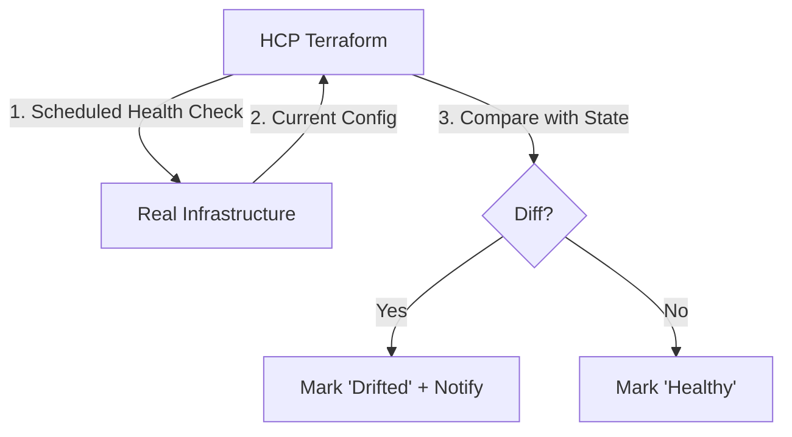

# Advanced Features

TFC isn't just about applying code; it's about Day 2 operations: detecting drift, managing costs, and sharing modules.

## 1. Drift Detection (Health Assessments)

In OSS Terraform, you only know if your infra is broken when you run a plan. TFC changes this.

*   **Continuous Validation**: TFC periodically checks if the Real World matches the State File.
*   **Health Status**: Workspaces show "Drifted" status if someone manually changed an AWS resource via the Console.



---

## 2. Cost Estimation

Before you click "Confirm Apply", TFC tells you how much it will cost.

*   **How it works**: Uses the AWS/Azure/GCP public pricing APIs against the resources in the `terraform plan`.
*   **Delta**: Shows "+$500/mo" or "-$20/mo".
*   **Policy Integration**: You can write a Sentinel/OPA policy to *block* any PR that increases monthly spend by > $1000.

---

## 3. Private Module Registry (PMR)

Stop copying `vpc` code into every repo. Use the PMR.

*   **Versioning**: Semantic Versioning support (v1.0.0, v1.1.0).
*   **Documentation**: TFC automatically parses `README.md`, `variables.tf`, and `outputs.tf` to generate a beautiful documentation UI for your module.
*   **Verified Modules**: Mark internal modules as "Verified" so devs know they are safe to use.

**Usage**:
```hcl
module "vpc" {
  source  = "app.terraform.io/my-org/vpc/aws"
  version = "1.0.4"
  # Clean inputs based on generated docs
}
```

---

## 4. Real-Life Scenarios

### Scenario 1: "The Manual Change"
**Problem**: An On-call engineer fixed a firewall issue by manually editing the Security Group in the AWS Console at 3 AM. They forgot to backport it to Terraform.
**Discovery**: The next morning, TFC Drift Detection ran, marked the workspace "Drifted", and sent a Slack alert showing the exact rule that was added.
**Fix**: The team imported the change into Terraform code to match reality.

### Scenario 2: "The $5000 Surprise"
**Problem**: A junior dev typo'd `count = 100` instead of `10`.
**Prevention**: Cost Estimation showed "Proposed Monthly Cost: +$8,500". The Sentinel policy blocked the run automatically. The dev fixed the typo before it ever cost a cent.

### Scenario 3: "Module Sprawl"
**Problem**: 5 different teams wrote 5 different S3 bucket modules. Some were public, some lacked encryption.
**Solution**: Platform team published `terraform-aws-s3-secure` to the Private Registry and marked it "Verified". Sentinel policy enforced that all Prod workspaces MUST use modules from the Private Registry, not GitHub.

---

## 5. ❓ Interview Questions

1.  **How often does Drift Detection run?**
    *   **Answer**: Default is once every 24 hours, but can be configured or triggered manually.

2.  **Does Cost Estimation cover all resources?**
    *   **Answer**: No, only resources supported by the pricing APIs and mapped in the Cost Estimation logic (mostly Compute, DBs, Storage). Custom resources or obscure services might show $0.

3.  **Can you publish a module to PMR without Git?**
    *   **Answer**: Yes, via API upload, but the standard workflow is connecting a Git repo and pushing a tag (e.g., `v1.0.1`).

4.  **What happens if I delete a module version from PMR?**
    *   **Answer**: Any workspace pinned to that version will fail its next `terraform init`. TFC warns you heavily before allowing this.

5.  **What is "Design-no-Code"?**
    *   **Answer**: A TFC feature allowing users to provision infrastructure by selecting a Module from the Registry and filling in a form, without writing HCL files manually.

6.  **Can Cost Estimation block a run?**
    *   **Answer**: Not by itself. It just provides data. You need a Policy (Sentinel/OPA) to act on that data and block the run.

7.  **What distinguishes a "Public" vs "Private" registry module?**
    *   **Answer**: Public modules (registry.terraform.io) are visible to the world. Private modules (app.terraform.io) are authenticated and visible only to your Org.

8.  **Does Drift Detection auto-correct config?**
    *   **Answer**: No, it only *detects* drift. You must decide whether to `apply` (overwrite reality) or change code (accept reality).

9.  **Can you share modules across Organizations?**
    *   **Answer**: Generally no. Modules are scoped to the Org. You would need to publish to a shared public registry or duplicate the repo connection.

10. **What is Continuous Validation?**
    *   **Answer**: A feature that runs assertions (checks) on infrastructure periodically, even if no code changes (e.g., checking if a certificate is expiring soon).

---

## 6. 🧠 Knowledge Check (Quiz)

### Features
1.  **Drift Detection checks:**
    *   [x] State vs Reality.
    *   [ ] Code vs State.

2.  **Cost Estimation runs:**
    *   [x] during the Plan phase.
    *   [ ] after Apply.

3.  **Private Module Registry supports:**
    *   [x] Semantic Versioning.
    *   [ ] Only `latest`.

4.  **How do you view Private Module docs?**
    *   [x] In the TFC UI (Registry tab).
    *   [ ] In the code comments only.

### Logic
5.  **If Cost Est says "+$0":**
    *   [x] It might mean resources aren't priceable, or no cost change.
    *   [ ] It guarantees free infra.

6.  **"Verified" modules are:**
    *   [x] Curated by Org Admins.
    *   [ ] Verified by HashiCorp.

7.  **To block high costs:**
    *   [x] Use Policy as Code.
    *   [ ] Use Cost Estimation settings.

8.  **Drift Detection is useful for:**
    *   [x] Finding "ClickOps" changes.
    *   [ ] Finding syntax errors.

9.  **Continuous Validation uses:**
    *   [x] `check` blocks or assertions.
    *   [ ] `resource` blocks.

10. **A "Public" module source starts with:**
    *   [ ] `app.terraform.io`
    *   [x] Just the namespace (e.g., `hashicorp/aws`).

### Scenarios
11. **If a user changes a Security Group manually:**
    *   [x] Drift detection will flag it.
    *   [ ] Terraform ignores it.

12. **To encourage standard patterns:**
    *   [x] Publish official modules to PMR.
    *   [ ] Send a PDF guide.

13. **If Cost Estimation fails (API down):**
    *   [x] The run usually proceeds (soft failure mode).
    *   [ ] The run blocks.

14. **Design-no-Code helps:**
    *   [x] Non-technical users provision infra.
    *   [ ] Experts write code faster.

15. **Module READMEs in PMR are generated from:**
    *   [x] The Git repo's `README.md`.
    *   [ ] Manually typed text.

### General
16. **Is Drift Detection realtime?**
    *   [ ] Yes.
    *   [x] No, it's periodic (or triggered).

17. **Can you use public modules in TFC?**
    *   [x] Yes.
    *   [ ] No.

18. **Does PMR allow "Breaking Changes"?**
    *   [x] Yes, by bumping the Major version (v1 -> v2).
    *   [ ] No.

19. **Cost Estimation requires:**
    *   [x] No extra credentials (uses public pricing data).
    *   [ ] Your AWS Bill access.

20. **Can you link multiple repos to one Module?**
    *   [ ] Yes.
    *   [x] No, 1 Repo = 1 Module.