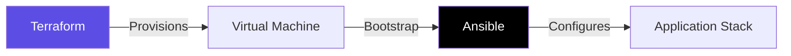

# 🔧 Configuration Management & IaC Mastery

> **"Infrastructure is no longer a physical rack of servers; it is Code. The only difference between a bug and a feature in infrastructure is a single commit."**

## 📚 Overview

Infrastructure as Code (IaC) is the practice of managing and provisioning computing infrastructure through machine-readable definition files, rather than physical hardware configuration or interactive configuration tools. This module covers the industry-standard tools used to build, change, and version infrastructure safely and efficiently.

## 🎓 Learning Objectives

- **Provisioning**: Learn to create complex cloud topologies using Terraform and vendor-specific tools.
- **Image Building**: Master Packer to build "Golden Images" for faster scaling.
- **Kubernetes Packaging**: Use Helm and Kustomize to manage microservice deployments.
- **Server Configuration**: Master Ansible, Chef, and Puppet for agentless and model-driven management.

## 🏗️ Module Roadmap

| Tool | Category | Focus |
| :--- | :--- | :--- |
| **[01-Terraform](./01-Terraform/README.md)** | **IaC** | Provisioning, Modules, State Management. |
| **[02-Ansible](../01-Scripting-Automation/05-Ansible/README.md)** | **Config** | Agentless configuration management. |
| **[03-Chef](./03-Chef/README.md)** | **Config** | Policy-driven automation with Ruby. |
| **[04-Helm](./04-Helm/README.md)** | **K8s** | Kubernetes Package Management. |
| **[05-Cloud-Init](./05-Cloud-Init/README.md)** | **Init** | Instance bootstrapping and User Data. |
| **[06-Kustomize](./06-Kustomize/README.md)** | **K8s** | Native Kubernetes configuration (Overlay). |
| **[07-Puppet](./07-Puppet/README.md)** | **Config** | Model-driven configuration management. |
| **[08-SaltStack](./08-SaltStack/README.md)** | **Orchestration** | Event-driven automation & Remote execution. |
| **[09-Packer](./09-Packer/README.md)** | **Images** | Automated Machine Image building (AMI/VMDK). |
| **[10-Vagrant](./10-Vagrant/README.md)** | **Labs** | Development environment consistency. |
| **[11-Pulumi](./11-Pulumi/README.md)** | **IaC** | Infrastructure as Code in Python/TS/Go. |
| **[12-Vendor-Tools](./12-Vendor-Tools/README.md)** | **Cloud** | CloudFormation, ARM, Deployment Manager. |

---

## 🏗️ The "Provision vs Configure" Pattern

Understanding where one tool stops and another starts is the key to a clean architecture.

- **Phase 1: Provisioning (Terraform)** - Building the "Hardware" (VMs, Networks, DBs).
- **Phase 2: Configuration (Ansible/Chef)** - Building the "Software" (OS Settings, App Installs).
- **Phase 3: Bootstrapping (Cloud-Init)** - The hand-off between the two.

---

## 📖 Real-Life Scenarios

### Scenario 1: The "Click-Ops" Nightmare

**Problem**: An engineer manually created a Load Balancer, 5 Security Groups, and 3 Databases in the AWS Console.  
**Crisis**: No one knew what settings were used. When the dev environment needed to match Production, it took 2 weeks of manual clicking.  
**Solution**: Imported the resources into **Terraform**.  
**Result**: Environment replication now takes 10 minutes.

### Scenario 2: The "Golden Image" Speedup

**Problem**: Installing Java, Nginx, and internal tools on boot via Script took 15 minutes per server.  
**Crisis**: During a traffic spike, the autoscaling group couldn't scale fast enough.  
**Solution**: Used **Packer** to build a "Golden AMI" with everything pre-installed.  
**Result**: Boot time reduced to 2 minutes.

---

## 🚀 How to Succeed

1. **Iterative Provisioning**: Start with a single resource, then modularize.
2. **State is Sacred**: Never manually edit resources managed by Terraform.
3. **Immutable wins**: Prefer rebuilding (Packer/Terraform) over patching (Chef/Puppet) for modern cloud apps.

---

*Code is documentation. If it isn't in Git, it doesn't exist.*