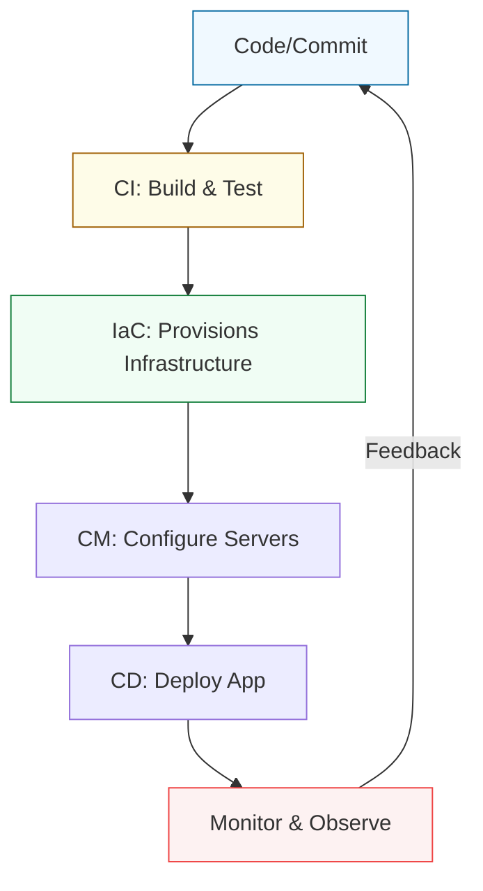

# ⚙️ Phase 2: Advanced Automation & Infrastructure as Code (IaC)

> **"The goal of automation is not to replace the human, but to liberate the human from the mundane, allowing the architect to focus on the impossible."**

## 📚 Overview

Phase 2 takes you deep into the engine room of modern DevOps. Having mastered networking and Linux fundamentals, you will now learn how to treat infrastructure as a software problem. We cover the full spectrum of automation—from scripting local tasks to managing global cloud fleets with declarative code.

## 📋 Curriculum Path

### 1. [01. Infrastructure Automation](./01-Infrastructure-Automation/README.md)
*Treating infrastructure as code.*
- **Advanced Scripting**: Mastering Bash and Python for complex automation.
- **Config Management**: Ansible, Terraform, and the state-based paradigm.
- **Cloud Engineering**: Scaling resources on AWS, Azure, and GCP.
- **System Admin**: Auditing and compliance at scale.

### 2. [02. Delivery & Governance](./02-Delivery-and-Governance/README.md)
*Building the production highway.*
- **CI/CD Pipelines**: Jenkins, Secret scanning, and Static analysis.
- **GitOps**: Declarative deployment models with ArgoCD.
- **Policy as Code**: Enforcement using OPA and Gatekeeper.
- **Security Automation**: DevSecOps integration.

### 3. [03. Modern Operations](./03-Modern-Operations/README.md)
*The future of systems intelligence.*
- **Observability**: Beyond monitoring—logging, tracing, and metrics.
- **AI Operations**: Leveraging LLMs and prompt engineering for DevOps.
- **FinOps**: Cost-as-code and cloud financial management.
- **Next-Gen**: Edge computing (K3s) and Serverless IaC.

---

## 🚀 Career Impact

By completing Phase 2, you transition from a "SysAdmin" to a **Site Reliability Engineer (SRE)** or **Platforms Engineer**. You will be capable of:
- Reducing deployment times from days to seconds.
- Managing thousands of servers with a single commit.
- Implementing "Zero Trust" and "Self-Healing" infrastructures.

---

## 🛠️ Log of Actions
- ✅ **Reorganization**: Consolidated 12 fragmented parts into 3 logical tiers.
- ✅ **Migration**: Safely moved over 1,600 files while maintaining logic.
- ✅ **Standardization**: Applied high-fidelity documentation standards across all parts.
- ✅ **Cleanup**: Removed orphaned directories and legacy mapping markers.
