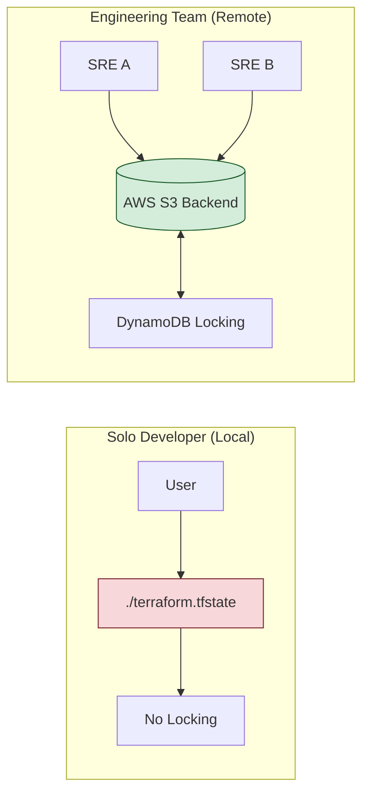

# Local vs. Remote State: Choosing Your Architecture

Deciding where to store your state file is a critical architectural decision. It defines how your team collaborates, how your data is secured, and how your infrastructure scales.

## 🏗️ State Storage Workflow

---

## 🏗️ Real-Life Scenarios

### Scenario 1: The "Loner" Laptop Disaster
**Problem**: A startup's lead developer was the only person managing the cloud. They stored the state file locally on their MacBook Pro.
**Crisis**: The laptop was stolen at a coffee shop. 
**Outcome**: The company had no backup of the state file. When they tried to run Terraform from a new machine, Terraform didn't "know" about the 50+ existing production instances and tried to recreate them, leading to massive resource duplication and downtime.
**Solution**: Use **Remote State (S3)** from Day 1. Remote state persists independently of any individual developer's hardware.
**Result**: The team can now work from any machine, and a lost laptop is just a hardware replacement, not a production catastrophe.

### Scenario 2: The "Double-Apply" Corruption
**Problem**: Two engineers (Alice and Bob) were working on a critical database update using a shared network drive for local state storage.
**Crisis**: Alice ran `terraform apply`. Five seconds later, Bob (not knowing Alice had started) also ran `terraform apply`.
**Outcome**: Since "Local" state (even on a network drive) has no locking mechanism, both processes wrote to the file at the same time. The JSON became malformed and corrupted.
**Solution**: Implement **Remote State Locking** with DynamoDB.
**Result**: When Bob tried to run his apply, he received an error: `Error: Error acquiring the state lock`. The second process was blocked until Alice finished, preserving state integrity.

### Scenario 3: The "Credential Leak" Audit
**Problem**: An internal security audit found that the company was storing state files in a public S3 bucket without encryption.
**Crisis**: The auditor demonstrated they could download the state file and see the plain-text password for the production RDS instance.
**Outcome**: The company failed its SOC2 compliance audit.
**Solution**: Configured the **S3 Backend with `encrypt = true`** and strict IAM policies. 
**Result**: State is now encrypted at rest with KMS, and only the specific CI/CD IAM role has the "Get" permission. The company passed the follow-up audit.

---

## ❓ Interview Questions

1.  **What are the three main problems solved by Remote State?**
    - *Answer*: 1. **Collaboration**: Multiple users can share a single source of truth. 2. **Locking**: Prevents two people from modifying state simultaneously. 3. **Security/Durability**: State is encrypted at rest and backed up (versioned) automatically in the cloud.
2.  **How do you migrate from Local state to Remote state?**
    - *Answer*: 1. Add a `backend` block to your Terraform configuration. 2. Run `terraform init`. 3. Terraform will detect the change and ask to migrate the existing state. 4. Type 'yes' to upload the local state to the remote backend.
3.  **Explain the significance of 'terraform_remote_state' data source.**
    - *Answer*: It allows one Terraform project to read the *outputs* of another project's state. This is essential for building "Tiered Infrastructure" (e.g., an App project reading the VPC ID from a separate Networking project).
4.  **What happens if a backend doesn't support locking?**
    - *Answer*: If the backend (like a raw HTTP backend without specific lock support) doesn't lock, multiple users could run `apply` simultaneously. This leads to race conditions where the state file can become corrupted or infrastructure can get into an inconsistent "Ghost" state.
5.  **Can you use 'Variables' inside a `backend` configuration block?**
    - *Answer*: No. The `backend` block is processed very early in the Terraform lifecycle, before variables are loaded. You must use hardcoded values, or use a "Backend Config File" (`-backend-config=path/to/file`) during `terraform init`.
6.  **Why should you enable 'Versioning' on your S3 state bucket?**
    - *Answer*: State management is high-risk. If a state file becomes corrupted or you make a mistake that deletes half your infrastructure from state, S3 Versioning allows you to instantly "roll back" the state file to a previous healthy version.

---

## 🧠 Comprehensive Quiz (25 Questions)

<b>1. Where is local state stored by default?</b>

Show Answer

Answer: B

<b>2. True/False: Local state supports automatic concurrency locking.</b>

Show Answer

Answer: B

<b>3. Which command is used to transition from local to remote state?</b>

Show Answer

Answer: B

<b>4. Remote state allows teams to share a single _____ of Truth.</b>

Show Answer

Answer: B

<b>5. Which AWS service works with S3 to provide state locking?</b>

Show Answer

Answer: B

<b>6. 'terraform_remote_state' is used to:</b>

Show Answer

Answer: B

<b>7. True/False: You can use HCL variables (var.name) inside a backend block.</b>

Show Answer

Answer: A

<b>8. Which backend is managed by HashiCorp and provides a GUI?</b>

Show Answer

Answer: B

<b>9. In an S3 backend, the 'key' attribute defines:</b>

Show Answer

Answer: B

<b>10. What is the biggest danger of storing state on a local laptop?</b>

Show Answer

Answer: B

<b>11. Which attribute ensures state is encrypted in S3?</b>

Show Answer

Answer: B

<b>12. True/False: You can use Git as a Terraform backend.</b>

Show Answer

Answer: A

<b>13. Which command allows you to provide backend config via an external file?</b>

Show Answer

Answer: A

<b>14. If two people run 'apply' on S3 without DynamoDB, what might happen?</b>

Show Answer

Answer: B

<b>15. 'Partial Configuration' in backends means:</b>

Show Answer

Answer: B

<b>16. True/False: Terraform Cloud supports state locking natively.</b>

Show Answer

Answer: A

<b>17. Which resource type does 'terraform_remote_state' belong to?</b>

Show Answer

Answer: B

<b>18. Why should state storage be kept separate from application code repos?</b>

Show Answer

Answer: B

<b>19. 'State Migration' moves state from _____ to _____.</b>

Show Answer

Answer: B

<b>20. True/False: S3 backends support 'Workspaces'.</b>

Show Answer

Answer: A

<b>21. A 'Bucket Policy' should be used to:</b>

Show Answer

Answer: B

<b>22. 'Standard S3 Backend' requires which two components for full safety?</b>

Show Answer

Answer: B

<b>23. Which command verifies if the current backend is healthy?</b>

Show Answer

Answer: A

<b>24. Remote state is the '_____ of Collaboration' for teams.</b>

Show Answer

Answer: A

<b>25. Without remote state, professional DevOps is _____ .</b>

Show Answer

Answer: B

