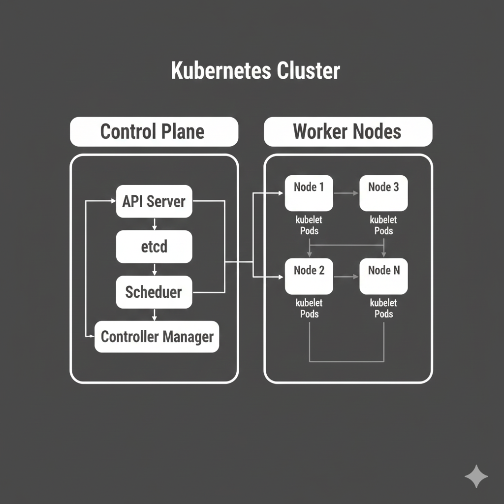
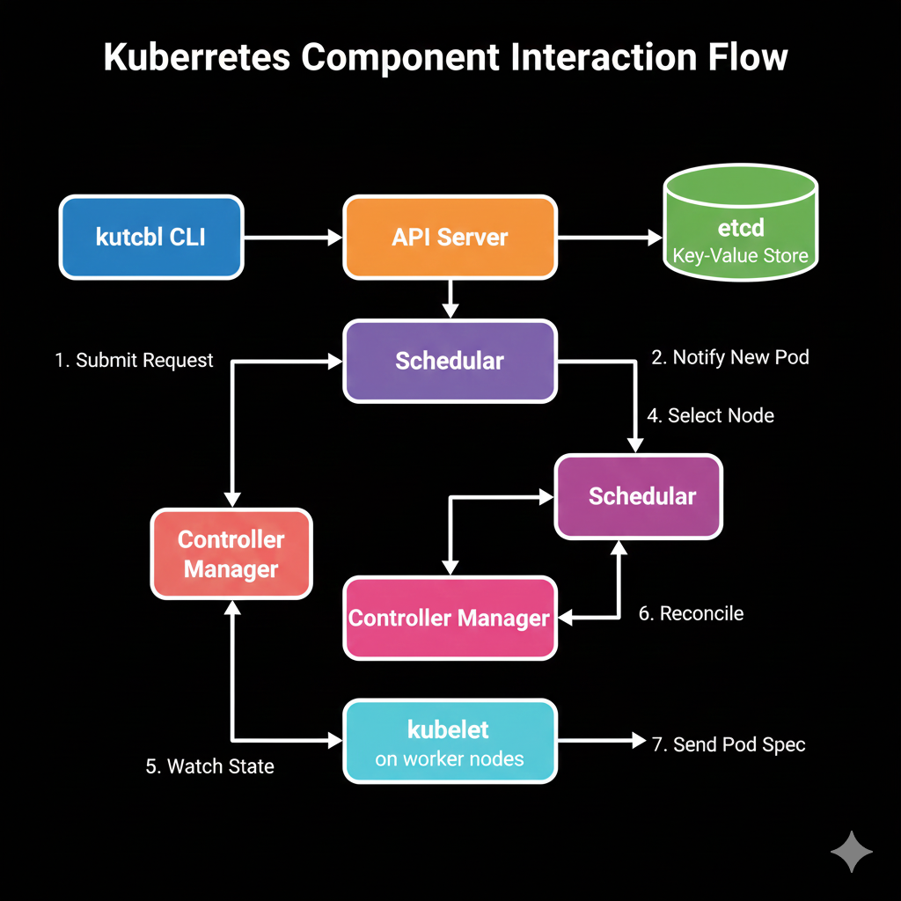
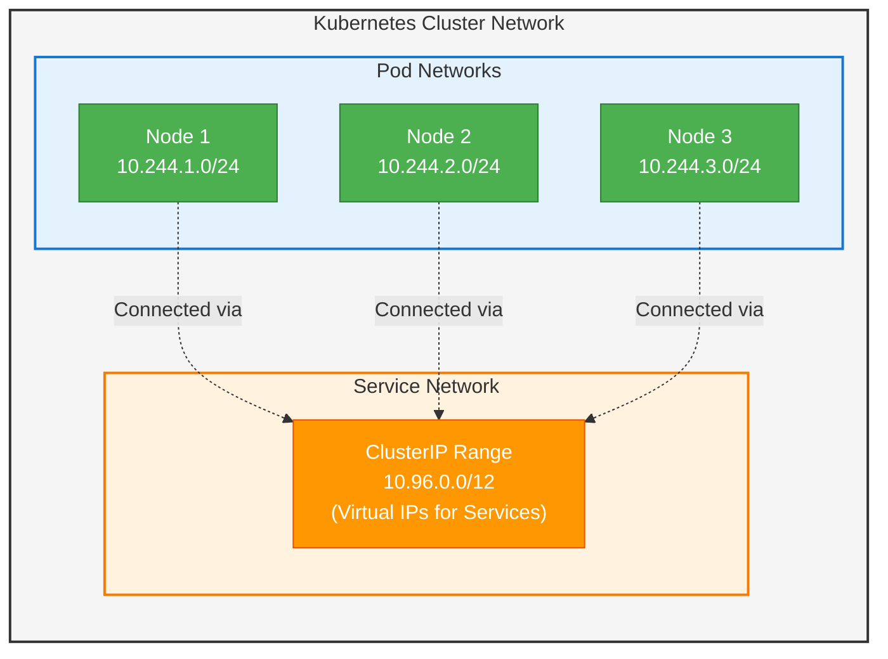

# Kubernetes Cluster Architecture

## Overview

**Kubernetes Cluster** is a set of nodes that run containerized applications managed by Kubernetes. A cluster consists of a control plane that manages the cluster and worker nodes that run application workloads. The cluster provides a unified platform for deploying, scaling, and managing containerized applications.

## What is a Kubernetes Cluster?

A Kubernetes Cluster is:
- A collection of nodes working together as a single system
- Composed of control plane and worker nodes
- The foundation for running containerized applications
- A distributed system providing high availability and scalability

## Cluster Architecture

### High-Level Architecture


### Component Interaction



## Cluster Components

### Control Plane Components

#### 1. API Server (kube-apiserver)
**Purpose**: Central management component and cluster gateway

**Responsibilities**:
- Exposes Kubernetes API
- Validates and processes API requests
- Serves as communication hub for all components
- Handles authentication and authorization

#### 2. etcd
**Purpose**: Distributed key-value store for cluster data

**Responsibilities**:
- Stores all cluster configuration and state
- Provides consistent data storage
- Enables cluster-wide coordination
- Maintains cluster history and versioning

#### 3. Scheduler (kube-scheduler)
**Purpose**: Assigns pods to nodes

**Responsibilities**:
- Watches for unscheduled pods
- Selects optimal nodes for pod placement
- Considers resource requirements and constraints
- Applies scheduling policies and priorities

#### 4. Controller Manager (kube-controller-manager)
**Purpose**: Runs controller processes

**Responsibilities**:
- Manages cluster state reconciliation
- Handles node lifecycle management
- Manages replication and scaling
- Processes cluster events and changes

#### 5. Cloud Controller Manager
**Purpose**: Integrates with cloud provider APIs

**Responsibilities**:
- Manages cloud-specific resources
- Handles load balancer provisioning
- Manages node lifecycle in cloud environments
- Integrates with cloud storage and networking

### Node Components

#### 1. kubelet
**Purpose**: Node agent that manages pods

**Responsibilities**:
- Communicates with API Server
- Manages pod lifecycle on the node
- Reports node and pod status
- Handles volume mounting and container execution

#### 2. kube-proxy
**Purpose**: Network proxy for services

**Responsibilities**:
- Maintains network rules for services
- Handles load balancing for service endpoints
- Manages iptables/IPVS rules
- Enables service discovery and connectivity

#### 3. Container Runtime
**Purpose**: Runs containers

**Supported Runtimes**:
- containerd
- CRI-O
- Docker (deprecated)

## Cluster Types

### 1. Single-Node Cluster
**Use Cases**: Development, testing, learning

```yaml
# minikube example
apiVersion: v1
kind: Node
metadata:
  name: minikube
  labels:
    node-role.kubernetes.io/control-plane: ""
    node-role.kubernetes.io/master: ""
spec:
  taints:
  - effect: NoSchedule
    key: node-role.kubernetes.io/control-plane
```

### 2. Multi-Node Cluster
**Use Cases**: Production, staging environments

```yaml
# Control plane node
apiVersion: v1
kind: Node
metadata:
  name: control-plane-1
  labels:
    node-role.kubernetes.io/control-plane: ""
---
# Worker nodes
apiVersion: v1
kind: Node
metadata:
  name: worker-1
  labels:
    node-role.kubernetes.io/worker: ""
```

### 3. High Availability Cluster
**Use Cases**: Production with high availability requirements

```yaml
# Multiple control plane nodes
apiVersion: v1
kind: Node
metadata:
  name: control-plane-1
  labels:
    node-role.kubernetes.io/control-plane: ""
---
apiVersion: v1
kind: Node
metadata:
  name: control-plane-2
  labels:
    node-role.kubernetes.io/control-plane: ""
---
apiVersion: v1
kind: Node
metadata:
  name: control-plane-3
  labels:
    node-role.kubernetes.io/control-plane: ""
```

## Cluster Networking

### Network Model



### CNI Plugins
```yaml
# Flannel CNI configuration
apiVersion: v1
kind: ConfigMap
metadata:
  name: kube-flannel-cfg
  namespace: kube-system
data:
  cni-conf.json: |
    {
      "name": "cbr0",
      "cniVersion": "0.3.1",
      "plugins": [
        {
          "type": "flannel",
          "delegate": {
            "hairpinMode": true,
            "isDefaultGateway": true
          }
        },
        {
          "type": "portmap",
          "capabilities": {
            "portMappings": true
          }
        }
      ]
    }
  net-conf.json: |
    {
      "Network": "10.244.0.0/16",
      "Backend": {
        "Type": "vxlan"
      }
    }
```

### Service Types
```yaml
# ClusterIP Service
apiVersion: v1
kind: Service
metadata:
  name: internal-service
spec:
  type: ClusterIP
  selector:
    app: myapp
  ports:
  - port: 80
    targetPort: 8080
---
# NodePort Service
apiVersion: v1
kind: Service
metadata:
  name: nodeport-service
spec:
  type: NodePort
  selector:
    app: myapp
  ports:
  - port: 80
    targetPort: 8080
    nodePort: 30080
---
# LoadBalancer Service
apiVersion: v1
kind: Service
metadata:
  name: loadbalancer-service
spec:
  type: LoadBalancer
  selector:
    app: myapp
  ports:
  - port: 80
    targetPort: 8080
```

## Cluster Setup Methods

### 1. kubeadm
```bash
# Initialize control plane
kubeadm init --pod-network-cidr=10.244.0.0/16

# Join worker nodes
kubeadm join <control-plane-endpoint> --token <token> --discovery-token-ca-cert-hash <hash>

# Install CNI plugin
kubectl apply -f https://raw.githubusercontent.com/flannel-io/flannel/master/Documentation/kube-flannel.yml
```

### 2. Managed Kubernetes Services

#### Amazon EKS
```bash
# Create EKS cluster
eksctl create cluster --name my-cluster --region us-west-2 --nodegroup-name workers --node-type m5.large --nodes 3

# Update kubeconfig
aws eks update-kubeconfig --region us-west-2 --name my-cluster
```

#### Google GKE
```bash
# Create GKE cluster
gcloud container clusters create my-cluster --zone us-central1-a --num-nodes 3

# Get credentials
gcloud container clusters get-credentials my-cluster --zone us-central1-a
```

#### Azure AKS
```bash
# Create AKS cluster
az aks create --resource-group myResourceGroup --name myAKSCluster --node-count 3 --enable-addons monitoring --generate-ssh-keys

# Get credentials
az aks get-credentials --resource-group myResourceGroup --name myAKSCluster
```

### 3. Development Clusters

#### minikube
```bash
# Start minikube cluster
minikube start --driver=docker --cpus=2 --memory=4g

# Enable addons
minikube addons enable ingress
minikube addons enable dashboard
```

#### kind (Kubernetes in Docker)
```yaml
# kind-config.yaml
kind: Cluster
apiVersion: kind.x-k8s.io/v1alpha4
nodes:
- role: control-plane
- role: worker
- role: worker
```

```bash
# Create kind cluster
kind create cluster --config kind-config.yaml --name my-cluster
```

## Cluster Security

### RBAC Configuration
```yaml
# ClusterRole
apiVersion: rbac.authorization.k8s.io/v1
kind: ClusterRole
metadata:
  name: pod-reader
rules:
- apiGroups: [""]
  resources: ["pods"]
  verbs: ["get", "watch", "list"]
---
# ClusterRoleBinding
apiVersion: rbac.authorization.k8s.io/v1
kind: ClusterRoleBinding
metadata:
  name: read-pods
subjects:
- kind: User
  name: jane
  apiGroup: rbac.authorization.k8s.io
roleRef:
  kind: ClusterRole
  name: pod-reader
  apiGroup: rbac.authorization.k8s.io
```

### Network Policies
```yaml
apiVersion: networking.k8s.io/v1
kind: NetworkPolicy
metadata:
  name: deny-all
  namespace: production
spec:
  podSelector: {}
  policyTypes:
  - Ingress
  - Egress
---
apiVersion: networking.k8s.io/v1
kind: NetworkPolicy
metadata:
  name: allow-frontend-to-backend
  namespace: production
spec:
  podSelector:
    matchLabels:
      app: backend
  policyTypes:
  - Ingress
  ingress:
  - from:
    - podSelector:
        matchLabels:
          app: frontend
    ports:
    - protocol: TCP
      port: 8080
```

### Pod Security Standards
```yaml
apiVersion: v1
kind: Namespace
metadata:
  name: secure-namespace
  labels:
    pod-security.kubernetes.io/enforce: restricted
    pod-security.kubernetes.io/audit: restricted
    pod-security.kubernetes.io/warn: restricted
```

## Cluster Monitoring

### Metrics Server
```yaml
apiVersion: apps/v1
kind: Deployment
metadata:
  name: metrics-server
  namespace: kube-system
spec:
  selector:
    matchLabels:
      k8s-app: metrics-server
  template:
    spec:
      containers:
      - name: metrics-server
        image: k8s.gcr.io/metrics-server/metrics-server:v0.6.1
        args:
        - --cert-dir=/tmp
        - --secure-port=4443
        - --kubelet-preferred-address-types=InternalIP,ExternalIP,Hostname
        - --kubelet-use-node-status-port
        - --metric-resolution=15s
```

### Prometheus Monitoring
```yaml
apiVersion: apps/v1
kind: Deployment
metadata:
  name: prometheus
  namespace: monitoring
spec:
  selector:
    matchLabels:
      app: prometheus
  template:
    spec:
      containers:
      - name: prometheus
        image: prom/prometheus:latest
        ports:
        - containerPort: 9090
        volumeMounts:
        - name: config
          mountPath: /etc/prometheus
      volumes:
      - name: config
        configMap:
          name: prometheus-config
```

### Cluster Logging
```yaml
apiVersion: apps/v1
kind: DaemonSet
metadata:
  name: fluentd
  namespace: kube-system
spec:
  selector:
    matchLabels:
      name: fluentd
  template:
    spec:
      containers:
      - name: fluentd
        image: fluent/fluentd-kubernetes-daemonset:v1-debian-elasticsearch
        env:
        - name: FLUENT_ELASTICSEARCH_HOST
          value: "elasticsearch.logging.svc.cluster.local"
        - name: FLUENT_ELASTICSEARCH_PORT
          value: "9200"
```

## Cluster Scaling

### Horizontal Pod Autoscaler
```yaml
apiVersion: autoscaling/v2
kind: HorizontalPodAutoscaler
metadata:
  name: webapp-hpa
spec:
  scaleTargetRef:
    apiVersion: apps/v1
    kind: Deployment
    name: webapp
  minReplicas: 2
  maxReplicas: 10
  metrics:
  - type: Resource
    resource:
      name: cpu
      target:
        type: Utilization
        averageUtilization: 70
  - type: Resource
    resource:
      name: memory
      target:
        type: Utilization
        averageUtilization: 80
```

### Vertical Pod Autoscaler
```yaml
apiVersion: autoscaling.k8s.io/v1
kind: VerticalPodAutoscaler
metadata:
  name: webapp-vpa
spec:
  targetRef:
    apiVersion: apps/v1
    kind: Deployment
    name: webapp
  updatePolicy:
    updateMode: "Auto"
  resourcePolicy:
    containerPolicies:
    - containerName: webapp
      maxAllowed:
        cpu: 1
        memory: 2Gi
      minAllowed:
        cpu: 100m
        memory: 128Mi
```

### Cluster Autoscaler
```yaml
apiVersion: apps/v1
kind: Deployment
metadata:
  name: cluster-autoscaler
  namespace: kube-system
spec:
  selector:
    matchLabels:
      app: cluster-autoscaler
  template:
    spec:
      containers:
      - image: k8s.gcr.io/autoscaling/cluster-autoscaler:v1.21.0
        name: cluster-autoscaler
        command:
        - ./cluster-autoscaler
        - --v=4
        - --stderrthreshold=info
        - --cloud-provider=aws
        - --skip-nodes-with-local-storage=false
        - --expander=least-waste
        - --node-group-auto-discovery=asg:tag=k8s.io/cluster-autoscaler/enabled,k8s.io/cluster-autoscaler/my-cluster
        - --balance-similar-node-groups
        - --skip-nodes-with-system-pods=false
```

## Cluster Maintenance

### Cluster Upgrades
```bash
# Check current version
kubectl version --short

# Plan upgrade (kubeadm)
kubeadm upgrade plan

# Upgrade control plane
kubeadm upgrade apply v1.28.0

# Upgrade kubelet and kubectl
apt-mark unhold kubeadm kubelet kubectl
apt-get update && apt-get install -y kubeadm=1.28.0-00 kubelet=1.28.0-00 kubectl=1.28.0-00
apt-mark hold kubeadm kubelet kubectl

# Restart kubelet
systemctl daemon-reload
systemctl restart kubelet
```

### Backup and Recovery
```bash
# Backup etcd
ETCDCTL_API=3 etcdctl snapshot save backup.db \
  --endpoints=https://127.0.0.1:2379 \
  --cacert=/etc/kubernetes/pki/etcd/ca.crt \
  --cert=/etc/kubernetes/pki/etcd/server.crt \
  --key=/etc/kubernetes/pki/etcd/server.key

# Restore etcd
ETCDCTL_API=3 etcdctl snapshot restore backup.db \
  --data-dir=/var/lib/etcd-restore \
  --name=etcd-1 \
  --initial-cluster=etcd-1=https://10.0.0.1:2380 \
  --initial-advertise-peer-urls=https://10.0.0.1:2380
```

### Certificate Management
```bash
# Check certificate expiration
kubeadm certs check-expiration

# Renew certificates
kubeadm certs renew all

# Renew specific certificate
kubeadm certs renew apiserver
kubeadm certs renew etcd-server
```

## Cluster Troubleshooting

### Common Issues

#### 1. Cluster Connectivity
```bash
# Check cluster info
kubectl cluster-info

# Check node status
kubectl get nodes

# Check component status
kubectl get componentstatuses

# Check system pods
kubectl get pods -n kube-system
```

#### 2. DNS Issues
```bash
# Test DNS resolution
kubectl run -it --rm debug --image=busybox --restart=Never -- nslookup kubernetes.default

# Check CoreDNS
kubectl get pods -n kube-system -l k8s-app=kube-dns
kubectl logs -n kube-system -l k8s-app=kube-dns
```

#### 3. Network Issues
```bash
# Check CNI configuration
ls -la /etc/cni/net.d/

# Test pod-to-pod connectivity
kubectl run test-pod-1 --image=busybox --restart=Never -- sleep 3600
kubectl run test-pod-2 --image=busybox --restart=Never -- sleep 3600
kubectl exec test-pod-1 -- ping <test-pod-2-ip>
```

#### 4. Resource Issues
```bash
# Check resource usage
kubectl top nodes
kubectl top pods --all-namespaces

# Check resource quotas
kubectl describe quota --all-namespaces

# Check limit ranges
kubectl describe limitrange --all-namespaces
```

### Debug Commands
```bash
# Cluster events
kubectl get events --sort-by=.metadata.creationTimestamp

# Component logs
journalctl -u kubelet -f
journalctl -u docker -f
journalctl -u containerd -f

# API server logs
kubectl logs -n kube-system kube-apiserver-<control-plane-node>

# etcd logs
kubectl logs -n kube-system etcd-<control-plane-node>
```

## Best Practices

### 1. Cluster Design
- Use multiple control plane nodes for high availability
- Separate control plane and worker nodes
- Plan for appropriate cluster sizing
- Implement proper network segmentation

### 2. Security
- Enable RBAC and implement least privilege
- Use network policies for micro-segmentation
- Implement Pod Security Standards
- Regular security audits and updates

### 3. Monitoring and Logging
- Deploy comprehensive monitoring solution
- Implement centralized logging
- Set up alerting for critical events
- Monitor resource usage and capacity

### 4. Maintenance
- Plan regular upgrade cycles
- Implement backup and disaster recovery
- Test failure scenarios
- Document operational procedures

## Cluster Patterns

### Multi-Cluster Architecture
```yaml
# Cluster federation or multi-cluster management
apiVersion: v1
kind: ConfigMap
metadata:
  name: cluster-config
data:
  production-us-east: |
    server: https://prod-us-east.k8s.example.com
    certificate-authority-data: LS0tLS1...
  production-us-west: |
    server: https://prod-us-west.k8s.example.com
    certificate-authority-data: LS0tLS1...
  staging: |
    server: https://staging.k8s.example.com
    certificate-authority-data: LS0tLS1...
```

### Edge Computing
```yaml
# Edge cluster configuration
apiVersion: v1
kind: Node
metadata:
  name: edge-node-1
  labels:
    node-role.kubernetes.io/edge: ""
    topology.kubernetes.io/zone: edge-location-1
spec:
  taints:
  - key: node-role.kubernetes.io/edge
    value: "true"
    effect: NoSchedule
```

## Conclusion

Kubernetes Clusters provide:
- Scalable platform for containerized applications
- High availability and fault tolerance
- Unified management interface
- Flexible deployment options
- Comprehensive ecosystem integration

Understanding cluster architecture, components, and operations is essential for successfully deploying and managing Kubernetes in production environments.