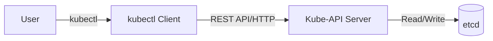

# ⌨️ kubectl: The Kubernetes Command Center


## 📋 Overview

**kubectl** is the official command-line interface (CLI) tool for interacting with the Kubernetes API. It is the bridge between the human operator and the cluster's internal components. Mastering `kubectl` is the first step toward becoming a proficient Kubernetes administrator.

### 🎯 Learning Objectives

By the end of this module, you will:
- Master both **Imperative** and **Declarative** management styles.
- Become proficient in **Filtering** and **Formatting** output.
- Automate cluster tasks using **Aliases** and **JSONPath**.
- Troubleshoot workloads using diagnostic commands (`logs`, `exec`, `debug`).
- Understand how `kubectl` interacts with the **API Server request pipeline**.

---

## 🏗️ How kubectl Works

When you run a command like `kubectl get pods`, the following happens:
1.  **Authentication**: `kubectl` looks at your `~/.kube/config` for credentials.
2.  **Conversion**: It converts your human-friendly command (or YAML) into a REST API call (usually JSON).
3.  **Communication**: It sends an HTTP request to the **API Server**.
4.  **Formatting**: It receives the raw JSON response and formats it into the table or YAML you see.

### High-Level Flow


---

## 🚜 Management Styles: Imperative vs. Declarative

### 1. Imperative (Commands)
Best for quick "one-off" tasks or troubleshooting.
```bash
# Get it done now
kubectl run nginx --image=nginx
kubectl expose pod nginx --port=80
```

### 2. Declarative (Manifests)
Best for production and version control. You define the **Desired State**.
```bash
# Keep it in Git
kubectl apply -f deployment.yaml
```

---

## 🚀 Pro-Level Productivity: The Kubectl "God Mode"

### 1. The Power of JSONPath
Stop scrolling through massive YAML files. Use JSONPath to extract exactly what you need.

**Get the IP addresses of all nodes:**
```bash
kubectl get nodes -o jsonpath='{.items[*].status.addresses[?(@.type=="InternalIP")].address}'
```

### 2. Custom Columns for Reporting
Create your own terminal views for clean status reports.
```bash
kubectl get pods -o custom-columns="POD_NAME:.metadata.name,RESTARTS:.status.containerStatuses[0].restartCount,NODE:.spec.nodeName"
```

---

## 🛠️ Essential Diagnostic Toolkit

| Command | Usage | Why use it? |
| :--- | :--- | :--- |
| `kubectl logs -f` | Continuous logs | Watch application output in real-time. |
| `kubectl describe` | Detailed status | See events (e.g., PullBackOff, OOMKilled). |
| `kubectl exec -it` | Shell access | Check local files or environment variables. |
| `kubectl port-forward` | Local access | Reach internal apps without a LoadBalancer. |
| `kubectl debug` | Ephemeral containers | Debug "distroless" images safely. |

---

## 📖 Real-World DevOps Story: "The Accidental Purge"

**The Scenario:** A junior engineer wanted to delete all pods in their local development namespace. They intended to run `kubectl delete pods --all`. However, they were accidentally in the `production` context and didn't specify the resource. 

**The Result:** Every resource in the PRODUCTION namespace—Deployments, Services, ConfigMaps—was deleted. Because they weren't using **GitOps**, the recovery took hours of manual toil.

**The Lesson:** 
- **Always** use a CLI prompt that shows your current context (e.g., Starship).
- Use `kubectx` and `kubens` to separate your environments visually.

---

## 👨‍💻 Interview Preparation (CLI Master)

1. **Q: What happens when you run `kubectl logs --previous`?**
   *   *A: It retrieves logs from the container's previous instantiation (the one that just crashed).*

2. **Q: How can you see the exact API request kubectl sends?**
   *   *A: Increase the verbosity: `kubectl get pods -v=8`.*

3. **Q: How do you "restart" a Deployment without downtime?**
   *   *A: `kubectl rollout restart deployment <name>`. This triggers a rolling update.*

---

## 🧠 Knowledge Check

1. Which command switches your active namespace? (`kubectl config set-context --current --namespace=<ns>`)
2. What flag allows you to test a command without actually changing anything? (`--dry-run=client`)
3. Where does `kubectl` store cluster connection information? (`~/.kube/config`)

---

## 🔗 Internal Navigation
- [Next: Pods and Nodes](../03-Pods-and-Nodes/README.md)
- [Back: Cluster Architecture](../01-Cluster-Architecture/README.md)