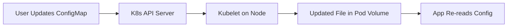

# ⚙️ ConfigMaps and Secrets: Decoupling Configuration

## 📋 Overview

In Kubernetes, it is a best practice to decouple your application code from its configuration. **ConfigMaps** and **Secrets** allow you to inject environment variables, configuration files, and credentials into your containers without rebuilding images.

### 🎯 Learning Objectives

By the end of this module, you will:
- Master the difference between **sensitive** (Secret) and **non-sensitive** (ConfigMap) data.
- Inject configuration via **Environment Variables** and **Volume Mounts**.
- Implement **Immutability** to prevent accidental configuration changes.
- Secure secrets using **RBAC** and **Encryption at Rest**.
- Use the `stringData` field for easier manifest management.

---

## 🎭 The Dynamic Duo: ConfigMaps vs. Secrets

| Feature | ConfigMap | Secret |
| :--- | :--- | :--- |
| **Use Case** | App settings, Feature flags, API URLs. | Passwords, API Keys, SSL Certs. |
| **Storage** | Plain text. | Base64 encoded. |
| **Security** | Low (Internal Visibility). | High (Restricted via RBAC). |

---

## 🛠️ 1. ConfigMaps: Non-Sensitive Metadata

ConfigMaps allow you to store data as key-value pairs or as entire files.

### Creation (Imperative)
```bash
kubectl create configmap my-config --from-literal=LOG_LEVEL=debug --from-literal=APP_COLOR=blue
```

### Usage (Declarative)
```yaml
spec:
  containers:
    - name: app
      env:
        - name: LOG_LEVEL
          valueFrom:
            configMapKeyRef:
              name: my-config
              key: LOG_LEVEL
```

---

## 🔒 2. Secrets: Sensitive Credentials

Secrets are meant for small amounts of sensitive data. **Important:** By default, Secrets are base64 encoded, which is NOT encryption.

### Creation (Best Practice with stringData)
```yaml
apiVersion: v1
kind: Secret
metadata:
  name: db-credentials
type: Opaque
stringData:
  DB_PASSWORD: "verysecretpassword" # K8s will base64 encode this for you
```

### Mounting as a Volume
Mounting a secret as a volume creates a file in the container. This is more secure than environment variables because env vars often leak into logs.
```yaml
volumeMounts:
  - name: secret-volume
    mountPath: "/etc/db-secrets"
    readOnly: true
```

---

## 🔄 Live Configuration Updates

When you mount a ConfigMap or Secret as a **Volume**, the files inside the pod are updated automatically within seconds of you updating the resource in the cluster.


*Note: Apps must be designed to watch for file changes to benefit from this without a restart.*

---

## 📖 Real-World DevOps Story: "The Git-Leaked Password"

**The Scenario:** A developer committed a `secret.yaml` containing the production DB password to a public repository. Within minutes, the credentials were compromised.

**The Result:** The team had to rotate the password immediately. Because they were using Kubernetes, they simply updated the Secret object and performed a `kubectl rollout restart`. All 20 instances of the app picked up the new password without manual configuration on each server.

**The Lesson:** Never commit real secrets to Git. Use placeholders and populate them via CI/CD pipelines or Secret Management operators.

---

## 👨‍💻 Interview Preparation

1. **Q: How do you access a Secret value in the terminal for debugging?**
   *   *A: `kubectl get secret <name> -o jsonpath='{.data.password}' | base64 --decode`.*

2. **Q: Why would you pick a Volume Mount over an Environment Variable for a Secret?**
   *   *A: Environment variables are often printed in debug logs or visible via `docker inspect`. Volume mounts are only visible to the running process inside the pod.*

3. **Q: What is an Immutable ConfigMap?**
   *   *A: You can set `immutable: true`. This prevents accidental updates and improves cluster performance by reducing the load on the API server.*

---

## 🧠 Knowledge Check

1. What is the max size for a single ConfigMap? (1 MiB)
2. Which field allows you to provide plain-text values in a Secret yaml? (`stringData`)
3. Does a pod restart automatically when its referenced ConfigMap changes? (No, only volume files update)

---

## 🔗 Internal Navigation
- [Next: Persistence and Storage](../../Part-4-State-and-Persistence/08-Persistence-and-Storage/README.md)
- [Back: Ingress Controllers](../06-Ingress-Controllers/README.md)