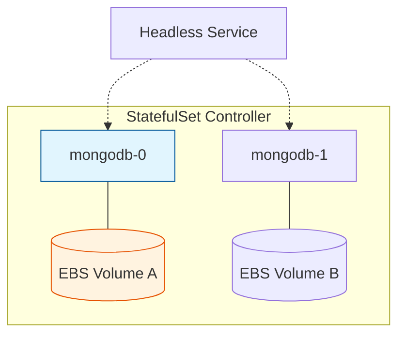

# 🏗️ StatefulSets, Jobs, and CronJobs

## 📋 Overview

While most web applications are **stateless** (managed by Deployments), mission-critical systems like databases, message brokers, and batch processors require **Persistence** and **Ordered Execution**. This module covers the advanced controllers used for workloads that need a stable identity or a defined endpoint.

### 🎯 Learning Objectives

By the end of this module, you will:
- Differientiate between **Deployments** (Stateless) and **StatefulSets** (Stateful).
- Implement stable storage using **Volume Claim Templates**.
- Configure **Headless Services** for direct pod discovery.
- Execute batch processing using **Jobs**.
- Automate scheduled tasks (backups, reports) using **CronJobs**.

---

## 🏗️ 1. StatefulSets: The Database Standard

StatefulSets are the "Gold Standard" for running databases like PostgreSQL, MongoDB, or Redis. They ensure each pod has a sticky identity that persists across restarts.

### Key Features
- **Stable Pod Names**: `db-0`, `db-1`, `db-2`.
- **Persistent Storage**: `db-0` is always linked to `pvc-db-0`, ensuring it never loses its specific data.
- **Sequential Deployment**: Pod 1 won't start until Pod 0 is "Ready."



---

## ⚡ 2. Jobs: Do it Once

A **Job** creates one or more Pods and ensures that a specified number of them successfully terminate. Once the task is finished, the Job stops.

### Use Cases
- Database Migrations.
- One-time Image Processing.
- Batch Data Uploads.

### ⚙️ Job Parallelism
```yaml
spec:
  completions: 10   # Run 10 times total
  parallelism: 3     # Run 3 at a time
```

---

## 🕒 3. CronJobs: Do it on Schedule

A **CronJob** is a "Job Scheduler." It creates Jobs on a repeating schedule (using Linux Cron syntax).

### ⚙️ Best Practice Manifest
```yaml
apiVersion: batch/v1
kind: CronJob
metadata:
  name: nightly-backup
spec:
  schedule: "0 2 * * *"  # 2:00 AM every day
  concurrencyPolicy: Forbid # Don't start a new one if old is running
  jobTemplate:
    spec:
      template:
        spec:
          containers:
          - name: backupper
            image: alpine:latest
          restartPolicy: OnFailure
```

---

## 📖 Real-World DevOps Story: "The Persistent Duplicate"

**The Scenario:** A team was upgrading their 3-node RabbitMQ Statewide. They noticed the upgrade hung after the first node.

**The Cause:** RabbitMQ-0 was healthy, but RabbitMQ-1 failed to start because the cloud provider couldn't move the volume fast enough. Because StatefulSets enforce **Ordered Updates**, Kubernetes refused to proceed to node 2, protecting the cluster from a total outage.

**The Lesson:** StatefulSets are cautious by design. They prioritize **Data Integrity** over speed. Always monitor the order of operations during a stateful rollout.

---

## 👨‍💻 Interview Preparation

1. **Q: What is a "Headless Service" and why is it used with StatefulSets?**
   *   *A: A service with `clusterIP: None`. It doesn't load-balance; instead, it returns the direct IP addresses of the pods. This allows applications to discover and connect to specific cluster members directly.*

2. **Q: What is the difference between `restartPolicy: Never` and `OnFailure` in a Job?**
   *   *A: `Never` creates a new Pod if the container crashes. `OnFailure` restarts the container inside the *same* pod.*

3. **Q: How do you handle CronJob failures in Production?**
   *   *A: Monitor the `status.failed` count and set a `startingDeadlineSeconds` to handle cases where the cluster is too busy to start the job on time.*

---

## 🧠 Knowledge Check

1. In a StatefulSet named `redis`, what is the pod name of the second replica? (`redis-1`)
2. Which controller is best for running a script every Sunday at midnight? (CronJob)
3. If a StatefulSet is scaled down from 3 to 1, in which order are the pods deleted? (`db-2` first, then `db-1`)

---

## 🔗 Internal Navigation
- [Next: Managed Kubernetes EKS](../../Part-5-Cloud-Ops-and-Admin/10-Managed-Kubernetes-EKS/README.md)
- [Back: Persistence and Storage](../08-Persistence-and-Storage/README.md)