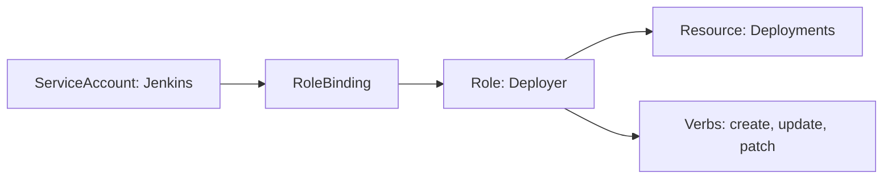

# 🛡️ Cluster Administration: Security and Governance

## 📋 Overview

Managing a Kubernetes cluster involves more than just deploying apps. You must ensure **Multi-tenancy**, enforce **Security Best Practices**, and manage **Resources** effectively. This module covers the administrative tools used to keep a cluster healthy, secure, and cost-efficient.

### 🎯 Learning Objectives

By the end of this module, you will:
- Master **RBAC** (Role-Based Access Control) for fine-grained permissions.
- Isolate workloads using **Namespaces**.
- Enforce security standards using **Pod Security Contexts**.
- Prevent "Noisy Neighbors" using **ResourceQuotas** and **LimitRanges**.
- Audit cluster access and verify permissions with `kubectl auth can-i`.

---

## 🔑 1. RBAC: The Gatekeeper

Kubernetes security is built on the principle of **Least Privilege**. RBAC allows you to define exactly who can do what.

### The RBAC Model
1.  **Who** (Subjects): Users, Groups, or **ServiceAccounts**.
2.  **What** (Roles): Permissions like `get pods` or `delete services`.
3.  **Where** (Bindings): Linking the "Who" to the "What" in a specific Namespace.



---

## 🏗️ 2. Namespaces: Virtual Isolation

Namespaces are the primary tool for organizing your cluster. They partition resources into logical groups.

- **Isolation**: Prevents name collisions (e.g., Two apps can both be named `web` if they are in different namespaces).
- **Security**: You can restrict a developer to only see the `dev` namespace.
- **Resource Management**: You can set a budget for a whole namespace.

---

## 📊 3. Resource Hygiene

Without limits, a single leaking application can crash an entire Node.

### ResourceQuotas (The Budget)
Limits the *total* resources consumed by a Namespace.
```yaml
spec:
  hard:
    pods: "10"
    requests.cpu: "4"
    requests.memory: 10Gi
```

### LimitRanges (The Rules)
Sets default requests/limits for *individual* pods in a namespace.

---

## 🛡️ 4. Pod Security Standards

Control the "dangerous" things a pod can do (like running as root or accessing the host filesystem).

- **Privileged**: No restrictions. Mostly for system pods.
- **Baseline**: Prevents common privilege escalations.
- **Restricted**: Highly secure. Forces the pod to run as non-root.

---

## 📖 Real-World DevOps Story: "The Admin who deleted the wrong Namespace"

**The Scenario:** A junior admin ran `kubectl delete ns project-x`. They didn't realize that in this cluster, `project-x` contained the production database and all active API gateways.

**The Result:** Because a Namespace is a parent container, Kubernetes immediately deleted every resource inside it. The entire platform went offline in seconds.

**The Lesson:** 
- **RBAC is King**: Only senior admins should have `delete namespace` rights.
- **Confirmation**: Always verify your context (`kubectl config current-context`) before running destructive commands.

---

## 👨‍💻 Interview Preparation

1. **Q: What is a ServiceAccount?**
   *   *A: It is an identity used by processes (pods) inside the cluster to authenticate to the Kubernetes API.*

2. **Q: How can you test if a user can delete pods in the 'dev' namespace?**
   *   *A: Use `kubectl auth can-i delete pods -n dev --as=developer-alice`.*

3. **Q: Explain the difference between 'Limits' and 'Requests'.**
   *   *A: **Requests** are what the pod is guaranteed to have (used for scheduling). **Limits** are the hard cap (if the pod exceeds this, it may be throttled or killed).*

---

## 🧠 Knowledge Check

1. Which resource is used to provide an identity to a Pod? (ServiceAccount)
2. What is the cluster-wide version of a Role? (ClusterRole)
3. How do you prevent a pod from running as the root user? (Use `runAsNonRoot: true` in the `securityContext`)

---

## 🔗 Internal Navigation
- [Next: Interview Prep & Quizzes](../../Part-6-Mastery-and-Resources/12-Interview-Questions-and-Quizzes/README.md)
- [Back: Managed Kubernetes EKS](../10-Managed-Kubernetes-EKS/README.md)