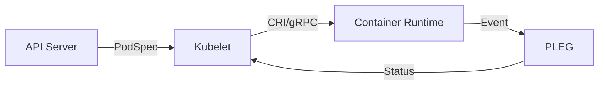

# 📦 Kubernetes Deep Dives & Supplementary Resources

## 📋 Overview

While the main modules cover the essential path to Kubernetes mastery, this section provides specialized **Deep Dives** into individual components and advanced tooling. This is where you transition from "Administrator" to "System Architect."

### 🎯 Learning Objectives

By the end of this resource hub, you will:
- Understand **Kubelet Internals** and the PLEG lifecycle.
- Master **Helm** for templating and managing complex releases.
- Implement **Dynamic Storage Provisioning** using CSI drivers.
- Configure **Identity & Access** using ServiceAccounts for automation.
- Deep dive into specialized **Volume Types** (EmptyDir, HostPath, NFS).

---

## 🏗️ 1. Kubelet Internals: The Heart of the Node

The **[Kubelet](./Kubelet/README.md)** is the primary "node agent." It ensures that containers described in PodSpecs are running and healthy.

### The Sync Loop & PLEG
- **Sync Loop**: The main process that continuously compares "Actual" vs "Desired" state.
- **PLEG (Pod Lifecycle Event Generator)**: The subsystem that polls the runtime for container changes.

---

## 📦 2. Helm: The Kubernetes Package Manager

Raw YAML is difficult to manage at scale. **[Helm](./Helm/README.md)** allows you to package, version, and share Kubernetes applications.

### Key Components
- **Value Templates**: Use variables in your YAML (e.g., `{{ .Values.replicaCount }}`).
- **Rollbacks**: Helm tracks releases, allowing you to instantly revert a deployment.
- **Charts**: A collection of files that describe a related set of Kubernetes resources.

---

## 🛡️ 3. ServiceAccounts: Non-Human Identities

**[ServiceAccounts](./ServiceAccounts/README.md)** provide identities for processes that run in a Pod. 

- **Automation**: Used by tools like Jenkins, Prometheus, or the Kubernetes Dashboard.
- **RBAC**: You can grant specific permissions to a ServiceAccount to talk to the API Server.

---

## 📘 4. Advanced Storage Options

- **[Dynamic Provisioning](./DynamicProvisioning/README.md)**: Automatically creating cloud disks when a user requests storage.
- **[Volume Types](./VolumeTypes/README.md)**: Deep dive into the different ways to store data, from ephemeral `EmptyDir` to cross-node `NFS`.

---

## 📖 Real-World DevOps Story: "The Day the Node Went Ghost"

**The Scenario:** A high-traffic node randomly switched between `Ready` and `NotReady` for weeks. The pods were healthy, but the node status kept flipping in the Dashboard.

**The Root Cause:** The team discovered `PLEG is not healthy` in the Kubelet logs. An application bug was causing a container to crash and restart 1,000 times a minute. The Kubelet's event generator (PLEG) couldn't keep up with the status updates and hung.

**The Lesson:** 
- Monitor **Kubelet Health** specifically.
- Use **Backoff Limits** in your pod specifications to prevent "Status Storms."

---

## 👨‍💻 Interview Preparation

1. **Q: How does a Kubelet know which pods to run?**
   *   *A: It watches the API Server for pods where the `spec.nodeName` matches its own node name.*

2. **Q: What is the difference between a Helm Chart and a Helm Release?**
   *   *A: A **Chart** is the blueprint (package); a **Release** is a specific instance of that chart running in a namespace.*

3. **Q: Why should we avoid using the "default" ServiceAccount in production?**
   *   *A: It is a security risk. If you accidentally grant broad permissions to the default SA, every single pod in that namespace inherits them.*

---

## 🧠 Knowledge Check

1. Which component is responsible for executing Liveness and Readiness probes? (Kubelet)
2. What is the command to roll back a Helm deployment? (`helm rollback <release>`)
3. Which object is used to give a Jenkins pod permission to create new pods? (ServiceAccount)

---

## 🔗 Internal Navigation
- [Back: Part 6 Overview](../README.md)
- [View Resource List: Observability Foundations](../../../02-Observability-Foundations/README.md)
