# StatefulSet Architecture and Concepts

This document provides visual representations of StatefulSet architecture, behavior, and key concepts using Mermaid diagrams.

---

## 1. StatefulSet Architecture Overview

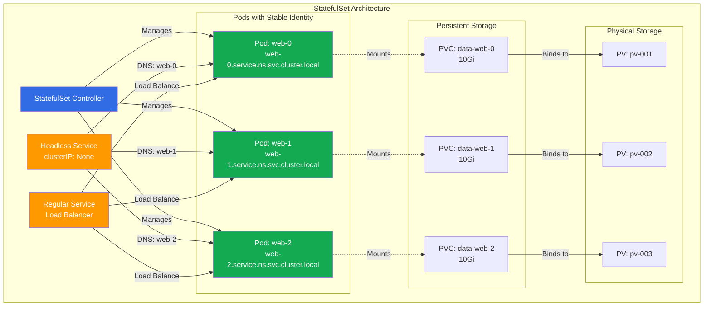

---

## 2. StatefulSet vs Deployment

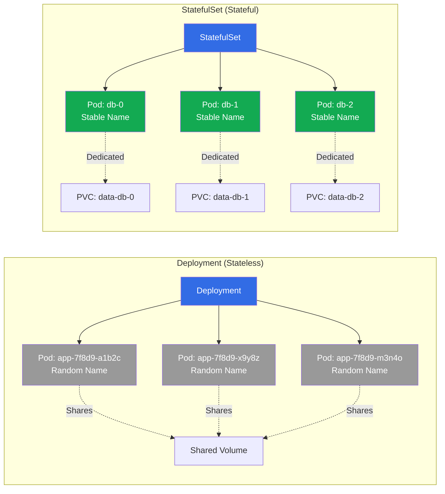

---

## 3. Ordered Deployment and Scaling

### Scale Up (0 → 3 replicas)

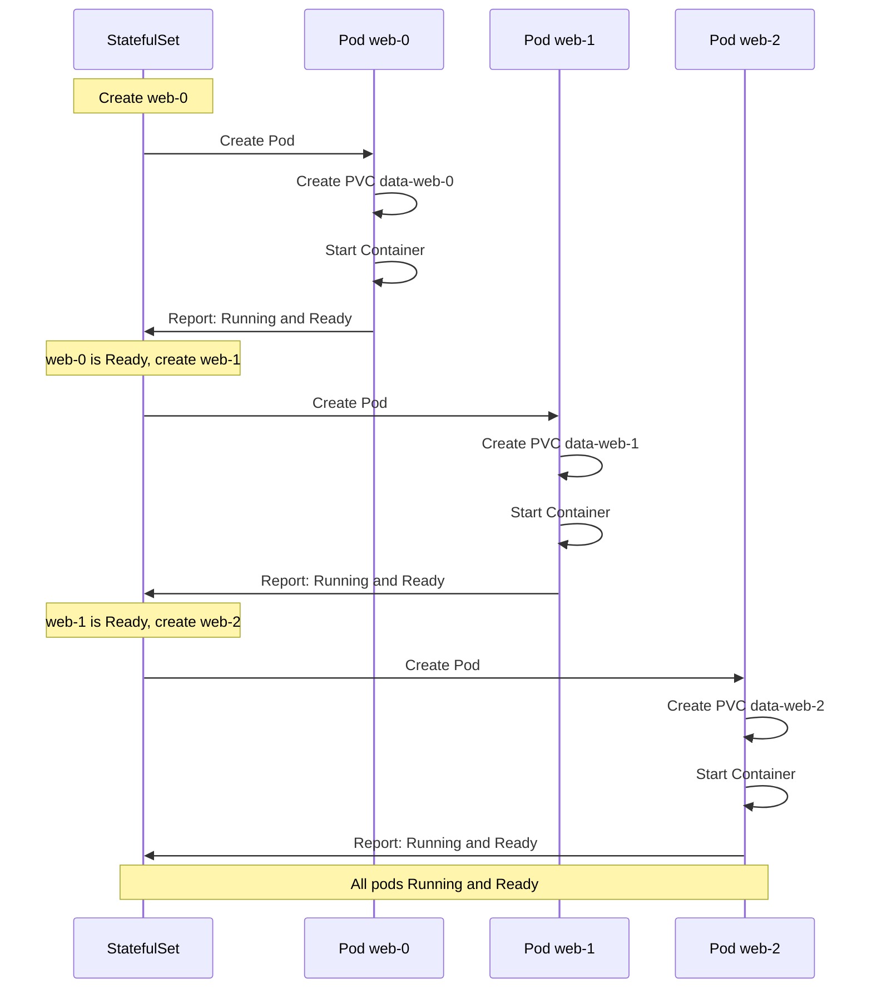

### Scale Down (3 → 1 replicas)

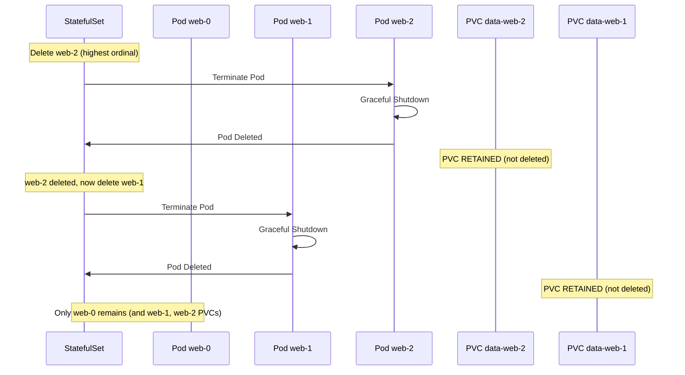

---

## 4. Pod Identity and DNS

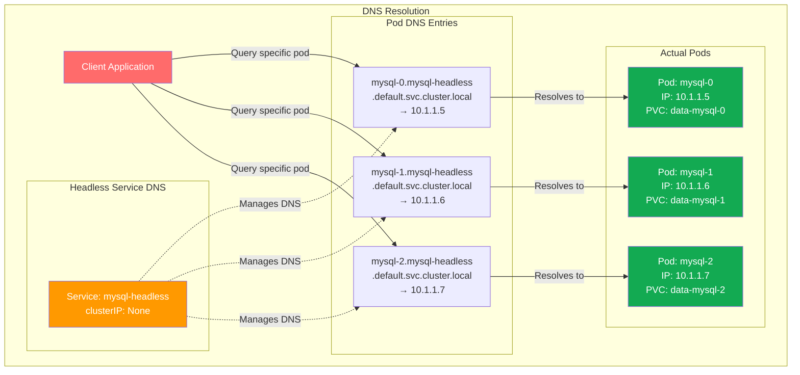

---

## 5. PersistentVolumeClaim Lifecycle

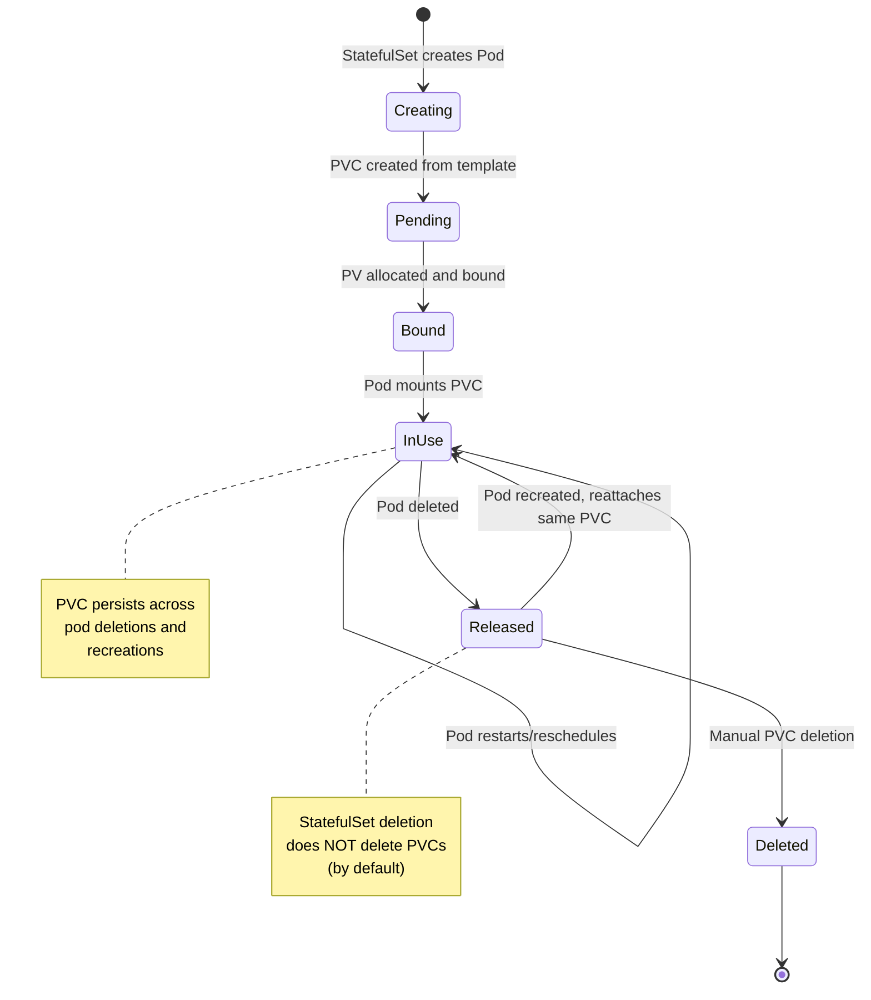

---

## 6. Rolling Update Strategy

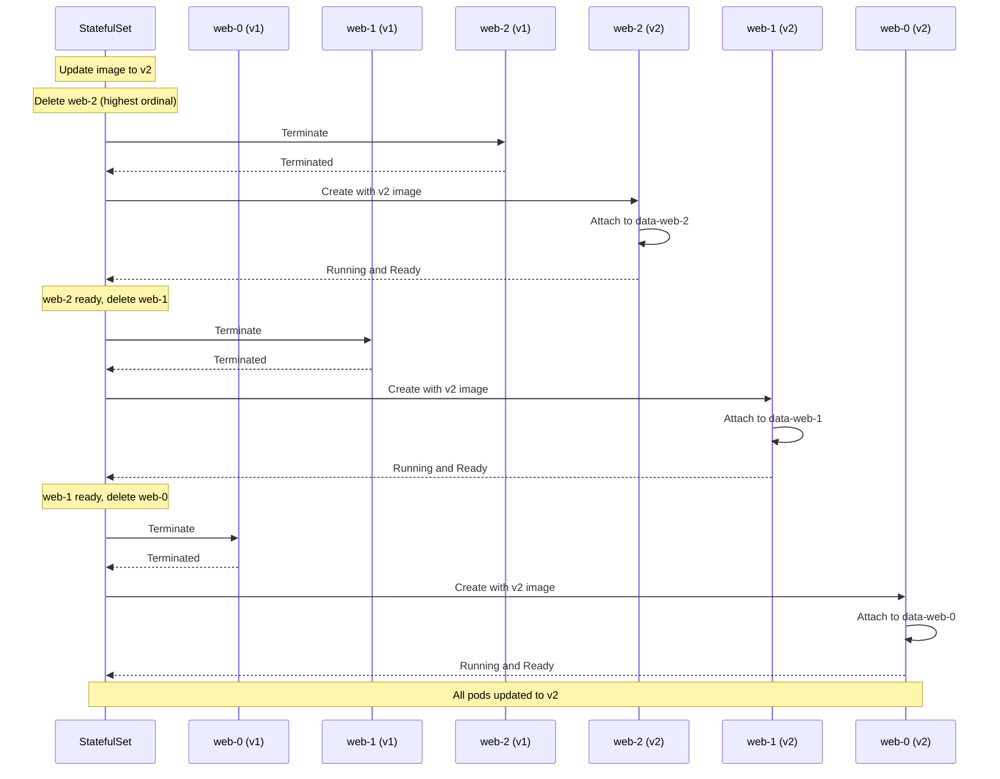

---

## 7. Partition-Based Canary Deployment

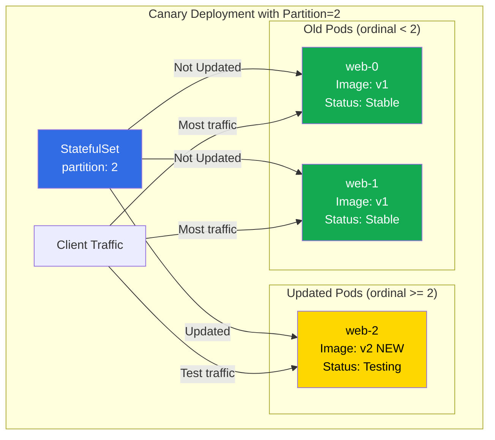

---

## 8. Database Replication Example

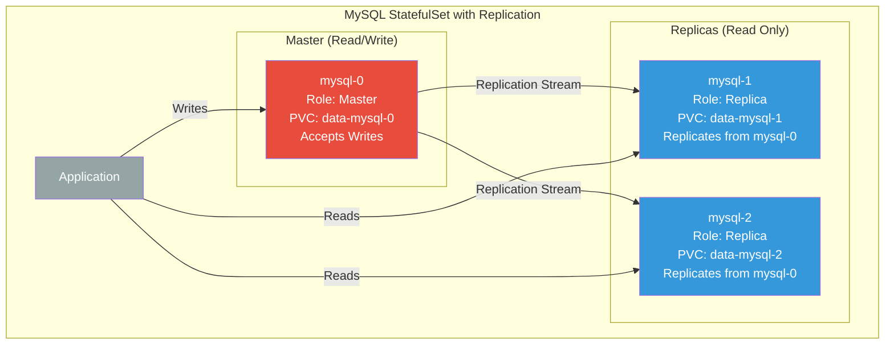

---

## 9. StatefulSet Component Relationships

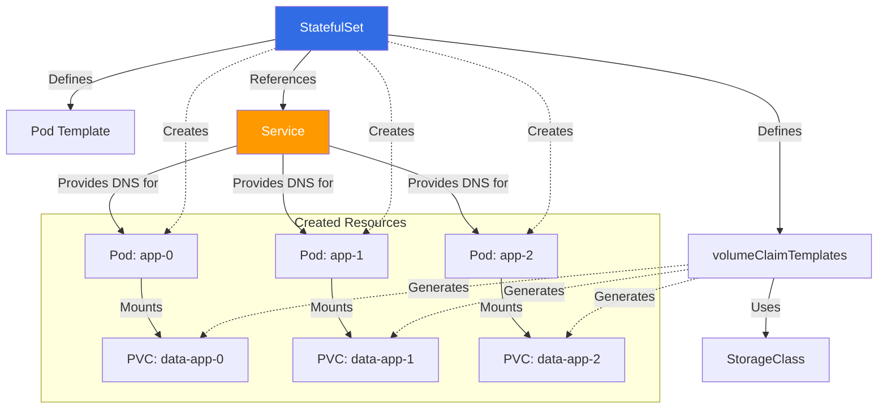

---

## 10. Failure and Recovery Scenario

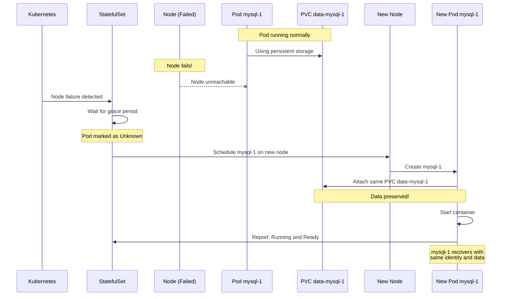

---

## Summary

These diagrams illustrate key StatefulSet concepts:

1. **Architecture**: How StatefulSets manage pods, services, and storage
2. **Comparison**: Differences between StatefulSets and Deployments
3. **Ordering**: Sequential pod creation and deletion
4. **DNS**: Stable network identities via headless services
5. **PVC Lifecycle**: How persistent storage is managed
6. **Updates**: Rolling update and canary deployment strategies
7. **Replication**: Master/replica patterns for databases
8. **Recovery**: How StatefulSets handle failures

For practical examples, see:
- [Intermediate StatefulSet Guide](../../../../../../3-Advanced/01-Phase-1/04-Container-Orchestration/Advanced-K8s/StatefulSets)
- [Advanced StatefulSet Patterns](../../../../../../3-Advanced/01-Phase-1/04-Container-Orchestration/Advanced-K8s/StatefulSets)
