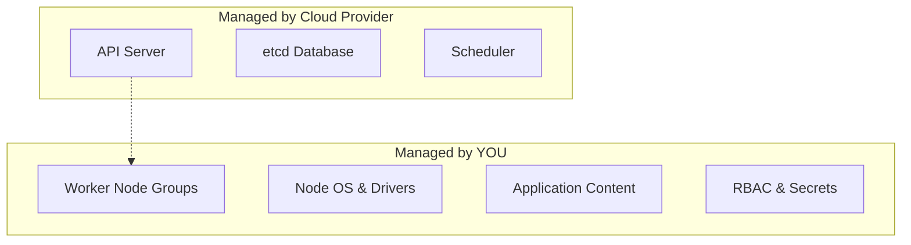

# ☁️ Managed Kubernetes: EKS, GKE, and AKS

## 📋 Overview

Running Kubernetes on your own hardware (or manual VMs) is a massive operational burden. **Managed Kubernetes Services** remove the headache of managing the Control Plane, allowing you to focus on your applications. This module covers the core concepts of cloud-native orchestration.

### 🎯 Learning Objectives

By the end of this module, you will:
- Understand the **Shared Responsibility Model** in the cloud.
- Compare the "Big 3" providers: **AWS EKS**, **Google GKE**, and **Azure AKS**.
- Configure **Identity & Access Management (IAM)** for cluster security.
- Implement **Serverless Workloads** using AWS Fargate or GKE Autopilot.
- Manage cluster lifecycles (Upgrades and Scaling).

---

## 🏗️ 1. Why Go Managed?

| Feature | Self-Managed (kubeadm) | Managed (EKS/GKE/AKS) |
| :--- | :--- | :--- |
| **Control Plane** | You build, scale, and backup etcd. | **Automated & Guaranteed by Cloud API.** |
| **Maintenance** | Manual OS patches and upgrades. | **One-click rolling upgrades.** |
| **SLA** | None (Your responsibility). | **99.9% - 99.95% Availability.** |
| **Integration** | Difficult custom integration. | **Native LoadBalancers, IAM, and VPCs.** |

---

## 📈 2. The Shared Responsibility Matrix

---

## 🚀 3. Provider Specifics

- **[AWS EKS](./EKS/README.md)**: Deep integration with AWS VPC and IAM. Uses `eksctl` as the standard CLI tool.
- **[Google GKE](./GKE/README.md)**: The original and most advanced managed service. Offers **Autopilot** for a fully-managed experience.
- **[Azure AKS](./AKS/README.md)**: Features seamless integration with Azure DevOps and Microsoft Entra ID (formerly Azure AD).

---

## 📖 Real-World DevOps Story: "The Secret Cost of Control Planes"

**The Scenario:** A startup created 10 separate clusters for 10 different small microservices to "keep them isolated."

**The Result:** They were shocked to receive a huge bill at the end of the month. Most managed providers charge a flat **Control Plane Fee** (e.g., $72/month for EKS). They were paying $720/month just for the privilege of having clusters, before even running a single pod.

**The Lesson:** Isolate workloads using **Namespaces** and **Network Policies** within a larger, shared cluster to optimize costs.

---

## 👨‍💻 Interview Preparation

1. **Q: How do you authenticate a Pod to call AWS S3 in EKS?**
   *   *A: Using **IAM Roles for Service Accounts (IRSA)**. You associate an IAM Role with a K8s ServiceAccount, and the Pod automatically receives the AWS credentials it needs.*

2. **Q: What is GKE Autopilot?**
   *   *A: It is a mode where Google manages the nodes, scaling, and security hardening for you. You pay per pod, not per node.*

3. **Q: What is a "Managed Node Group"?**
   *   *A: A feature where the cloud provider manages the underlying EC2/VM instances for your worker nodes, including automated patching and node draining during upgrades.*

---

## 🧠 Knowledge Check

1. Which managed service offers the most "native" feeling Kubernetes experience? (Google GKE)
2. What happens to your worker nodes when you upgrade the EKS control plane? (Nothing—you must upgrade them separately in a second step)
3. Where is the etcd data stored in a managed cluster? (Inside the cloud provider's managed control plane; you don't have direct access)

---

## 🔗 Internal Navigation
- [Next: Cluster Administration](../11-Cluster-Administration/README.md)
- [Back: StatefulSets and Jobs](../09-StatefulSets-and-Jobs/README.md)
