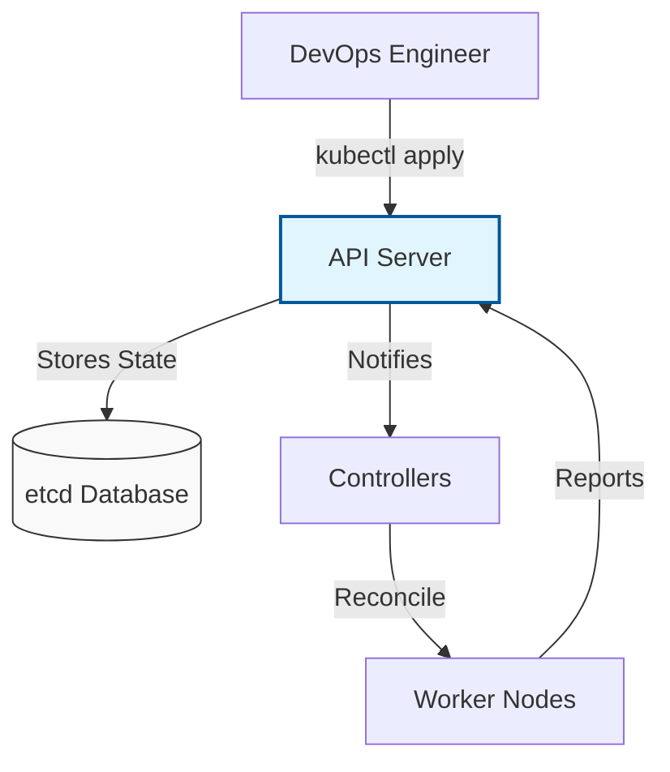

# ☸️ Kubernetes (K8s) Orchestration Master Class

Welcome to the definitive guide to **Kubernetes**, the "Operating System of the Cloud." This curriculum takes you from a beginner understanding of containers to managing enterprise-grade, highly available clusters.

---

## 🗺️ The Kubernetes Learning Path

Follow these modules in order to master container orchestration. Each module contains **Real-World Stories**, **Interview Prep**, and **Hands-on Challenges**.

### 🏗️ Phase 1: Foundations & Architecture
1.  **[01-Cluster-Architecture](./01-Cluster-Architecture/README.md)**: Deep dive into the API Server, etcd, and Control Plane.
2.  **[02-Kubectl-Basics](./02-Kubectl-Basics/README.md)**: Master the CLI tools and pro-level productivity tricks.
3.  **[03-Pods-and-Nodes](./03-Pods-and-Nodes/README.md)**: Understand the atomic units of compute.

### 🔄 Phase 2: Application Management
4.  **[04-Deployments-and-Scaling](./04-Deployments-and-Scaling/README.md)**: Zero-downtime rollouts and horizontal scaling.
5.  **[05-Services-and-Networking](./05-Services-and-Networking/README.md)**: Service discovery, DNS, and internal load balancing.
6.  **[06-Ingress-Controllers](./06-Ingress-Controllers/README.md)**: Advanced Layer 7 routing and SSL termination.
7.  **[07-ConfigMaps-and-Secrets](./07-ConfigMaps-and-Secrets/README.md)**: Decoupling configuration and securing credentials.

### 💾 Phase 3: State & Persistence
8.  **[08-Persistence-and-Storage](./08-Persistence-and-Storage/README.md)**: PVs, PVCs, and dynamic cloud storage.
9.  **[09-StatefulSets-and-Jobs](./09-StatefulSets-and-Jobs/README.md)**: Running databases and batch processes.

### 🛡️ Phase 4: Production Governance
10. **[10-Managed-Kubernetes-EKS](./10-Managed-Kubernetes-EKS/README.md)**: EKS, GKE, and the Shared Responsibility Model.
11. **[11-Cluster-Administration](./11-Cluster-Administration/README.md)**: RBAC, Namespaces, and Resource Hygiene.

### 🎓 Phase 5: Mastery & Career
12. **[12-Interview-Questions-and-Quizzes](./12-Interview-Questions-and-Quizzes/README.md)**: Senior-level deep dives and CKA prep.
13. **[13-Real-Life-Scenarios](./13-Real-Life-Scenarios/README.md)**: Advanced troubleshooting and "Panic Button" solutions.

---

## 🏗️ Core Philosophy: The Desired State

In Kubernetes, you don't "run" commands; you define a **Desired State** in YAML, and the Kubernetes **Control Plane** works 24/7 to reconcile the **Actual State**.

---

## 🛡️ Best Practices for Production
- **Resources**: Never deploy a pod without `requests` and `limits`.
- **Health**: Always implement `Liveness` and `Readiness` probes.
- **Security**: Use the `Restricted` Pod Security Standard by default.
- **GitOps**: Store your YAMLs in Git and use `kubectl apply` for all changes.

---

## 🏆 Related Certifications
- **CKA**: Certified Kubernetes Administrator (Focus on Cluster Ops).
- **CKAD**: Certified Kubernetes Application Developer (Focus on Workloads).
- **CKS**: Certified Kubernetes Security Specialist (Focus on Hardening).

---

## 🔗 Next Steps
- **[Helm Charts](../../02-Phase-2/02-Configuration-Tools/04-Helm)** - Learn to package your apps.
- **[Observability Foundations](../10-Observability-Foundations/)** - Monitor your cluster health.

---
*Orchestrate with confidence. Scale without limits.*