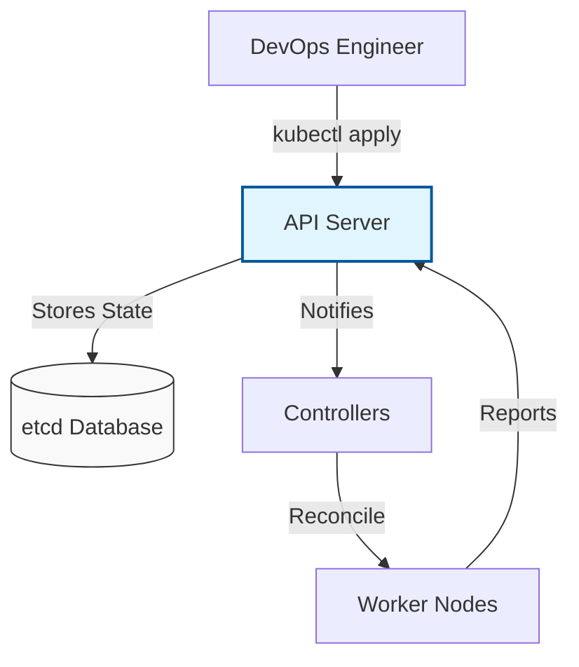

# ☸️ Kubernetes (K8s) Orchestration Master Class

Welcome to the definitive guide to **Kubernetes**, the "Operating System of the Cloud." This curriculum is organized into logical learning paths to take you from foundations to enterprise-grade cluster operations.

---

## 🗺️ The Kubernetes Learning Path

### 🏗️ [Part 1: Foundations & Architecture](./Part-1-Foundations/README.md)

Master the brain, the CLI, and the basic communication patterns.

- **[01-Cluster-Architecture](./Part-1-Foundations/01-Cluster-Architecture/README.md)**: Control Plane, etcd, and the Request Lifecycle.
- **[02-Kubectl-Basics](./Part-1-Foundations/02-Kubectl-Basics/README.md)**: CLI productivity, JSONPath, and Custom Columns.

### 🔄 [Part 2: Workload Management](./Part-2-Workload-Management/README.md)

Learn how to deploy, scale, and manage the health of your applications.

- **[03-Pods-and-Nodes](./Part-2-Workload-Management/03-Pods-and-Nodes/README.md)**: Pod lifecycle, Sidecars, and Scheduling.
- **[04-Deployments-and-Scaling](./Part-2-Workload-Management/04-Deployments-and-Scaling/README.md)**: Rolling updates and Horizontal Autoscaling (HPA).

### 🚦 [Part 3: Networking and Configuration](./Part-3-Networking-and-Config/README.md)

Connect your services and manage application settings securely.

- **[05-Services-and-Networking](./Part-3-Networking-and-Config/05-Services-and-Networking/README.md)**: Service Types, DNS, and discovery.
- **[06-Ingress-Controllers](./Part-3-Networking-and-Config/06-Ingress-Controllers/README.md)**: Layer 7 routing and SSL termination.
- **[07-ConfigMaps-and-Secrets](./Part-3-Networking-and-Config/07-ConfigMaps-and-Secrets/README.md)**: Decoupling configuration from containers.

### 💾 [Part 4: State and Persistence](./Part-4-State-and-Persistence/README.md)

Handle databases and long-term storage in a containerized environment.

- **[08-Persistence-and-Storage](./Part-4-State-and-Persistence/08-Persistence-and-Storage/README.md)**: PVs, PVCs, and StorageClasses.
- **[09-StatefulSets-and-Jobs](./Part-4-State-and-Persistence/09-StatefulSets-and-Jobs/README.md)**: Persistent identities and Batch processing.

### 🛡️ [Part 5: Cloud Ops and Administration](./Part-5-Cloud-Ops-and-Admin/README.md)

Manage your cluster in the cloud and enforce enterprise governance.

- **[10-Managed-Kubernetes-EKS](./Part-5-Cloud-Ops-and-Admin/10-Managed-Kubernetes-EKS/README.md)**: EKS, GKE, and Shared Responsibility.
- **[11-Cluster-Administration](./Part-5-Cloud-Ops-and-Admin/11-Cluster-Administration/README.md)**: RBAC, Namespaces, and Quotas.

### 🎓 [Part 6: Mastery and Resources](./Part-6-Mastery-and-Resources/README.md)

Advanced troubleshooting, interview preparation, and technical deep-dives.

- **[12-Interview-Questions-and-Quizzes](./Part-6-Mastery-and-Resources/12-Interview-Questions-and-Quizzes/README.md)**: CKA prep and senior screenings.
- **[13-Real-Life-Scenarios](./Part-6-Mastery-and-Resources/13-Real-Life-Scenarios/README.md)**: High-pressure troubleshooting stories.
- **[📦 Deep Dives & Supplementary](./Part-6-Mastery-and-Resources/Deep-Dives/README.md)**: Helm, Kubelet internals, and specialized storage.

---

## 📂 Practical Code & Scripts

Leverage raw Kubernetes assets for lab environments:

- **[Kubernetes Lab Manifests](./Kubernetes/k8s/)**: Deployment, Service, and Ingress YAML templates.
- **[K3s Lightweight Setup](./Kubernetes/k3s/)**: Quick deployment scripts for low-resource environments.
- **[Diagnostics & Troubleshooting](./Kubernetes/scripts/Diagnose/)**: Bash scripts to check pod health, distribution, and networking.
- **[Docker Workloads](./Docker/)**: Multistage builds and petclinic-specific container logic.

---

## 🏗️ Core Philosophy: The Desired State

In Kubernetes, you don't "run" commands; you define a **Desired State** in YAML, and the Kubernetes **Control Plane** works 24/7 to reconcile the **Actual State**.

---

## 🛡️ Best Practices for Production

- **Resources**: Never deploy a pod without `requests` and `limits`.
- **Health**: Always implement `Liveness` and `Readiness` probes.
- **Security**: Use the `Restricted` Pod Security Standard by default.
- **GitOps**: Store your YAMLs in Git and use `kubectl apply` for all changes.

---

## 🏆 Related Certifications

- **CKA**: Certified Kubernetes Administrator (Focus on Cluster Ops).
- **CKAD**: Certified Kubernetes Application Developer (Focus on Workloads).
- **CKS**: Certified Kubernetes Security Specialist (Focus on Hardening).

---
*Orchestrate with confidence. Scale without limits.*
