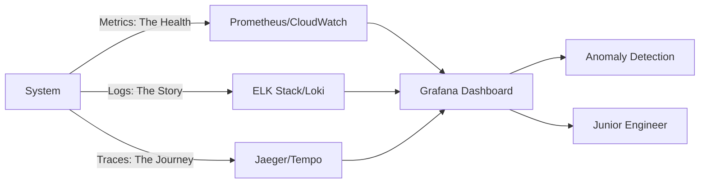

# 📊 Observability Foundations: The Systems Oracle

> **"Listen up, Junior. Monitoring tells you if a system is dead. Observability tells you why it's dying. In this module, you move from 'Reaction' to 'Intelligence'."**

---

## 🧠 The Mental Model: The Systems Oracle

**The Junior Struggle**: "I have a dashboard that shows CPU and RAM. Isn't that enough? Why do I need distributed tracing, structured logs, and OpenTelemetry?"

**The Architect Solution**: You realize that in a microservices world, dashboards are not enough. You need a **Systems Oracle** that can see through the noise:
- **Metrics (The Heartbeat)**: Tells you "How many requests are failing?"
- **Logs (The Story)**: Tells you "What exactly went wrong in that specific request?"
- **Traces (The Journey)**: Tells you "Where in the 5-service chain did the request slow down?"
- **Alerting (The Alarm)**: Tells you "Wake up, because the Golden Signals are out of whack."

---

## 🆚 Junior Way vs. Architect Way

| Feature | The Junior Way (Problematic) | The Architect Way (Strategic) |
|:---|:---|:---|
| **Approach** | Checking fixed dashboards | **Asking questions** of the data |
| **Failures** | "It's slow" (Vague) | **"Service X has 200ms latency in Phase Y"** |
| **Logs** | Plain text `printf` logging | **Structured JSON** for searchability |
| **Cost** | "Enable all logs!" (Expensive) | **Metric & Trace Sampling** for efficiency |
| **Response** | Waiting for the alert | **Predictive Anomaly Detection** |

---

## 🏗️ Visual: The Observability Intelligence Mesh

---

## 🗺️ Curriculum Path

### 📈 [Part 1: Monitoring Foundations](./Part-1-Monitoring-Foundations/README.md)
*Junior, learn the 'Four Golden Signals'.* 
Master the metrics that matter: Latency, Traffic, Errors, and Saturation.

### 📜 [Part 2: Logging & Cloud Metrics](./Part-2-Logging-and-Cloud-Metrics/README.md)
*A log without structure is just noise.* 
Structured JSON logging, log rotation, and mastering AWS CloudWatch/Loki.

### 🕵️ [Part 3: Distributed Tracing & APM](./Part-3-Distributed-Tracing-and-APM/README.md)
*Trace the needle in the haystack.* 
Distributed tracing with OpenTelemetry and Jaeger. Follow a single request through the microservices maze.

### 🎓 [Part 4: Mastery and Resources](./Part-4-Mastery-and-Resources/README.md)
*The SRE Interview.* 
Advanced troubleshooting, interview preparation, and real-world outage scenarios.

---

## 🏆 Real-World DevOps Story: The Silent Killer

**The Scenario**: A service was "Healthy" (200 OK) but users were complaining that data wasn't showing up. 
**The Crisis**: Standard metrics showed everything was fine. 
**The Discovery**: **Distributed Tracing** revealed that an asynchronous process was failing silently after the response was sent.
**The Lesson**: **Junior, don't trust the HTTP status code. Look at the trace.**

---

## 🎤 Interview Preparation (Observability)

1. **Q: Junior, what are the 'Four Golden Signals' of monitoring?**
   - *A: **Latency** (time to service a request), **Traffic** (demand), **Errors** (rate of failure), and **Saturation** (how "full" the service is).*

2. **Q: Explain 'Structured Logging' and why it's better than plain text.**
   - *A: Structured logging (usually JSON) allows logs to be easily parsed and searched by tools like ELK or Loki. You can filter by `user_id` or `error_code` instantly.*

3. **Q: What is 'Distributed Tracing'?**
   - *A: It's the process of tracking a single request as it moves through various microservices, using a unique 'Trace ID' to correlate the steps.*

4. **Q: What is the 'Cardinality' problem in metrics?**
   - *A: High cardinality occurs when you use labels with too many unique values (like 'User ID' or 'IP Address'). This can cause the metrics database to explode in size and crash.*

5. **Q: Explain 'MTTR' vs. 'MTBF'.**
   - *A: **MTBF** (Mean Time Between Failures) is how long the system stays up. **MTTR** (Mean Time To Repair) is how fast you can fix it. In modern DevOps, we optimize for **MTTR**.*

6. **Q: What is a 'Sidecar' in the context of observability?**
   - *A: A helper container (like the Otel Collector or FluentBit) that runs alongside the main app to collect and export logs/metrics without the app needing to know the destination.*

7. **Q: What is 'Sampling' in tracing?**
   - *A: Instead of storing 100% of traces (which is expensive), you only store a percentage (e.g., 5%) to get a representative view of the system performance.*

8. **Q: Explain 'Black-box' vs. 'White-box' monitoring.**
   - *A: **Black-box** monitors from the outside (e.g., Ping, HTTP check). **White-box** monitors from the inside based on the app's internal metrics (e.g., DB connection pool size).*

9. **Q: What is an 'Error Budget'?**
   - *A: The allowed amount of 'unreliability' (e.g., 0.1% for 99.9% uptime). If the budget is exhausted, the team stops releasing features and focuses on reliability.*

10. **Q: Junior, how do you debug a service that is 'Slow' but not 'Failing'?**
    - *A: Look at the **Latency Heatmap** in Grafana to find percentiles (P99), then use **Distributed Tracing** to find the specific bottleneck in the service chain.*

---

## 📝 Knowledge Check

1. **Which pill of observability is best for telling the 'story' of an error?**
   - [x] Logs.

2. **Latency is usually measured in which percentile to find the 'worst' experience?**
   - [x] P99.

3. **Which tool is a vendor-neutral standard for collecting observability data?**
   - [x] OpenTelemetry.

4. **What is 'Context Propagation'?**
   - [x] Passing the Trace ID from one service to the next in the headers.

5. **Where should you store your long-term metrics for visualization?**
   - [x] Prometheus / Mimir / CloudWatch.

6. **True/False: It is a good idea to put credit card numbers in logs for easier debugging.**
   - [x] **False**. (Security/PII risk).

7. **What does 'Saturation' measure?**
   - [x] How much of a resource (CPU, Disk, Memory) is being used.

8. **Which alerting type only fires for problems that affect end-users?**
   - [x] Symptom-based Alerting.

9. **What is the standard port for the Prometheus node-exporter?**
   - [x] 9100.

10. **Which visualization is best for seeing the distribution of request times?**
    - [x] Histogram.

---

## 🔗 Next Steps
Junior, you have the eyes of the Oracle. Now let's learn how to secure the borders.
1. Proceed to: **[03. API Gateways & Security](../03-API-Gateways-Security/README.md)** →
2. Return to: **[Phase 3 Hub](../README.md)** →