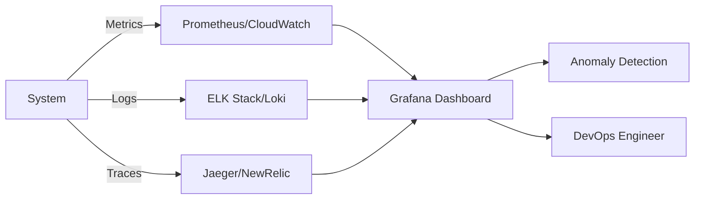

# 📊 Observability Foundations Master Class

Welcome to the definitive guide to **Observability**, the critical discipline of understanding complex systems through their outputs (Metrics, Logs, and Traces). This curriculum transforms you from a "responder" to an "architect" of system visibility.

---

## 🗺️ The Observability Learning Path

### 📈 [Part 1: Monitoring Foundations](./Part-1-Monitoring-Foundations/README.md)
Master the "What": Tracking performance and system health.
- **[01-Monitoring-Basics](./Part-1-Monitoring-Foundations/01-Monitoring-Basics/README.md)**: Four Golden Signals, White vs. Black box monitoring.
- **[03-Health-Checks-and-Probers](./Part-1-Monitoring-Foundations/03-Health-Checks-and-Probers/README.md)**: Liveness, Readiness, and Synthetic uptime checks.

### 📜 [Part 2: Logging & Cloud Metrics](./Part-2-Logging-and-Cloud-Metrics/README.md)
Master the "How": Collecting data and using cloud-native tools.
- **[02-Log-Management](./Part-2-Logging-and-Cloud-Metrics/02-Log-Management/README.md)**: Structured logging, levels, and rotation.
- **[07-AWS-CloudWatch](./Part-2-Logging-and-Cloud-Metrics/07-AWS-CloudWatch/README.md)**: Native AWS visibility and dashboards.

### 🕵️ [Part 3: Distributed Tracing & APM](./Part-3-Distributed-Tracing-and-APM/README.md)
Master the "Where": Following requests across distributed microservices.
- **[04-Tracing-Foundations](./Part-3-Distributed-Tracing-and-APM/04-Tracing-Foundations/README.md)**: Spans, Context Propagation, and Root Cause Analysis.

### 🎓 [Part 4: Mastery and Resources](./Part-4-Mastery-and-Resources/README.md)
Bridge the gap to professional expertise.
- **[05-Interview-Questions-and-Quizzes](./Part-4-Mastery-and-Resources/05-Interview-Questions-and-Quizzes/README.md)**: Assess your knowledge for senior screenings.
- **[06-Real-Life-Scenarios](./Part-4-Mastery-and-Resources/06-Real-Life-Scenarios/README.md)**: Troubleshoot high-pressure production incidents.
- **[📺 YouTube Mastery](./Part-4-Mastery-and-Resources/Youtube_Lessons.md)**: Curated video deep-dives.

---

## 🏗️ Core Philosophy: MTTR > MTBF

In modern cloud-native systems, failures are inevitable (**MTBF - Mean Time Between Failures** is often unpredictable). Elite teams focus on **MTTR (Mean Time To Repair)**. High Observability is the only way to minimize repair time.

---

## 🛡️ Best Practices for Production
- **Structured Logging**: Always use JSON format for logs to make them searchable.
- **Symptom-Based Alerting**: Only wake up engineers for problems that affect end-users.
- **Cardinality Management**: Watch out for high-cardinality metrics that spike observability costs.
- **Correlation IDs**: Pass a unique ID across all microservices to link logs and traces.

---

## 🏆 Related Certifications
- **AWS Certified DevOps Engineer**: Focus on CloudWatch and X-Ray.
- **Prometheus Certified Associate (PCA)**: Mastery of the Prometheus ecosystem.
- **FinOps Certified Practitioner**: Managing the costs of observability data.

---
*If you can't measure it, you can't improve it. Visibility is freedom.*