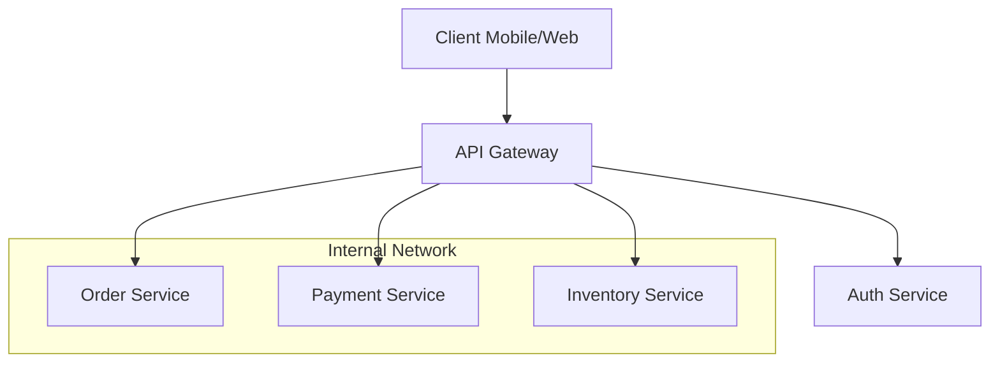

# 01: API Gateway Basics

An **API Gateway** is a reverse proxy that sits between a client and a collection of backend microservices. It acts as a single entry point, abstracting the internal complexity of the system.

## 🏗️ Core Responsibilities

1. **Routing**: Directing requests to the appropriate service (e.g., `/users` -> User Service, `/orders` -> Order Service).
2. **Protocol Translation**: Converting between different protocols (e.g., REST to gRPC, or WebSockets).
3. **Aggregation**: Combining responses from multiple microservices into one (Fan-out/Fan-in).
4. **Offloading**: Handling cross-cutting concerns (Auth, Logging, SSL termination) so developers don't have to implement them in every service.

---

## 🆚 API Gateway vs. Load Balancer

| Feature | Load Balancer | API Gateway |
| :--- | :--- | :--- |
| **Layer** | Usually Layer 4 (Transport) or Layer 7 (Application) | Layer 7 (Application) |
| **Purpose** | Distributes traffic to multiple instances of the *same* service. | Routes traffic to *different* services based on logic. |
| **Capabilities** | Health checks, simple SSL termination. | Auth, Rate Limiting, Request Transformation, Aggregation. |
| **Common Tools** | Nginx, HAProxy, AWS ALB. | Kong, Tyk, AWS API Gateway, Apigee. |

---

## 🛠️ Common API Gateway Tools

- **Kong**: Highly extensible, built on Nginx and Lua.
- **Tyk**: Go-based, open-source with a powerful dashboard.
- **AWS API Gateway**: Managed service, scales automatically, integrates with Lambda.
- **Nginx NJS/Lua**: Used as a high-performance gateway with custom logic.
- **Spring Cloud Gateway**: Popular in the Java/Spring ecosystem.

---

## 📐 High-Level Architecture

