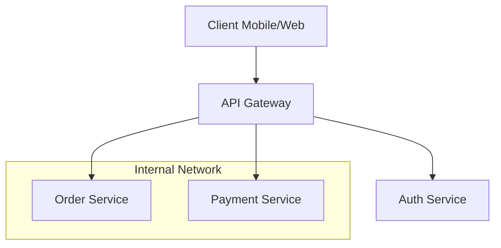

# 🚪 API Gateway Basics: The Entry Point

Welcome to the foundation of API Management. The API Gateway acts as the single entry point for all clients, abstracting the internal complexity of your microservices and providing a central point for enforcement and visibility.

---

## 🏗️ Core Responsibilities
- **Routing**: Mapping `/v1/orders` to the correct internal IP.
- **Protocol Translation**: Converting REST/JSON to gRPC.
- **Offloading**: Handling SSL and Logging in one place.
- **Aggregation**: Multiplexing multiple internal calls into one client response.

---

## 🆚 Comparison: Gateway vs. Load Balancer
| Feature | Load Balancer | API Gateway |
| :--- | :--- | :--- |
| **Logic** | Simple (Round Robin, Least Conn) | Complex (Path/Header/Auth based) |
| **Intelligence** | Transport Layer (L4) / Simple L7 | Full Application Layer (L7) |
| **Common Tools** | AWS ALB, F5, HAProxy | Kong, Tyk, Apigee, AWS API GW |

---

## 📐 High-Level Architecture

---

## 📖 Real-World DevOps Story: "The Zombie Microservice"
Learn how exposing microservices directly to the internet (without a gateway) created a security nightmare that lead to a breach, and how a centralized gateway fixed it.

---

## 👔 Interview Prep & Deep Dives
Explore the "BFF" (Backend-for-Frontend) pattern and master the differences between North-South and East-West traffic.

---

## 🔗 Internal Navigation
- [Next: Authentication and JWT](../../Part-2-Security-and-Authentication/02-Authentication-and-JWT/README.md)
- [Back: Gateway Fundamentals Overview](../README.md)

---
*The gateway is your system's first impression. Make it count.*
