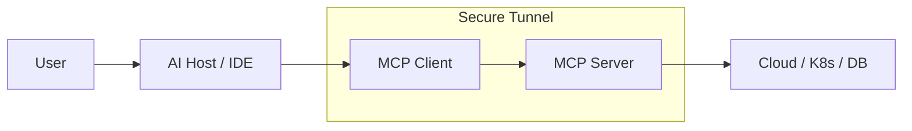

# 01: MCP Fundamentals

The **Model Context Protocol (MCP)** is an open-standard protocol that enables Large Language Models (LLMs) to securely and standardly interact with local and remote data and tools.

## 🏗️ Core Architecture

MCP operates on a simple Client-Server model:

1.  **MCP Host**: The application the user interacts with (e.g., Claude Desktop, IDEs, or a custom CLI).
2.  **MCP Client**: The layer within the host that communicates with the server.
3.  **MCP Server**: A lightweight program that exposes specific **Tools**, **Resources**, and **Prompts** to the client.

---

## 🚀 Why MCP for DevOps?

In a DevOps context, MCP acts as the "hands" for an AI assistant. Instead of the AI just giving you a command to run, an MCP-enabled AI can:
- **Read**: Fetch logs directly from CloudWatch.
- **Analyze**: Query the current state of a Kubernetes cluster.
- **Act**: Execute a Terraform plan or trigger a Jenkins job (with your approval).

### The "Bridge" Pattern

---

## 🛠️ Key Concepts

- **Tools**: Executable functions (e.g., `list_pods`, `restart_service`).
- **Resources**: Static or dynamic data sources (e.g., a `.conf` file, a database table).
- **Prompts**: Pre-defined templates for interacting with the AI.
