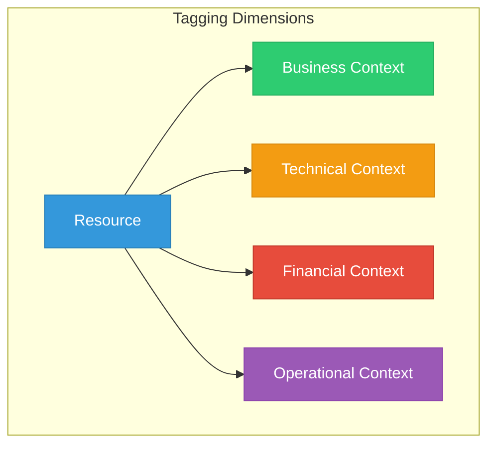
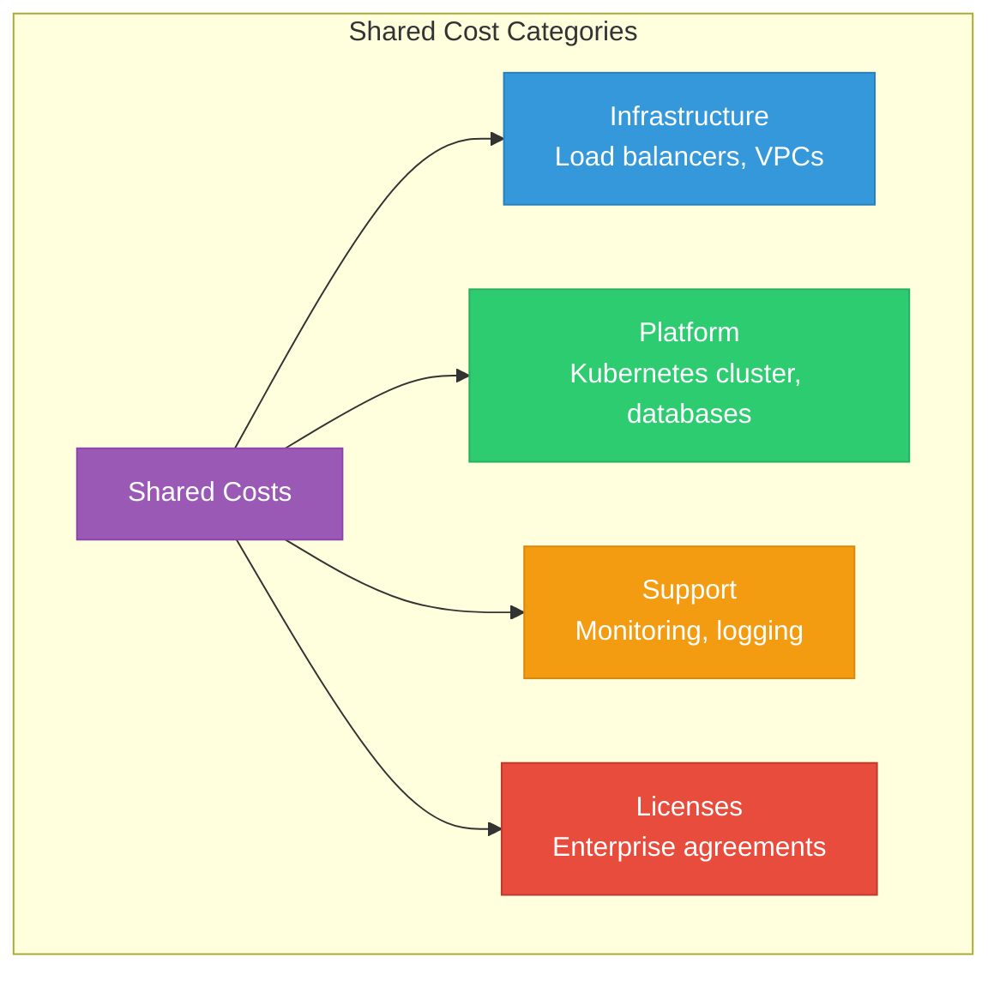
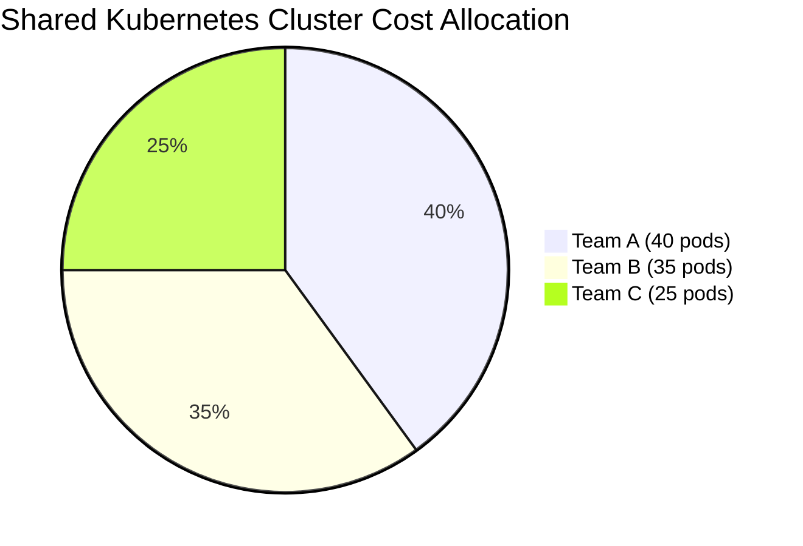
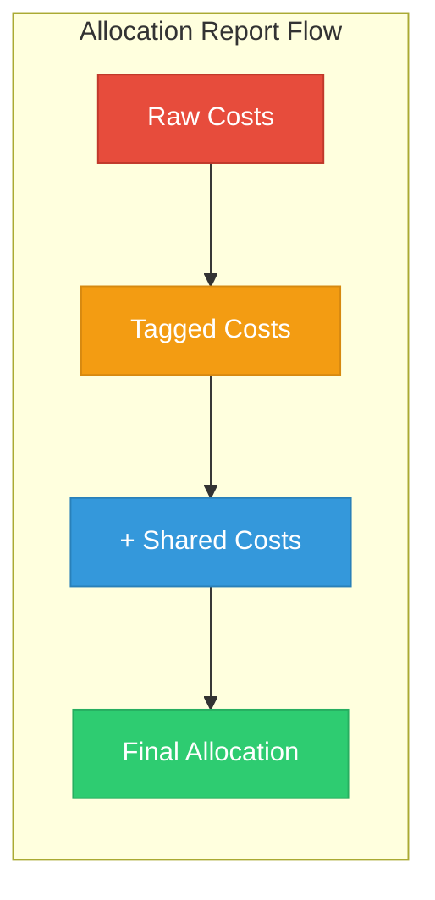

# Lesson 01: Cost Allocation Strategies

## Learning Objectives

By the end of this lesson, you will:
- Implement advanced tagging strategies
- Configure cost allocation rules
- Handle shared and untaggable costs
- Create accurate cost allocation reports

---

## Advanced Tagging Strategy

### Multi-Dimensional Tagging

Move beyond basic tags to create a comprehensive tagging taxonomy:



### Comprehensive Tag Set

#### Business Context Tags
| Tag Key | Values | Purpose |
|---------|--------|---------|
| `BusinessUnit` | sales, marketing, engineering | Map to org structure |
| `Product` | product-a, product-b | Product-level costs |
| `Customer` | customer-id, internal | Customer attribution |
| `Revenue` | revenue-generating, support | Business value |

#### Technical Context Tags
| Tag Key | Values | Purpose |
|---------|--------|---------|
| `Application` | api-gateway, user-service | Application identification |
| `Component` | frontend, backend, database | Architecture layer |
| `Version` | v1.2.3, latest | Version tracking |
| `Tier` | web, app, data | Service tier |

#### Financial Context Tags
| Tag Key | Values | Purpose |
|---------|--------|---------|
| `CostCenter` | CC-1234 | Financial mapping |
| `Project` | project-alpha | Project tracking |
| `Budget` | capex, opex | Capital vs. operating |
| `Chargeback` | yes, no | Chargeback eligibility |

#### Operational Context Tags
| Tag Key | Values | Purpose |
|---------|--------|---------|
| `Environment` | prod, staging, dev | Environment type |
| `Owner` | email address | Resource ownership |
| `Compliance` | pci, hipaa, sox | Compliance requirements |
| `Criticality` | high, medium, low | Business impact |

---

## Enforcing Tags

### AWS Tag Policies (Organizations)

```json
{
  "tags": {
    "Environment": {
      "tag_key": {
        "@@assign": "Environment"
      },
      "tag_value": {
        "@@assign": [
          "production",
          "staging",
          "development"
        ]
      },
      "enforced_for": {
        "@@assign": [
          "ec2:instance",
          "rds:db",
          "s3:bucket"
        ]
      }
    }
  }
}
```

### AWS Service Control Policy (SCP)

```json
{
  "Version": "2012-10-17",
  "Statement": [
    {
      "Sid": "DenyUntaggedResources",
      "Effect": "Deny",
      "Action": [
        "ec2:RunInstances"
      ],
      "Resource": "arn:aws:ec2:*:*:instance/*",
      "Condition": {
        "Null": {
          "aws:RequestTag/Environment": "true",
          "aws:RequestTag/Owner": "true"
        }
      }
    }
  ]
}
```

### Azure Policy for Tags

```json
{
  "mode": "All",
  "policyRule": {
    "if": {
      "allOf": [
        {
          "field": "type",
          "equals": "Microsoft.Compute/virtualMachines"
        },
        {
          "field": "tags['Environment']",
          "exists": "false"
        }
      ]
    },
    "then": {
      "effect": "deny"
    }
  }
}
```

---

## Handling Shared Costs

### Types of Shared Costs



### Allocation Methods

| Method | Description | Best For | Example |
|--------|-------------|----------|---------|
| **Usage-Based** | Proportional to actual usage | Metered resources | Network by GB transferred |
| **Resource-Based** | Proportional to resources used | Compute resources | K8s cluster by pods |
| **Headcount** | Per-person allocation | Support costs | Monitoring per team size |
| **Revenue** | Proportional to revenue | Business services | Based on product revenue |
| **Fixed** | Equal or predetermined split | Arbitrary allocation | Even split |

### Shared Cost Allocation Example



---

## Handling Untaggable Resources

Some resources can't be tagged directly:

| Resource Type | Challenge | Solution |
|---------------|-----------|----------|
| Data Transfer | No tagging | Allocate by endpoint tags |
| Support Charges | Account-level | Proportional split |
| Enterprise Discount | Organization-level | Apply to all costs |
| NAT Gateways | Shared infrastructure | Usage-based allocation |

### Creating Allocation Rules

**AWS Cost Categories Example:**

```json
{
  "CostCategoryName": "TeamAllocation",
  "Rules": [
    {
      "Value": "Platform-Team",
      "Rule": {
        "Tags": {
          "Key": "Team",
          "Values": ["platform"]
        }
      }
    },
    {
      "Value": "Shared-Costs",
      "Rule": {
        "Tags": {
          "Key": "Shared",
          "Values": ["true"]
        }
      }
    },
    {
      "Value": "Unallocated",
      "Type": "REGULAR",
      "Rule": {
        "Not": {
          "Tags": {
            "Key": "Team",
            "MatchOptions": ["PRESENT"]
          }
        }
      }
    }
  ],
  "SplitChargeRules": [
    {
      "Source": "Shared-Costs",
      "Targets": ["Platform-Team", "Backend-Team", "Frontend-Team"],
      "Method": "PROPORTIONAL"
    }
  ]
}
```

---

## Cost Allocation Reports

### Building an Allocation Report



### Report Components

| Section | Content |
|---------|---------|
| **Summary** | Total costs, trend, variance |
| **Direct Costs** | Tagged resources by team |
| **Shared Costs** | Allocated shared resources |
| **Unallocated** | Resources without tags |
| **Recommendations** | Tagging improvements |

### Sample Allocation Table

| Team | Direct Costs | Shared Costs | Total | % of Spend |
|------|--------------|--------------|-------|------------|
| Platform | $15,000 | $5,000 | $20,000 | 40% |
| Backend | $10,000 | $3,000 | $13,000 | 26% |
| Frontend | $5,000 | $2,000 | $7,000 | 14% |
| Data | $7,000 | $3,000 | $10,000 | 20% |
| **Total** | **$37,000** | **$13,000** | **$50,000** | **100%** |

---

## Automation with Terraform

### Auto-Tagging Resources

```hcl
# Default tags for all resources
locals {
  common_tags = {
    Environment = var.environment
    Project     = var.project
    ManagedBy   = "terraform"
    Owner       = var.owner_email
    CostCenter  = var.cost_center
  }
}

# Apply to provider
provider "aws" {
  default_tags {
    tags = local.common_tags
  }
}

# Apply to specific resources
resource "aws_instance" "app" {
  ami           = var.ami_id
  instance_type = var.instance_type
  
  tags = merge(local.common_tags, {
    Name        = "app-server"
    Application = "user-service"
    Component   = "backend"
  })
}
```

---

## Hands-On Exercise

### Exercise 1: Design Your Tag Taxonomy

Create a tagging strategy for your organization:

| Dimension | Tag Keys | Required? | Enforcement |
|-----------|----------|-----------|-------------|
| Business | | | |
| Technical | | | |
| Financial | | | |
| Operational | | | |

### Exercise 2: Identify Shared Costs

1. List all shared resources in your environment
2. Determine allocation method for each
3. Calculate allocation percentages

### Exercise 3: Create Allocation Report

Build a cost allocation report showing:
- Direct costs by team
- Shared cost allocation
- Unallocated costs

---

## Key Takeaways

- ✅ Multi-dimensional tagging enables accurate allocation
- ✅ Enforce tags through policies, not just documentation
- ✅ Shared costs require explicit allocation rules
- ✅ Automate tagging through IaC
- ✅ Regular allocation reports drive accountability

---

## Next Lesson

Continue to **[Lesson 02: Optimization Strategies](../02-Optimization-Strategies/README.md)** to learn cost reduction techniques.
