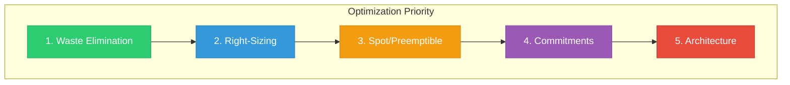
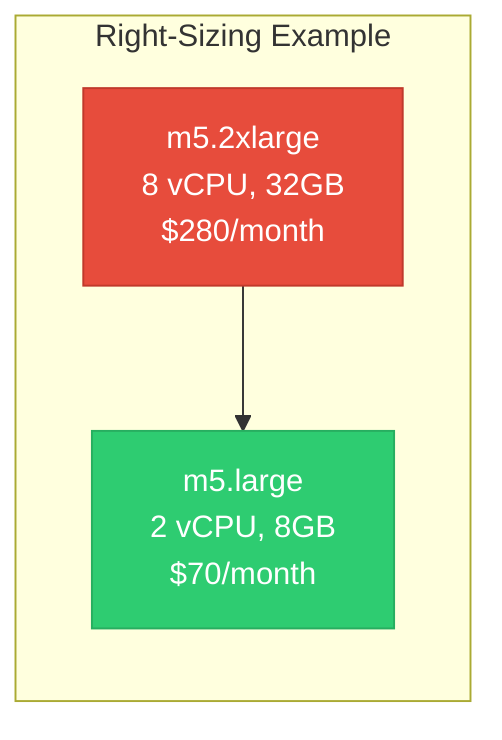
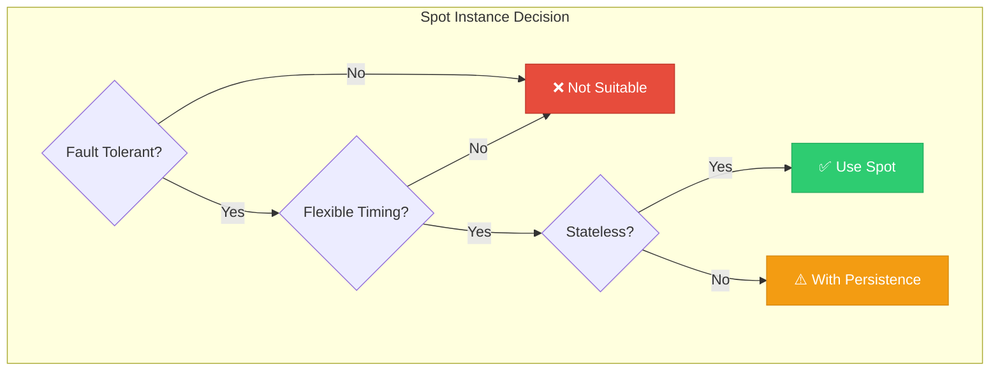
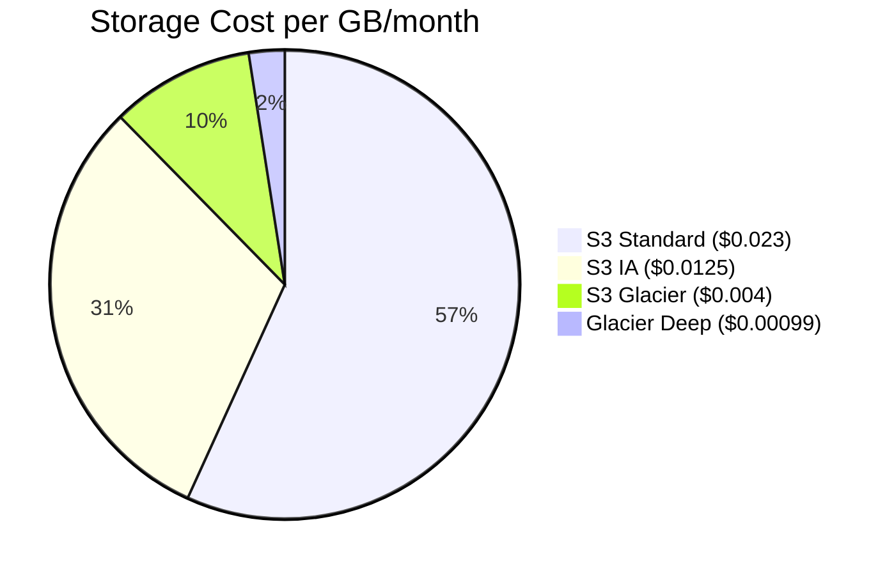
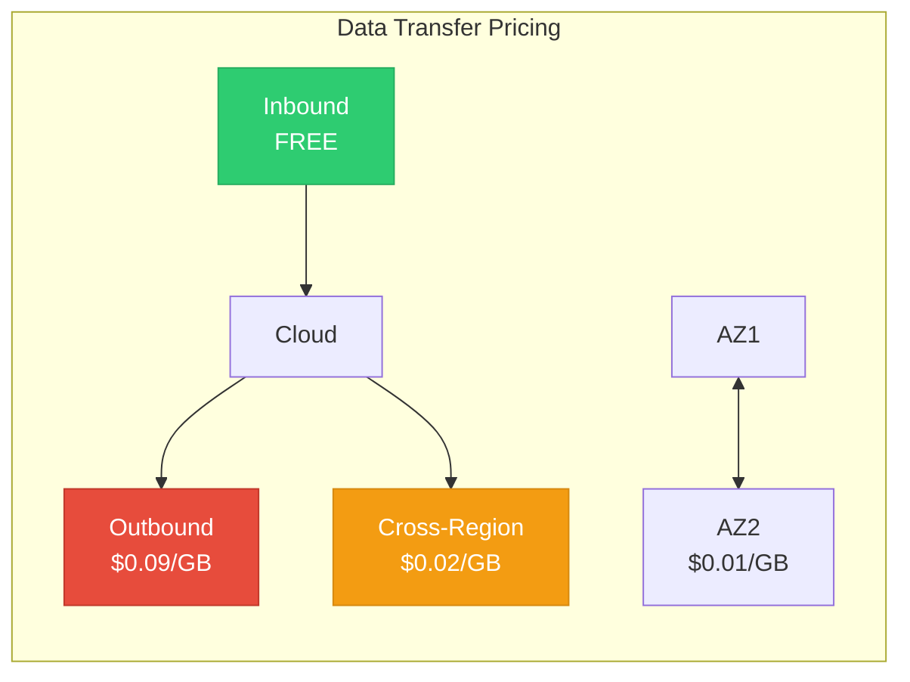

# Lesson 02: Optimization Strategies

## Learning Objectives

By the end of this lesson, you will:
- Implement right-sizing strategies
- Eliminate cloud waste
- Optimize storage costs
- Use spot/preemptible instances effectively

---

## The Optimization Framework



> 💡 **Start with quick wins**: Waste elimination and right-sizing before investing in commitments.

---

## 1. Waste Elimination

### Common Sources of Waste

| Waste Type | Description | Savings Potential |
|------------|-------------|-------------------|
| **Idle Resources** | Running but unused | 100% of resource |
| **Orphaned Storage** | Unattached volumes/snapshots | 100% of storage |
| **Oversized Resources** | More capacity than needed | 20-50% |
| **Old Snapshots** | Accumulated backups | 30-70% |
| **Unused IPs** | Elastic IPs not attached | $3.60/month each |

### Finding Waste: AWS

```bash
# Find unattached EBS volumes
aws ec2 describe-volumes \
  --filters "Name=status,Values=available" \
  --query 'Volumes[*].[VolumeId,Size,CreateTime]' \
  --output table

# Find unused Elastic IPs
aws ec2 describe-addresses \
  --query 'Addresses[?InstanceId==`null`].[PublicIp,AllocationId]' \
  --output table

# Find old snapshots (>90 days)
aws ec2 describe-snapshots --owner-ids self \
  --query 'Snapshots[?StartTime<=`2024-01-01`].[SnapshotId,VolumeSize,StartTime]' \
  --output table
```

### Finding Waste: Azure

```bash
# Find unattached disks
az disk list --query "[?diskState=='Unattached'].{Name:name,Size:diskSizeGb}"

# Find stopped VMs still incurring costs
az vm list -d --query "[?powerState!='VM running'].{Name:name,State:powerState}"
```

### Finding Waste: GCP

```bash
# Find unused disks
gcloud compute disks list --filter="NOT users:*"

# Find idle VMs (low CPU utilization)
gcloud recommender recommendations list \
  --recommender=google.compute.instance.IdleResourceRecommender \
  --location=us-central1-a
```

---

## 2. Right-Sizing

### What is Right-Sizing?

Matching resource allocation to actual utilization.



### Right-Sizing Metrics

| Metric | Target Range | Action if Below |
|--------|--------------|-----------------|
| CPU Average | 40-70% | Downsize |
| Memory Average | 60-80% | Downsize |
| CPU Peak | <90% | Downsize |
| Memory Peak | <90% | Downsize |

### Using AWS Compute Optimizer

```bash
# Get EC2 recommendations
aws compute-optimizer get-ec2-instance-recommendations \
  --query 'instanceRecommendations[*].[instanceArn,currentInstanceType,recommendationOptions[0].instanceType,estimatedMonthlySavings.value]' \
  --output table
```

### Right-Sizing with CloudWatch

```bash
# Query average CPU over 14 days
aws cloudwatch get-metric-statistics \
  --namespace AWS/EC2 \
  --metric-name CPUUtilization \
  --dimensions Name=InstanceId,Value=i-1234567890abcdef0 \
  --start-time $(date -d '14 days ago' --utc +%Y-%m-%dT%H:%M:%SZ) \
  --end-time $(date --utc +%Y-%m-%dT%H:%M:%SZ) \
  --period 3600 \
  --statistics Average Maximum
```

---

## 3. Spot/Preemptible Instances

### When to Use Spot Instances



### Good Spot Use Cases

| Use Case | Why It Works |
|----------|--------------|
| CI/CD builds | Short-lived, restartable |
| Batch processing | Checkpointable workloads |
| Dev/Test | Non-critical environments |
| Data processing | Stateless transformations |
| Container workloads | Easily rescheduled |

### Spot Best Practices

| Practice | Description |
|----------|-------------|
| **Diversify** | Use multiple instance types |
| **Handle interruption** | Implement graceful shutdown |
| **Mix with On-Demand** | Base capacity + Spot scaling |
| **Use Spot Fleets** | Automatic instance selection |
| **Set max price** | Limit hourly spend |

### AWS Spot Fleet Example

```json
{
  "SpotFleetRequestConfig": {
    "TargetCapacity": 10,
    "IamFleetRole": "arn:aws:iam::123456789012:role/spot-fleet-role",
    "LaunchSpecifications": [
      {
        "InstanceType": "m5.large",
        "WeightedCapacity": 1,
        "SpotPrice": "0.05"
      },
      {
        "InstanceType": "m5.xlarge",
        "WeightedCapacity": 2,
        "SpotPrice": "0.10"
      },
      {
        "InstanceType": "m4.large",
        "WeightedCapacity": 1,
        "SpotPrice": "0.04"
      }
    ],
    "AllocationStrategy": "lowestPrice"
  }
}
```

---

## 4. Storage Optimization

### Storage Tiers

| Tier | AWS | Azure | GCP | Use Case |
|------|-----|-------|-----|----------|
| **Hot** | S3 Standard | Hot | Standard | Frequent access |
| **Warm** | S3 IA | Cool | Nearline | Monthly access |
| **Cold** | S3 Glacier | Archive | Coldline | Yearly access |
| **Archive** | Glacier Deep | Archive | Archive | Compliance |

### Storage Savings by Tier



### Implementing Lifecycle Policies

**AWS S3 Lifecycle:**
```json
{
  "Rules": [
    {
      "ID": "TransitionToIA",
      "Status": "Enabled",
      "Transitions": [
        {
          "Days": 30,
          "StorageClass": "STANDARD_IA"
        },
        {
          "Days": 90,
          "StorageClass": "GLACIER"
        },
        {
          "Days": 365,
          "StorageClass": "DEEP_ARCHIVE"
        }
      ],
      "Expiration": {
        "Days": 2555
      }
    }
  ]
}
```

### EBS Optimization

| Optimization | Savings | Effort |
|--------------|---------|--------|
| Delete unattached volumes | 100% | Low |
| Use gp3 instead of gp2 | 20% | Low |
| Right-size volumes | Varies | Medium |
| Snapshot lifecycle | 30-50% | Medium |

---

## 5. Network Optimization

### Data Transfer Costs



### Network Optimization Strategies

| Strategy | Description | Savings |
|----------|-------------|---------|
| **CDN** | Cache at edge locations | 40-60% on egress |
| **Same-Region** | Keep resources together | Eliminate cross-region |
| **VPC Endpoints** | Avoid NAT Gateway | Variable |
| **Compression** | Reduce data size | Proportional to compression |
| **Caching** | Reduce repeated transfers | 50-90% |

---

## Optimization Checklist

### Weekly Tasks
- [ ] Review unused resource alerts
- [ ] Check for new optimization recommendations
- [ ] Validate scheduled shutdown compliance

### Monthly Tasks
- [ ] Run right-sizing analysis
- [ ] Review storage lifecycle policies
- [ ] Analyze spot instance savings
- [ ] Update optimization dashboard

### Quarterly Tasks
- [ ] Comprehensive waste audit
- [ ] Architecture review for cost efficiency
- [ ] Reserved instance coverage review

---

## Key Takeaways

- ✅ Eliminate waste first (100% savings on unused resources)
- ✅ Right-size to match utilization (20-50% savings)
- ✅ Use Spot for fault-tolerant workloads (60-90% savings)
- ✅ Implement storage lifecycle policies (70%+ on cold data)
- ✅ Optimize network architecture to reduce data transfer

---

## Next Lesson

Continue to **[Lesson 03: Reserved Instances & Savings Plans](../03-Reserved-Instances/README.md)** to learn about commitment-based discounts.
