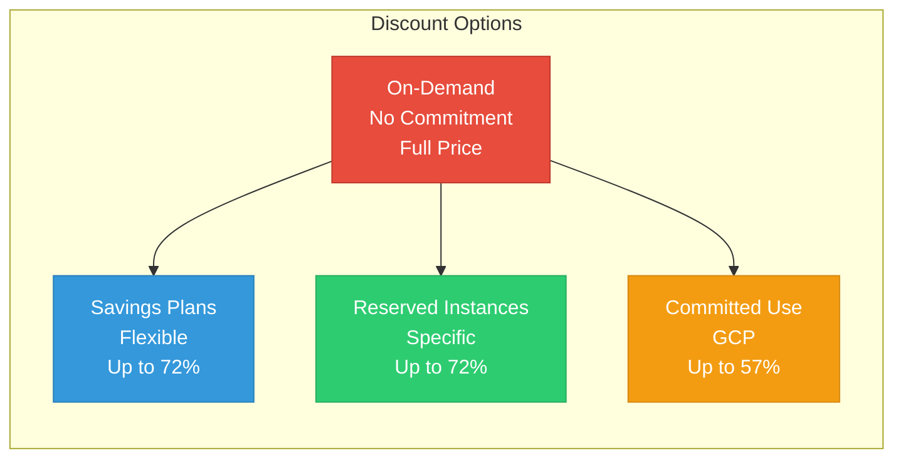
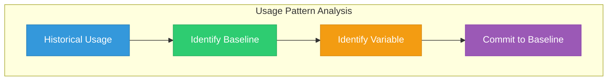
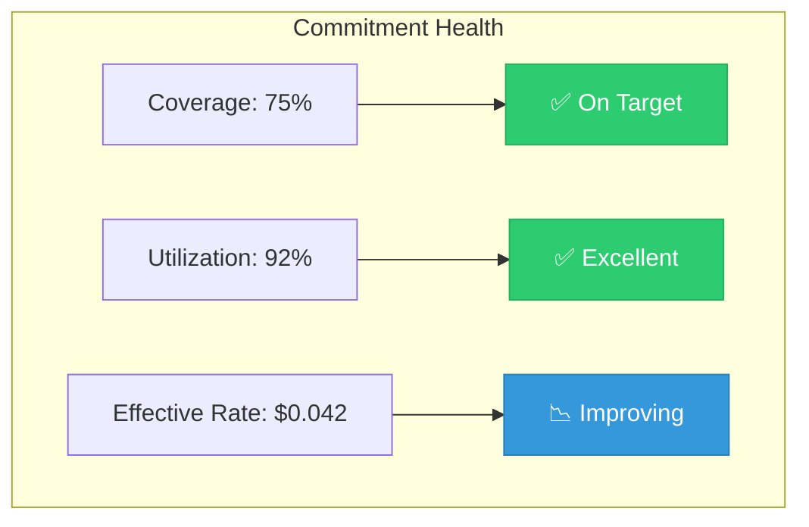

# Lesson 03: Reserved Instances & Savings Plans

## Learning Objectives

By the end of this lesson, you will:
- Understand different commitment options
- Calculate RI and Savings Plan needs
- Implement a commitment purchasing strategy
- Monitor and optimize commitment utilization

---

## Commitment-Based Discounts Overview

Cloud providers offer significant discounts for committing to use resources over time.



---

## AWS Savings Plans vs Reserved Instances

### Comparison Table

| Feature | Savings Plans | Reserved Instances |
|---------|---------------|-------------------|
| **Flexibility** | High (any instance type) | Low (specific instance) |
| **Discount** | Up to 72% | Up to 72% |
| **Terms** | 1 or 3 years | 1 or 3 years |
| **Payment** | All upfront, partial, no upfront | All upfront, partial, no upfront |
| **Coverage** | EC2, Fargate, Lambda | EC2, RDS, ElastiCache, etc. |
| **Recommendation** | Start here | For specific stable workloads |

### Types of Savings Plans

| Type | Flexibility | Best For |
|------|-------------|----------|
| **Compute** | Any instance family/region | Most scenarios |
| **EC2 Instance** | Instance family in region | Stable, predictable |
| **SageMaker** | ML workloads | Machine learning |

### Types of Reserved Instances

| Type | Flexibility | Discount |
|------|-------------|----------|
| **Standard RI** | Lowest (fixed) | Highest (up to 72%) |
| **Convertible RI** | Medium (can exchange) | Lower (up to 66%) |
| **Scheduled RI** | Time-based | Varies |

---

## Payment Options


| Payment Option | 1-Year Discount | 3-Year Discount | Cash Flow |
|----------------|-----------------|-----------------|-----------|
| **All Upfront** | ~40% | ~60% | Large initial |
| **Partial Upfront** | ~35% | ~55% | Balanced |
| **No Upfront** | ~30% | ~50% | Monthly payments |

---

## Calculating Commitment Needs

### Step 1: Analyze Usage Patterns



### Step 2: Identify Baseline Usage

Look for:
- Minimum consistent usage (24/7 workloads)
- Production workloads that won't change
- Resources with stable utilization

### Step 3: Calculate Coverage

```
Recommended Coverage = Baseline Usage × Coverage Target (70-80%)
```

**Example Calculation:**

| Metric | Value |
|--------|-------|
| Monthly EC2 On-Demand spend | $100,000 |
| Baseline (24/7) portion | $70,000 (70%) |
| Variable portion | $30,000 (30%) |
| Recommended SP commitment | $49,000-$56,000/month |
| Expected savings | $25,200-$40,320/month |

---

## AWS Savings Plans Purchase

### Using Cost Explorer Recommendations

```bash
# Get Savings Plan recommendations
aws ce get-savings-plans-purchase-recommendation \
  --savings-plans-type COMPUTE_SP \
  --term-in-years ONE_YEAR \
  --payment-option NO_UPFRONT \
  --lookback-period-in-days THIRTY_DAYS
```

### Purchase Example

```bash
# Purchase a Savings Plan
aws savingsplans create-savings-plan \
  --savings-plan-offering-id "offering-id-here" \
  --commitment "100.0" \
  --client-token "unique-token-12345"
```

---

## Azure Reserved Instances

### Azure RI Types

| Type | Coverage | Flexibility |
|------|----------|-------------|
| **VM Reserved Instances** | Virtual Machines | Instance size flexibility |
| **SQL Database RI** | SQL Database | vCore-based |
| **Cosmos DB RI** | Cosmos DB | Throughput-based |
| **Azure Storage RI** | Storage capacity | Capacity reserved |

### Azure CLI Example

```bash
# List available reservations
az reservations reservation-order list

# Purchase a reservation
az reservations reservation-order purchase \
  --reservation-order-id "order-id" \
  --sku "Standard_D2s_v3" \
  --location "eastus" \
  --term "P1Y" \
  --billing-plan "Monthly" \
  --quantity 10
```

---

## GCP Committed Use Discounts

### CUD Types

| Type | Discount | Flexibility |
|------|----------|-------------|
| **Resource-based** | Up to 57% | Specific vCPU/memory |
| **Spend-based** | Up to 25% | Any eligible service |

### GCP CLI Example

```bash
# Create a commitment
gcloud compute commitments create my-commitment \
  --region=us-central1 \
  --plan=12-month \
  --resources=vcpu=100,memory=200GB
```

---

## Monitoring Commitment Utilization

### Key Metrics

| Metric | Target | Action if Below |
|--------|--------|-----------------|
| **Coverage** | >70% | Purchase more commitments |
| **Utilization** | >80% | Right-size or sell unused |
| **Effective Rate** | Decreasing | Reducing over time is good |

### AWS Utilization Report

```bash
# Get RI utilization
aws ce get-reservation-utilization \
  --time-period Start=2024-01-01,End=2024-01-31 \
  --group-by Type=DIMENSION,Key=SERVICE

# Get Savings Plan utilization
aws ce get-savings-plans-utilization \
  --time-period Start=2024-01-01,End=2024-01-31
```

### Utilization Dashboard



---

## Commitment Strategy Best Practices

### Phased Approach

| Phase | Action | Timeline |
|-------|--------|----------|
| **1. Analysis** | 30 days usage data | Week 1-2 |
| **2. Pilot** | 25% of baseline | Week 3-4 |
| **3. Scale** | 50% of baseline | Month 2 |
| **4. Optimize** | 70-80% of baseline | Month 3+ |

### Risk Mitigation

| Risk | Mitigation |
|------|------------|
| Over-commitment | Start with Compute Savings Plans (flexible) |
| Under-utilization | Monitor weekly, adjust quarterly |
| Technology change | Use convertible RIs or Savings Plans |
| Workload volatility | Only commit to stable baseline |

### When NOT to Commit

- ❌ New applications without usage history
- ❌ Workloads planned for migration/sunset
- ❌ Highly variable seasonal workloads
- ❌ Development/test environments

---

## Hands-On Exercise

### Exercise 1: Calculate Baseline

Using your cloud provider's cost tool:
1. Pull 90 days of EC2/VM usage
2. Identify minimum daily usage
3. Calculate baseline commitment amount

### Exercise 2: Evaluate Recommendations

1. Access Savings Plan/RI recommendations
2. Review suggested commitment levels
3. Calculate expected ROI

### Exercise 3: Create Utilization Report

Build a report showing:
- Current commitment coverage
- Utilization percentage
- Missed savings opportunities

---

## Key Takeaways

- ✅ Start with Savings Plans for flexibility
- ✅ Only commit to stable, baseline usage (70-80%)
- ✅ Use no-upfront for largest discount with monthly payments
- ✅ Monitor utilization weekly, adjust quarterly
- ✅ Leave variable/spiky workloads on On-Demand or Spot

---

## Next Lesson

Continue to **[Lesson 04: Showback & Chargeback](../04-Showback-Chargeback/README.md)** to learn about allocating costs to teams.
