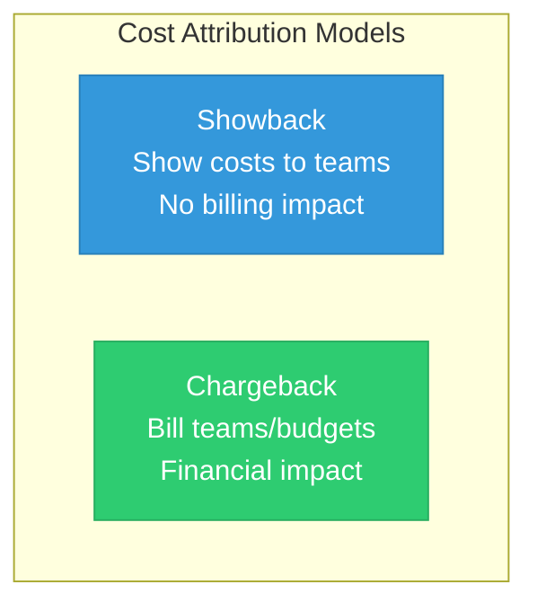
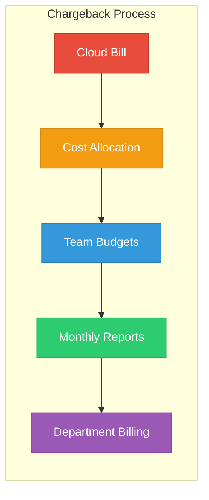
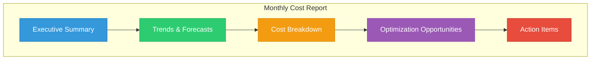

# Lesson 04: Showback & Chargeback

## Learning Objectives

By the end of this lesson, you will:
- Understand showback vs. chargeback models
- Implement a cost allocation framework
- Create cost reports for teams
- Design incentive structures for cost efficiency

---

## Showback vs. Chargeback



### Comparison

| Aspect | Showback | Chargeback |
|--------|----------|------------|
| **Purpose** | Awareness | Accountability |
| **Billing** | Informational | Actual charges |
| **Complexity** | Lower | Higher |
| **Cultural impact** | Medium | High |
| **Implementation** | Faster | Longer |
| **Best for** | Starting orgs | Mature orgs |

---

## The Showback Model

### Benefits
- ✅ Creates cost awareness
- ✅ No budget changes required
- ✅ Low friction to implement
- ✅ Good starting point

### Challenges
- ❌ No direct incentive to optimize
- ❌ Costs remain centralized
- ❌ Teams may ignore reports

### Showback Report Template

| Team | Service | Monthly Cost | Trend | % of Total |
|------|---------|--------------|-------|------------|
| Platform | EC2 | $15,000 | ↑ 5% | 30% |
| Platform | RDS | $8,000 | → 0% | 16% |
| Backend | EC2 | $10,000 | ↓ 3% | 20% |
| Backend | Lambda | $2,000 | ↑ 10% | 4% |
| Frontend | S3/CloudFront | $5,000 | → 0% | 10% |
| Data | EMR | $10,000 | ↑ 8% | 20% |
| **Total** | | **$50,000** | | **100%** |

---

## The Chargeback Model

### Benefits
- ✅ Direct financial accountability
- ✅ Teams own their budgets
- ✅ Strong optimization incentive
- ✅ Aligns with business units

### Challenges
- ❌ Requires accurate tagging
- ❌ Shared costs complexity
- ❌ Potential team conflicts
- ❌ Budget process changes

### Chargeback Flow



---

## Implementation Roadmap

### Phase 1: Foundation (Months 1-2)


- Implement comprehensive tagging
- Set up cost allocation tools
- Create basic visibility dashboards
- Launch showback reports

### Phase 2: Maturation (Months 3-4)

- Refine tagging coverage (>90%)
- Handle shared cost allocation
- Validate cost accuracy
- Train teams on reports

### Phase 3: Chargeback (Months 5-6)

- Define chargeback policies
- Update budgeting processes
- Align with finance team
- Launch chargeback billing

---

## Handling Shared Costs

### Shared Cost Categories

| Category | Examples | Allocation Method |
|----------|----------|-------------------|
| **Platform** | Kubernetes cluster, load balancers | By usage (pods, requests) |
| **Network** | NAT Gateway, VPN, Direct Connect | By data transfer |
| **Security** | WAF, GuardDuty, Security Hub | Fixed split or headcount |
| **Monitoring** | CloudWatch, Datadog | By resources monitored |
| **Support** | Enterprise support | By spend ratio |

### Allocation Formula Example

```
Team Shared Cost = Total Shared Cost × (Team Direct Cost / Total Direct Cost)
```

**Example:**
- Total Shared Costs: $10,000
- Team A Direct Costs: $30,000
- Total Direct Costs: $100,000
- Team A Shared Allocation: $10,000 × ($30,000 / $100,000) = $3,000

---

## Creating Effective Reports

### Report Components



### Report Frequency

| Audience | Frequency | Content |
|----------|-----------|---------|
| Executives | Monthly | Summary, trends, top issues |
| Team Leads | Weekly | Team costs, anomalies |
| Engineers | Real-time | Resource-level dashboards |
| Finance | Monthly | Detailed allocation, forecasts |

### Sample Executive Summary

```markdown
## Monthly Cloud Cost Report - January 2024

### Key Metrics
- **Total Spend**: $150,000 (+5% MoM)
- **Budget Status**: $145,000 budget → 103% utilized
- **Optimization Savings**: $12,000 implemented

### Top Concerns
<b>1. ⚠️ Data team overspent by $8,000</b>
<details>
<summary>Show Answer</summary>
Answer: EMR costs
</details>

2. ⚠️ Untagged resources: 12% of spend

### Next Month Forecast
- Projected spend: $155,000
- Recommended actions: Right-size EMR clusters
```

---

## Incentive Structures

### Cost Efficiency Incentives

| Incentive | Description | Impact |
|-----------|-------------|--------|
| **Savings Sharing** | Team keeps % of savings | High motivation |
| **Budget Flexibility** | Savings rollover to next period | Medium |
| **Recognition** | Public acknowledgment | Cultural |
| **Goals/OKRs** | Cost efficiency in performance | Tied to reviews |

### Anti-Patterns to Avoid

| Anti-Pattern | Problem | Solution |
|--------------|---------|----------|
| **Blame culture** | Teams fear cost visibility | Focus on improvement, not blame |
| **Rigid budgets** | No flexibility for innovation | Allow justified overages |
| **No context** | Raw numbers without meaning | Add benchmarks, trends |
| **Delayed reports** | Data too old to act on | Near real-time visibility |

---

## Building a Chargeback Policy

### Policy Elements

```yaml
Chargeback Policy:
  Scope:
    - All cloud resources with valid tags
    - Shared infrastructure (allocated)
    
  Allocation Rules:
    Tagged Resources:
      Method: Direct assignment by tags
      Accuracy: 100% to tagged team
      
    Shared Resources:
      Method: Proportional to direct costs
      Categories:
        - Platform infrastructure
        - Security tools
        - Monitoring
        
    Untagged Resources:
      Method: Assigned to "Unallocated" pool
      Review: Monthly with team leads
      
  Billing Cycle:
    Frequency: Monthly
    Due Date: 15th of following month
    
  Dispute Process:
    Window: 10 business days
    Escalation: FinOps team → Finance → VP Engineering
```

---

## Tools for Showback/Chargeback

### Native Tools

| Provider | Tool | Capability |
|----------|------|------------|
| **AWS** | Cost Categories, Cost Explorer | Cost allocation, reporting |
| **Azure** | Cost Management | Cost allocation, budgets |
| **GCP** | Billing Reports, Labels | Cost breakdown by label |

### Third-Party Tools

| Tool | Showback | Chargeback | Multi-Cloud |
|------|----------|------------|-------------|
| **CloudHealth** | ✅ | ✅ | ✅ |
| **Apptio Cloudability** | ✅ | ✅ | ✅ |
| **Kubecost** | ✅ | ✅ | K8s focused |
| **Spot.io** | ✅ | Limited | ✅ |

---

## Hands-On Exercise

### Exercise 1: Design Your Report

Create a showback report template for your organization:
1. Identify key stakeholders
2. Define report sections
3. Determine frequency

### Exercise 2: Calculate Shared Cost Allocation

Using your current data:
1. Identify shared cost categories
2. Calculate allocation percentages
3. Apply to sample month

### Exercise 3: Draft Chargeback Policy

Create a policy document covering:
1. Who is charged
2. What is charged
3. How disputes are handled

---

## Key Takeaways

- ✅ Start with showback to build awareness
- ✅ Progress to chargeback for accountability
- ✅ Handle shared costs with clear allocation rules
- ✅ Create incentives, not blame
- ✅ Regular, actionable reports drive behavior

---

## Next Lesson

Continue to **[Lesson 05: Automation & Tooling](../05-Automation/README.md)** to learn how to automate FinOps processes.
