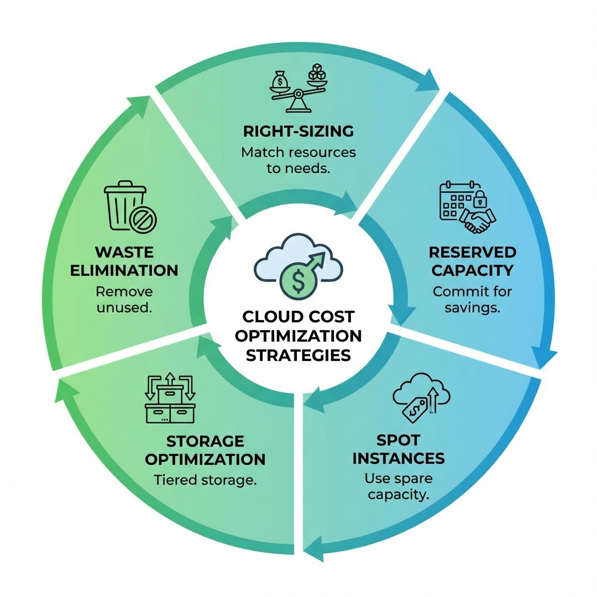
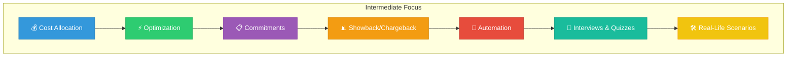

# FinOps - Intermediate Level

## Welcome to Intermediate FinOps

Building on the fundamentals, this intermediate guide covers cost optimization strategies, reserved capacity planning, and implementing showback/chargeback models.

---

## Learning Path Overview

| Lesson | Topic | Duration |
|--------|-------|----------|
| 01 | [Cost Allocation Strategies](./01-Cost-Allocation/README.md) | 60 min |
| 02 | [Optimization Strategies](./02-Optimization-Strategies/README.md) | 75 min |
| 03 | [Reserved Instances & Savings Plans](./03-Reserved-Instances/README.md) | 60 min |
| 04 | [Showback & Chargeback](./04-Showback-Chargeback/README.md) | 45 min |
| 05 | [Automation & Tooling](./05-Automation/README.md) | 60 min |
| 06 | [Interview Questions & Quizzes](./06-Interview-Questions-and-Quizzes/README.md) | 45 min |
| 07 | [Real-Life Scenarios](./07-Real-Life-Scenarios/README.md) | 60 min |
| 08 | [📺 YouTube Lessons](./Youtube_Lessons.md) | 30 min |

---

## Prerequisites

Before starting this level, ensure you have completed:
- ✅ [Beginner FinOps](../../1-Beginner/15-FinOps/README.md)
- ✅ Basic tagging strategy implemented
- ✅ Cost visibility tools configured
- ✅ Budgets and alerts set up

---

## Intermediate FinOps Focus Areas

---

## Key Optimization Levers

| Lever | Potential Savings | Effort |
|-------|-------------------|--------|
| **Right-sizing** | 20-40% | Medium |
| **Reserved Instances** | 40-72% | Low |
| **Spot Instances** | 60-90% | High |
| **Unused Resource Cleanup** | 10-30% | Low |
| **Storage Optimization** | 15-25% | Medium |

---

## Tools for Intermediate FinOps

### Cloud Native Tools

| Provider | Optimization Tool | Cost Analysis |
|----------|------------------|---------------|
| **AWS** | Compute Optimizer, Trusted Advisor | Cost Explorer, CUR |
| **Azure** | Advisor, Cost Management | Cost Analysis |
| **GCP** | Recommender, Active Assist | Billing Reports |

### Third-Party Tools

| Tool | Category | Key Features |
|------|----------|--------------|
| **CloudHealth** | Multi-cloud | Comprehensive cost management |
| **Spot.io** | Optimization | Automated spot management |
| **Kubecost** | Kubernetes | K8s cost allocation |
| **Apptio Cloudability** | Enterprise | Advanced analytics |
| **Flexera** | Multi-cloud | Asset management |
| **Densify** | Right-sizing | ML-based recommendations |

---

## FinOps Metrics to Track

### Efficiency Metrics

| Metric | Formula | Target |
|--------|---------|--------|
| **Coverage Ratio** | RI Hours / Total Hours | >70% |
| **Utilization Rate** | Used RI / Purchased RI | >80% |
| **Waste Percentage** | Idle Resources / Total | <10% |
| **Cost per Unit** | Total Cost / Business Metric | Decreasing |

### Financial Metrics

| Metric | Description | Frequency |
|--------|-------------|-----------|
| **Monthly Run Rate** | Annualized monthly spend | Monthly |
| **Forecast Accuracy** | Actual vs. Predicted | Monthly |
| **Budget Variance** | Actual vs. Budget | Weekly |
| **Cost per Customer** | Cloud Cost / Active Users | Monthly |

---

## Optimization Quick Wins

### Week 1: Low-Hanging Fruit
- [ ] Delete unused EBS volumes
- [ ] Release unattached Elastic IPs
- [ ] Remove old snapshots
- [ ] Terminate unused EC2 instances

### Week 2: Right-sizing
- [ ] Review Compute Optimizer recommendations
- [ ] Downsize over-provisioned instances
- [ ] Consolidate underutilized databases

### Week 3: Commitments
- [ ] Analyze usage patterns
- [ ] Calculate RI/Savings Plan needs
- [ ] Purchase initial commitments

### Week 4: Automation
- [ ] Set up scheduled shutdowns for dev
- [ ] Enable auto-scaling policies
- [ ] Implement resource lifecycle policies

---

## Learning Resources

### Certifications
- **FinOps Certified Practitioner** - FinOps Foundation
- **FinOps Certified Professional** - Advanced certification

### Communities
- [FinOps Foundation](https://www.finops.org/)
- [FinOps Slack Community](https://finopsfoundation.slack.com/)

### Books
- "Cloud FinOps" by J.R. Storment & Mike Fuller
- "The Frugal Architect" - AWS Best Practices

---

## Next Steps

Start with **[Lesson 01: Cost Allocation Strategies](./01-Cost-Allocation/README.md)** or jump to the **[Interview Prep](./06-Interview-Questions-and-Quizzes/README.md)**!

After completing the Intermediate level:
- 📕 [Advanced FinOps](../../3-Advanced/13-FinOps/README.md) - Enterprise frameworks and culture