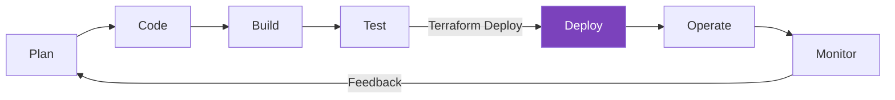

Terraform is an open-source Infrastructure as Code (IaC) tool created by HashiCorp that allows you to define and provision infrastructure using a declarative configuration language.
## Key Benefits
- **Infrastructure as Code**: Version control your infrastructure.
- **Multi-Cloud**: Support for 1000+ providers (AWS, Azure, GCP, etc.).
- **Declarative**: Describe the desired state, not the steps to get there.
- **Plan and Apply**: Preview changes before execution to avoid surprises.
- **State Management**: Track resource relationships and metadata.
- **Modular**: Build reusable infrastructure components.
## Use Cases
- **Cloud Infrastructure**: Managing AWS, Azure, GCP resources.
- **Multi-Cloud Deployments**: Consistent infrastructure across multiple clouds.
- **Application Infrastructure**: Managing Kubernetes, Docker, and databases.
- **Network Infrastructure**: Provisioning VPCs, load balancers, and DNS.
- **Security Infrastructure**: Configuring IAM, security groups, and certificates.

## Terraform in the DevOps Lifecycle

---
## 🏗️ Real-Life Scenario: The Manual Setup Trap
**Problem**: A startup needs to deploy their web app to AWS. The lead engineer manually creates the VPC, 3 EC2 instances, and an RDS database. When it's time to create a "staging" environment, they realize they can't remember all the manual settings, leading to "Environment Drift."
**Solution**: By using Terraform, the engineer defines the entire infrastructure in a `main.tf` file. They can now deploy identical copies of the environment (Dev, Staging, Prod) in minutes, ensuring consistency and version control.

---
## ❓ Interview Questions

1. **What is Infrastructure as Code (IaC)?**
   - *Answer*: IaC is the process of managing and provisioning computer data centers through machine-readable definition files, rather than physical hardware configuration or interactive configuration tools.

2. **How does Terraform differ from Ansible?**
   - *Answer*: Terraform is primarily an orchestration tool (Focuses on *Infrastructure*), while Ansible is a configuration management tool (Focuses on *Apps/OS*). Terraform is declarative, whereas Ansible can be procedural.

3. **What are the main advantages of using Terraform over manual infrastructure provisioning?**
   - *Answer*: Version control, reproducibility, consistency across environments, faster deployment, reduced human error, better documentation (code as documentation), and easier disaster recovery.

4. **Can Terraform manage existing infrastructure that wasn't created by Terraform?**
   - *Answer*: Yes, using the `terraform import` command to bring existing resources under Terraform management.

5. **What is the difference between declarative and imperative approaches?**
   - *Answer*: Declarative (Terraform) specifies the desired end state and the tool figures out how to achieve it. Imperative specifies step-by-step instructions on how to reach the end state.

---

## 🧠 Comprehensive Quiz (20 Questions)

**1. Who created Terraform?**
- A) Google
- B) Amazon
- C) HashiCorp
- D) Microsoft

Show Answer

**Answer: C**

**2. What language does Terraform use for configuration?**
- A) YAML
- B) HCL (HashiCorp Configuration Language)
- C) JSON only
- D) XML

Show Answer

**Answer: B**

**3. Is Terraform Declarative or Imperative?**
- A) Imperative
- B) Declarative
- C) Procedural
- D) Functional

Show Answer

**Answer: B**

**4. Name one advantage of using IaC.**
- A) More expensive
- B) Version control and consistency
- C) Requires more manual work
- D) Slower deployments

Show Answer

**Answer: B**

**5. Can Terraform manage on-premise infrastructure?**
- A) No, only cloud
- B) Yes, with appropriate providers like VMware or OpenStack
- C) Only with AWS
- D) Only virtual machines

Show Answer

**Answer: B**

**6. What does IaC stand for?**
- A) Internet as Code
- B) Infrastructure and Configuration
- C) Infrastructure as Code
- D) Integrated Application Code

Show Answer

**Answer: C**

**7. Which of these is NOT a primary benefit of Terraform?**
- A) Multi-cloud support
- B) State management
- C) Compiling code to machine language
- D) Plan before apply

Show Answer

**Answer: C**

**8. How many providers does Terraform support?**
- A) Only the big 3 clouds
- B) About 50
- C) 1000+
- D) Only HashiCorp providers

Show Answer

**Answer: C**

**9. What approach does Terraform use?**
- A) Specify steps to create resources
- B) Describe desired state, Terraform figures out steps
- C) Manual point-and-click
- D) Command-line scripts

Show Answer

**Answer: B**

**10. Terraform is best suited for:**
- A) Application code deployment
- B) Infrastructure provisioning
- C) Database queries
- D) Frontend development

Show Answer

**Answer: B**

**11. What is a key difference between Terraform and CloudFormation?**
- A) CloudFormation is multi-cloud, Terraform is not
- B) Terraform is multi-cloud, CloudFormation is AWS-only
- C) Terraform doesn't use JSON
- D) No difference

Show Answer

**Answer: B**

**12. Can Terraform manage Kubernetes resources?**
- A) No, only cloud providers
- B) Yes, through the Kubernetes provider
- C) Only EKS on AWS
- D) Only with Helm

Show Answer

**Answer: B**

**13. What does "immutable infrastructure" mean in Terraform context?**
- A) Infrastructure that never changes
- B) Replace rather than modify resources
- C) Infrastructure without variables
- D) Static IP addresses

Show Answer

**Answer: B**

**14. Terraform was released in:**
- A) 2010
- B) 2014
- C) 2018
- D) 2020

Show Answer

**Answer: B**

**15. Which is a valid Terraform use case?**
- A) Writing frontend React code
- B) Provisioning a VPC and subnets
- C) Compiling Java applications
- D) Running unit tests

Show Answer

**Answer: B**

**16. Terraform can manage:**
- A) Only AWS EC2 instances
- B) Cloud, SaaS, on-prem, and even DNS providers
- C) Only virtual machines
- D) Only networking

Show Answer

**Answer: B**

**17. What makes Terraform "cloud-agnostic"?**
- A) It doesn't use clouds
- B) It works with multiple cloud providers
- C) It only works locally
- D) It requires no authentication

Show Answer

**Answer: B**

**18. Terraform is:**
- A) A paid commercial product
- B) Open-source with optional commercial features
- C) Closed source
- D) Only for enterprises

Show Answer

**Answer: B**

**19. What is Terraform LEAST suitable for?**
- A) Managing infrastructure
- B) Writing business logic in applications
- C) Multi-cloud deployments
- D) Version-controlled infrastructure

Show Answer

**Answer: B**

**20. The main benefit of "Plan before Apply" is:**
- A) Faster execution
- B) Preview changes before they happen
- C) Automatic rollback
- D) Better syntax highlighting

Show Answer

**Answer: B**

