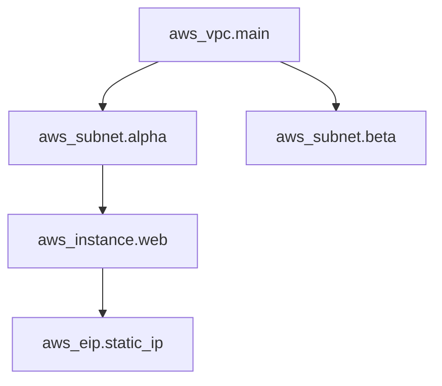
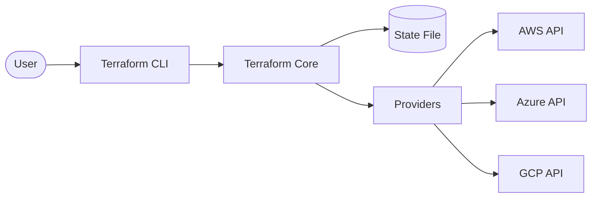

Understanding the architecture and main building blocks of Terraform.

## Terraform Architecture
Terraform consists of two main parts:
1. **Terraform Core**: The CLI tool that handles the logic, state, and planning.
2. **Providers**: Plugins that interface with remote APIs (AWS, Azure, GitHub, etc.).
## Main Building Blocks
- **Configuration Files**: `.tf` files defining the infrastructure.
- **State File**: A JSON file (`terraform.tfstate`) that tracks the current state of infrastructure.
- **Providers**: Plugins that bridge HCL to cloud APIs.
- **Resources**: The actual objects you want to manage (EC2, S3, etc.).
- **Modules**: Reusable packages of configurations.
- **Dependency Graph**: A mathematical structure (Directed Acyclic Graph) used to determine resource order.

## The Terraform Dependency Graph (DAG)
Terraform builds a map of all resources in your configuration to understand their relationships. This is called a **Directed Acyclic Graph (DAG)**.

### Why it matters:
1. **Parallelization**: Resources with no dependencies are created simultaneously to save time.
2. **Order of Operations**: It ensures a VPC exists before a Subnet is created within it.
3. **Efficiency**: Only changes the parts of the graph that are modified.

---

## 🏗️ Real-Life Scenario: The Lost State File
**Problem**: An engineer deletes the `terraform.tfstate` file by accident.
**Solution**: Terraform now thinks no infrastructure exists. If they run `terraform apply`, it will try to recreate everything, leading to errors (e.g., "Bucket already exists").
**Lesson**: Always use a remote backend (like S3 with DynamoDB locking) to store your state file safely and enable team collaboration.

---

## ❓ Interview Questions

1. **What is the purpose of the Terraform State file?**
   - *Answer*: It maps real-world resources to your configuration, keeps track of metadata, and improves performance for large infrastructures.

2. **What is the difference between a Provider and a Resource?**
   - *Answer*: A Provider is a plugin that makes an API reachable; a Resource is an object *within* that provider that you are creating/managing.

3. **How does Terraform's Dependency Graph (DAG) optimize resource creation?**
   - *Answer*: The DAG allows Terraform to parallelize the creation of independent resources while respecting dependencies. Resources without dependencies are created simultaneously, significantly reducing deployment time.

4. **What happens if there's a circular dependency in your Terraform configuration?**
   - *Answer*: Terraform will detect the circular dependency during the planning phase and return an error, preventing the apply operation. You must refactor your code to break the circular reference.

5. **Explain the difference between Terraform Core and Terraform Providers.**
   - *Answer*: Terraform Core is the main engine that handles parsing configurations, building the dependency graph, and managing state. Providers are plugins that translate Terraform's API calls into cloud-specific API calls (AWS, Azure, GCP, etc.).

6. **Why is Terraform considered "cloud-agnostic"?**
   - *Answer*: Terraform uses a plugin-based architecture where providers handle cloud-specific logic. The core language (HCL) and workflow remain the same regardless of the cloud provider, enabling multi-cloud deployments.

7. **What role does the state file play in the dependency graph?**
   - *Answer*: The state file stores the current state of resources including IDs, attributes, and metadata. Terraform uses this to calculate the difference between desired state (configuration) and current state (reality) when building the dependency graph for updates.

---

## 🧠 Comprehensive Quiz (25 Questions)

**1. What is the name of the Terraform state file?**
- A) `state.tf`
- B) `terraform.state`
- C) `terraform.tfstate`
- D) `.tfstate`

Show Answer

**Answer: C**

**2. Where does Terraform Core look for providers by default?**
- A) Local directory
- B) Terraform Registry
- C) GitHub
- D) Provider's official website

Show Answer

**Answer: B**

**3. What happens if the state file is out of sync with reality?**
- A) Terraform crashes
- B) Terraform updates its plan to match the current configuration with reality
- C) Resources are automatically deleted
- D) Nothing, Terraform ignores the difference

Show Answer

**Answer: B**

**4. Is it recommended to store state files in Git?**
- A) Yes, for version control
- B) No, it contains secrets and changes frequently
- C) Only in private repositories
- D) Yes, but only with encryption

Show Answer

**Answer: B**

**5. What is the 'Declarative' approach in Terraform?**
- A) You define step-by-step instructions
- B) You define the *What* (desired state), and Terraform figures out the *How*
- C) You write code in Python
- D) You manually configure each resource

Show Answer

**Answer: B**

**6. What data structure does Terraform use to determine resource order?**
- A) Binary Search Tree
- B) Linked List
- C) Directed Acyclic Graph (DAG)
- D) Hash Table

Show Answer

**Answer: C**

**7. What are the two main components of Terraform architecture?**
- A) Frontend and Backend
- B) Terraform Core and Providers
- C) Client and Server
- D) State and Configuration

Show Answer

**Answer: B**

**8. What file extension is used for Terraform configuration files?**
- A) `.tfconfig`
- B) `.hcl`
- C) `.tf`
- D) `.terraform`

Show Answer

**Answer: C**

**9. Which component handles the actual API calls to cloud providers?**
- A) Terraform Core
- B) Terraform CLI
- C) State File
- D) Provider Plugins

Show Answer

**Answer: D**

**10. What is the primary benefit of the DAG in Terraform?**
- A) Better error messages
- B) Parallelization and correct ordering of resource operations
- C) Smaller state files
- D) Faster configuration parsing

Show Answer

**Answer: B**

**11. Can Terraform's DAG contain cycles (circular dependencies)?**
- A) Yes, Terraform handles them automatically
- B) Yes, but only in modules
- C) No, Terraform will error if a cycle is detected
- D) Yes, but performance degrades

Show Answer

**Answer: C**

**12. What information does the state file contain?**
- A) Only resource IDs
- B) Resource mappings, metadata, and dependencies
- C) Only configuration code
- D) Provider authentication credentials

Show Answer

**Answer: B**

**13. How does Terraform determine which resources can be created in parallel?**
- A) Random selection
- B) By analyzing the DAG for independent resources
- C) All resources are always created sequentially
- D) Based on alphabetical order

Show Answer

**Answer: B**

**14. What happens when you reference one resource attribute in another resource?**
- A) Terraform creates an error
- B) Terraform creates an implicit dependency
- C) Resources are created in random order
- D) Nothing, dependencies must be explicit

Show Answer

**Answer: B**

**15. Where is the Terraform state file stored by default?**
- A) Cloud storage
- B) Terraform Cloud
- C) Local directory (terraform.tfstate)
- D) In-memory only

Show Answer

**Answer: C**

**16. What is the role of Terraform Core?**
- A) Making API calls to providers
- B) Parsing configuration, building graph, and managing state
- C) Storing secrets
- D) Hosting the registry

Show Answer

**Answer: B**

**17. What language does Terraform use for configuration?**
- A) YAML
- B) JSON only
- C) HashiCorp Configuration Language (HCL)
- D) Python

Show Answer

**Answer: C**

**18. If a VPC must exist before creating a subnet, what ensures proper order?**
- A) Manual timing
- B) The DAG and dependency graph
- C) Provider API
- D) Alphabetical resource names

Show Answer

**Answer: B**

**19. How many providers can a single Terraform configuration use?**
- A) Only one
- B) Maximum of three
- C) Multiple providers (unlimited)
- D) Two (primary and backup)

Show Answer

**Answer: C**

**20. What type of graph structure does Terraform use?**
- A) Cyclic graph
- B) Undirected graph
- C) Directed Acyclic Graph (DAG)
- D) Tree structure

Show Answer

**Answer: C**

**21. What is stored in the `.terraform` directory after `terraform init`?**
- A) State files
- B) Configuration backups
- C) Provider plugins and modules
- D) Log files only

Show Answer

**Answer: C**

**22. Can Terraform manage resources across multiple cloud providers simultaneously?**
- A) No, one provider per project
- B) Yes, using multiple provider blocks
- C) Only with Terraform Cloud
- D) Only AWS and Azure

Show Answer

**Answer: B**

**23. What happens if Terraform Core cannot reach a provider plugin?**
- A) Uses cached data
- B) Initialization or apply will fail
- C) Automatically downloads from internet
- D) Switches to alternative provider

Show Answer

**Answer: B**

**24. What is the relationship between Terraform configuration files and the state file?**
- A) They are identical
- B) Configuration defines desired state; state file tracks actual state
- C) State file contains backup of configuration
- D) No relationship

Show Answer

**Answer: B**

**25. Why is the DAG described as "Acyclic"?**
- A) It can process in any direction
- B) It has no circular dependencies (no cycles)
- C) It's faster than cyclic graphs
- D) It uses less memory

Show Answer

**Answer: B**

