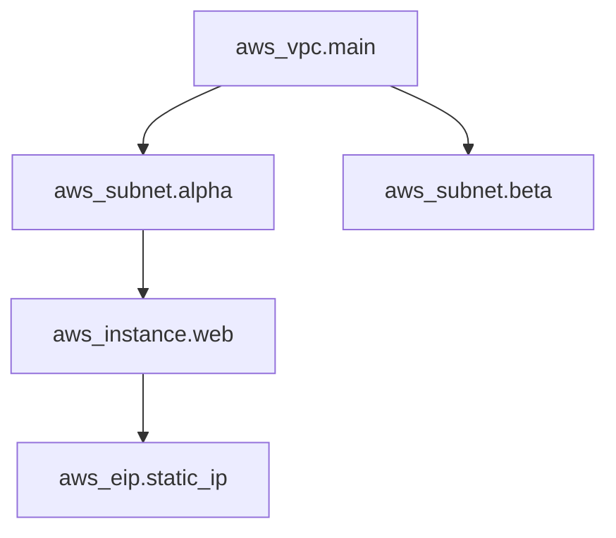

Understanding the architecture and main building blocks of Terraform.

## Terraform Architecture
Terraform consists of two main parts:
1. **Terraform Core**: The CLI tool that handles the logic, state, and planning.
2. **Providers**: Plugins that interface with remote APIs (AWS, Azure, GitHub, etc.).
## Main Building Blocks
- **Configuration Files**: `.tf` files defining the infrastructure.
- **State File**: A JSON file (`terraform.tfstate`) that tracks the current state of infrastructure.
- **Providers**: Plugins that bridge HCL to cloud APIs.
- **Resources**: The actual objects you want to manage (EC2, S3, etc.).
- **Modules**: Reusable packages of configurations.
- **Dependency Graph**: A mathematical structure (Directed Acyclic Graph) used to determine resource order.

## The Terraform Dependency Graph (DAG)
Terraform builds a map of all resources in your configuration to understand their relationships. This is called a **Directed Acyclic Graph (DAG)**.

### Why it matters:
1. **Parallelization**: Resources with no dependencies are created simultaneously to save time.
2. **Order of Operations**: It ensures a VPC exists before a Subnet is created within it.
3. **Efficiency**: Only changes the parts of the graph that are modified.

---

## 🏗️ Real-Life Scenario: The Lost State File
**Problem**: An engineer deletes the `terraform.tfstate` file by accident.
**Solution**: Terraform now thinks no infrastructure exists. If they run `terraform apply`, it will try to recreate everything, leading to errors (e.g., "Bucket already exists").
**Lesson**: Always use a remote backend (like S3 with DynamoDB locking) to store your state file safely and enable team collaboration.

---

## ❓ Interview Questions
1. **What is the purpose of the Terraform State file?**
   - *Answer*: It maps real-world resources to your configuration, keeps track of metadata, and improves performance for large infrastructures.
2. **What is the difference between a Provider and a Resource?**
   - *Answer*: A Provider is a plugin that makes an API reachable; a Resource is an object *within* that provider that you are creating/managing.

---
## 🧠 Quiz Snippet (5/20+)
1. **What is the name of the Terraform state file?** (terraform.tfstate)
2. **Where does Terraform Core look for providers?** (Terraform Registry)
3. **What happens if the state file is out of sync with reality?** (Terraform update its plan to match configuration)
4. **Is it recommended to store state in Git?** (No, it contains secrets and changes frequently)
5. **What is the 'Declarative' approach?** (You define the *What*, and Terraform figures out the *How*)
