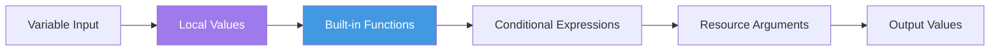

HashiCorp Configuration Language (HCL) is designed to be human-readable and machine-friendly for defining infrastructure.
## Syntax Basics
```hcl
# Block syntax
resource "resource_type" "local_name" {
  argument_name = "value"
}
```
## Data Types
- **String**: `"t3.micro"`
- **Number**: `10`
- **Boolean**: `true`
- **List**: `["us-east-1a", "us-east-1b"]`
- **Map**: `{ Name = "Web", Env = "Dev" }`

## Functions & Expressions
Terraform provides over 100 built-in functions (no custom functions allowed).
- **upper("hello")** -> "HELLO"
- **element(list, index)** -> retrieves an item.
- **lookup(map, key, default)** -> safe map retrieval.

## HCL Expression Evaluation



---
## 🏗️ Real-Life Scenario: Dynamic Naming
**Problem**: An organization needs to tag all resources with the environment name. Hardcoding tags works but is prone to errors.
**Solution**: Use **Locals** and **String Interpolation**.
```hcl
locals {
  name_prefix = "${var.project}-${var.env}"
}
resource "aws_instance" "app" {
  ...
  tags = { Name = "${local.name_prefix}-server" }
}
```

---

## ❓ Interview Questions

1. **What is HCL?**
   - *Answer*: HashiCorp Configuration Language. It is a declarative language used across HashiCorp products like Terraform, Vault, and Nomad.

2. **Can you write custom functions in Terraform?**
   - *Answer*: No, but you can use the wide range of built-in functions provided by HashiCorp.

3. **What is the difference between `locals` and `variables`?**
   - *Answer*: Variables are inputs to your module that can be set externally. Locals are computed values used internally within the module for DRY code and complex expressions.

4. **How do you use conditionals in Terraform?**
   - *Answer*: Using the ternary operator syntax: `condition ? true_val : false_val`. Example: `instance_type = var.env == "prod" ? "t3.large" : "t3.micro"`

5. **What is string interpolation in HCL?**
   - *Answer*: Embedding expressions within strings using `${}` syntax (older) or direct references in modern Terraform. Example: `"${var.name}-server"` or just using expressions directly.

6. **Can you use HCL for JSON?**
   - *Answer*: Yes, Terraform also accepts JSON syntax as an alternative to HCL, using `.tf.json` file extension.

7. **What are the primitive types in HCL?**
   - *Answer*: `string`, `number`, and `bool`.

---

## 🧠 Comprehensive Quiz (25 Questions)

**1. What is the extension for Terraform files?**
- A) `.terraform`
- B) `.hcl`
- C) `.tf`
- D) `.tfconfig`


<details>
<summary>Show Answer</summary>

**Answer: C**

</details>

**2. Which data type stores a key-value pair?**
- A) List
- B) Map
- C) Set
- D) Object


<details>
<summary>Show Answer</summary>

**Answer: B**

</details>

**3. What is the purpose of 'Locals'?**
- A) To define output values
- B) To handle internal logic/reusable expressions
- C) To create resources
- D) To import modules


<details>
<summary>Show Answer</summary>

**Answer: B**

</details>

**4. How do you comment a single line in HCL?**
- A) `/* comment */`
- B) `-- comment`
- C) `# or //`
- D) `<!-- comment -->`


<details>
<summary>Show Answer</summary>

**Answer: C**

</details>

**5. What is interpolation in Terraform?**
- A) Importing modules
- B) The `${}` syntax to include variables/results in strings
- C) Copying files
- D) Migrating state


<details>
<summary>Show Answer</summary>

**Answer: B**

</details>

**6. Which function converts a string to uppercase?**
- A) `uppercase()`
- B) `upper()`
- C) `toUpper()`
- D) `caps()`


<details>
<summary>Show Answer</summary>

**Answer: B**

</details>

**7. What is the syntax for a conditional expression?**
- A) `if condition then value`
- B) `condition ? true_val : false_val`
- C) `switch(condition)`
- D) `case condition of`


<details>
<summary>Show Answer</summary>

**Answer: B**

</details>

**8. Can you nest blocks in HCL?**
- A) No, only top-level blocks
- B) Yes, HCL supports nested blocks
- C) Only in modules
- D) Only with special syntax


<details>
<summary>Show Answer</summary>

**Answer: B**

</details>

**9. What does the `length()` function return?**
- A) Size of infrastructure
- B) Length of a list, map, or string
- C) Number of resources
- D) State file size


<details>
<summary>Show Answer</summary>

**Answer: B**

</details>

**10. How do you define a list in HCL?**
- A) `list("a", "b")`
- B) `["a", "b"]`
- C) `{"a", "b"}`
- D) `("a", "b")`


<details>
<summary>Show Answer</summary>

**Answer: B**

</details>

**11. What keyword defines reusable internal values?**
- A) `vars`
- B) `constants`
- C) `locals`
- D) `internals`


<details>
<summary>Show Answer</summary>

**Answer: C**

</details>

**12. Which character starts a heredoc string?**
- A) `"""`
- B) `<<<`
- C) `<<EOF`
- D) `---`


<details>
<summary>Show Answer</summary>

**Answer: C**

</details>

**13. Can HCL files use JSON format?**
- A) No, only HCL syntax
- B) Yes, with `.tf.json` extension
- C) Only in Terraform Cloud
- D) Only for variables


<details>
<summary>Show Answer</summary>

**Answer: B**

</details>

**14. What function joins list elements into a string?**
- A) `concat()`
- B) `merge()`
- C) `join()`
- D) `combine()`


<details>
<summary>Show Answer</summary>

**Answer: C**

</details>

**15. How do you access a map value?**
- A) `map.key` or `map["key"]`
- B) `map->key`
- C) `map@key`
- D) `get(map, key)`


<details>
<summary>Show Answer</summary>

**Answer: A**

</details>

**16. What does `coalesce()` function do?**
- A) Merges lists
- B) Returns the first non-null argument
- C) Combines maps
- D) Validates data


<details>
<summary>Show Answer</summary>

**Answer: B**

</details>

**17. Which are valid primitive types in HCL?**
- A) int, float, char
- B) string, number, bool
- C) varchar, integer, boolean
- D) text, decimal, flag


<details>
<summary>Show Answer</summary>

**Answer: B**

</details>

**18. How do you create a multi-line string?**
- A) Use triple quotes `"""`
- B) Use heredoc syntax `<<EOF ... EOF`
- C) Use backslash continuation
- D) Use pipe `|`


<details>
<summary>Show Answer</summary>

**Answer: B**

</details>

**19. What does `flatten()` do?**
- A) Removes whitespace
- B) Converts nested lists into a single flat list
- C) Compresses files
- D) Simplifies expressions


<details>
<summary>Show Answer</summary>

**Answer: B**

</details>

**20. Can you use arithmetic operations in HCL?**
- A) No, not supported
- B) Yes, +, -, *, /, % are supported
- C) Only addition
- D) Only with special functions


<details>
<summary>Show Answer</summary>

**Answer: B**

</details>

**21. What is the `for` expression syntax?**
- A) `for item in list`
- B) `[for item in list : expression]`
- C) `foreach(list, item)`
- D) `map(list, function)`


<details>
<summary>Show Answer</summary>

**Answer: B**

</details>

**22. How do you reference a local value?**
- A) `var.name`
- B) `local.name`
- C) `locals.name`
- D) `@name`


<details>
<summary>Show Answer</summary>

**Answer: B**

</details>

**23. What does `merge()` function do?**
- A) Combines lists
- B) Merges two or more maps
- C) Joins strings
- D) Concatenates files


<details>
<summary>Show Answer</summary>

**Answer: B**

</details>

**24. Can you define functions in `.tf` files?**
- A) Yes, using `function` block
- B) No, only built-in functions available
- C) Only in modules
- D) Only with Terraform 1.0+


<details>
<summary>Show Answer</summary>

**Answer: B**

</details>

**25. What is the operator for NOT equals?**
- A) `<>`
- B) `!=`
- C) `/=`
- D) `~=`


<details>
<summary>Show Answer</summary>

**Answer: B**

</details>
