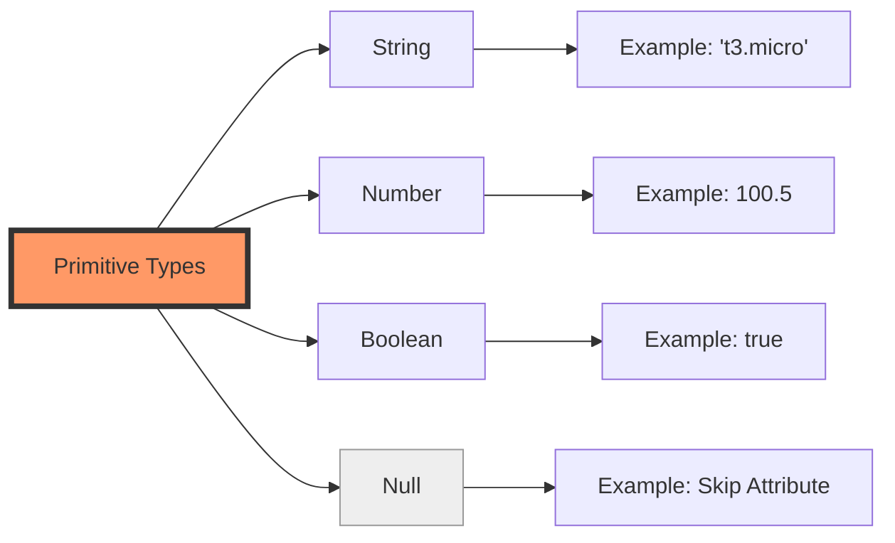
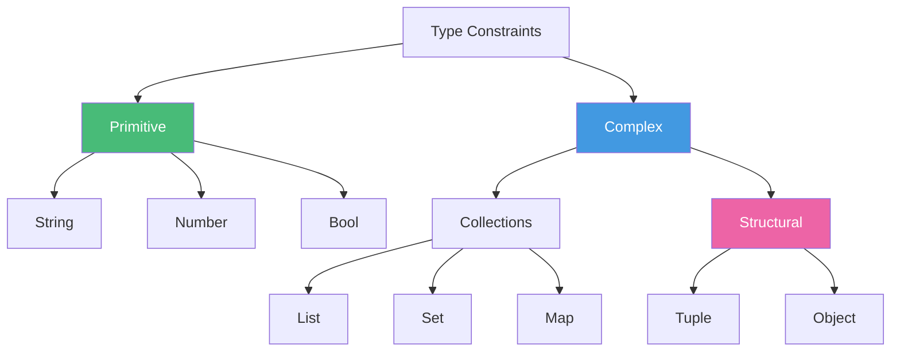
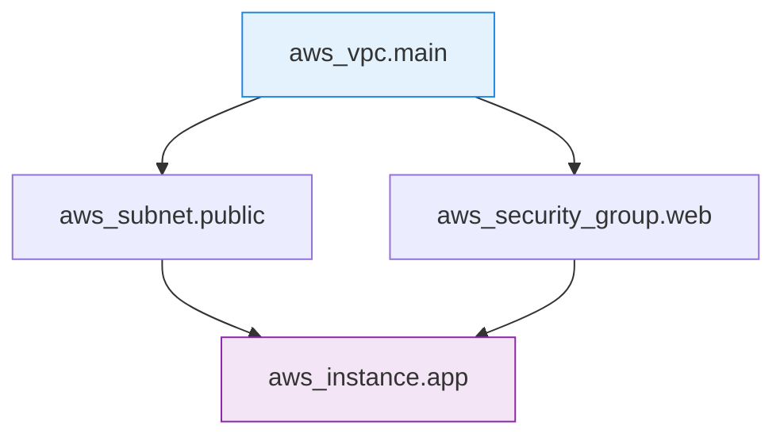
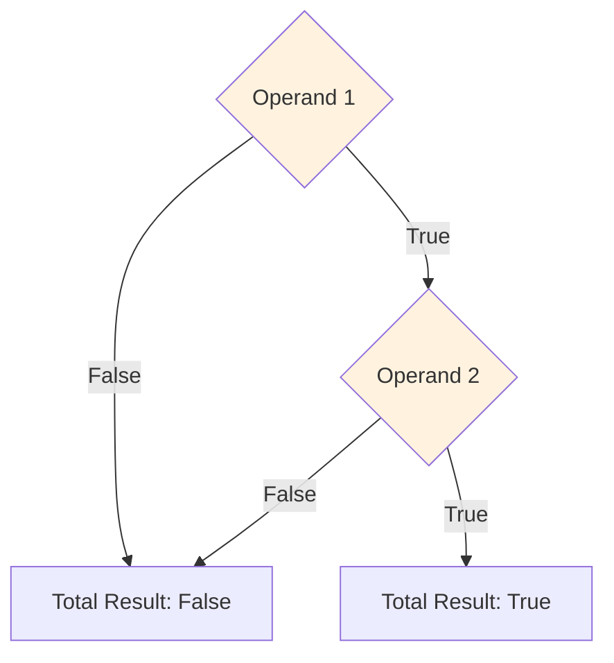
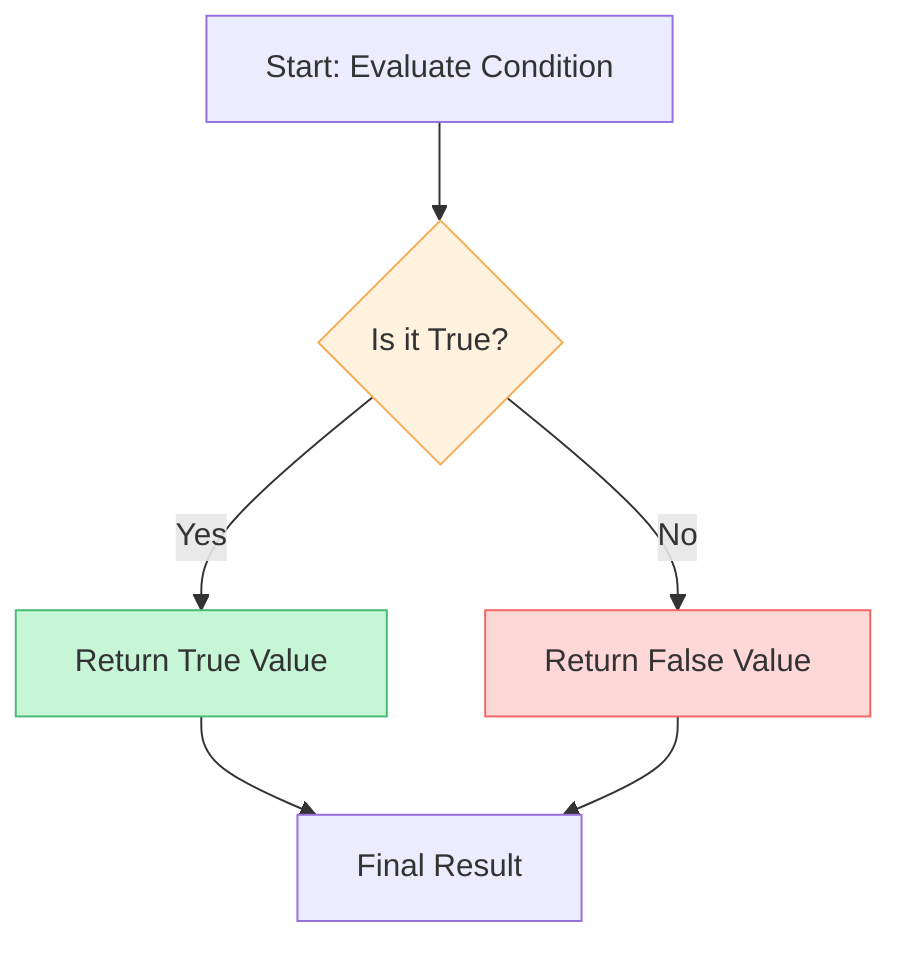
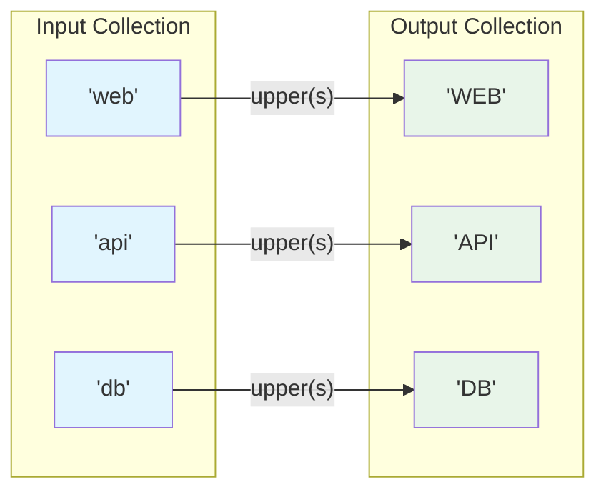
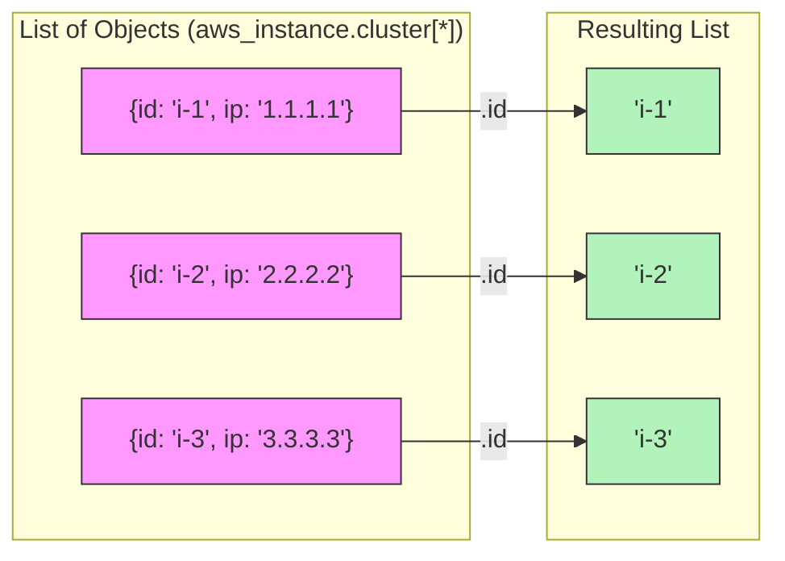
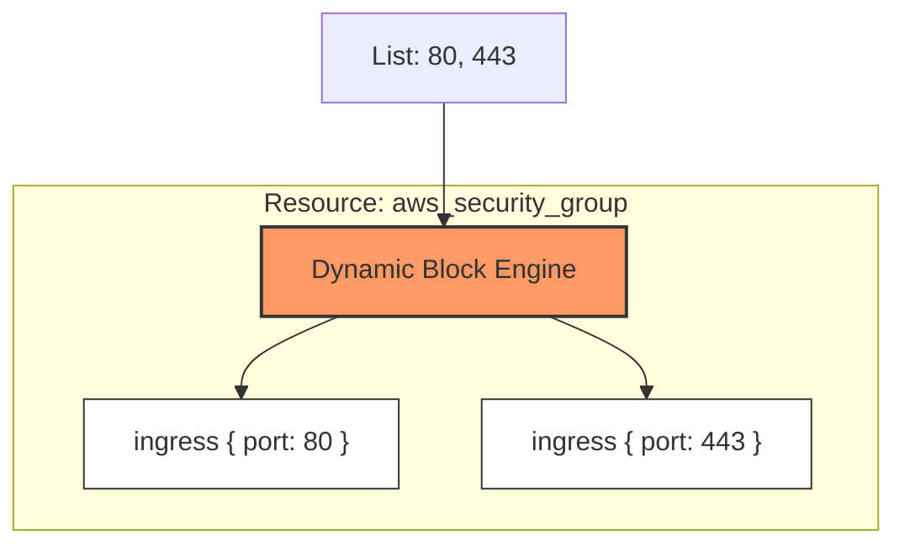
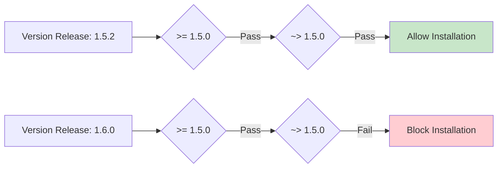
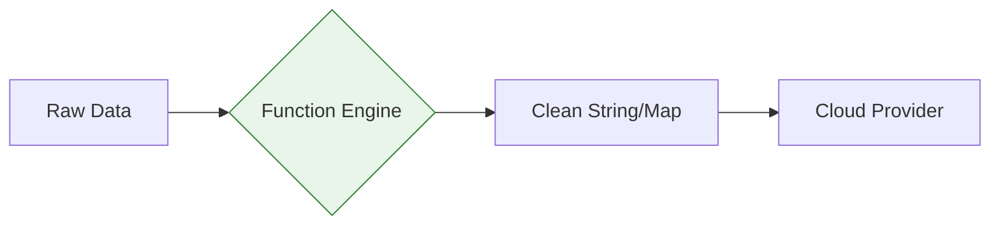

# 🧪 Terraform Expressions: Deep Dive
Expressions in Terraform represent values. Mastery of expressions allows you to move beyond basic resource declaration and build highly adaptable, automated infrastructure platforms.

---
## 💎 1. Types and Values
Terraform identifies data through a structured type system. Understanding these is crucial for variable definitions and resource attributes.
### 🧱 Primitive Types: The Building Blocks
Primitive types are the simplest forms of data in Terraform. They represent a single value and cannot be broken down further.

#### 📊 Type Analysis & Professional Usage

| Type | Description | Professional Usage Example |
| :--- | :--- | :--- |
| string | A sequence of Unicode characters (text). | `name = "prod-db-server"` |
| number | Numeric values (integers or decimals). | `cpu_threads = 2`, `storage_gb = 50.5` |
| bool | Boolean logic (True/False). | `enable_monitoring = true` |
| null | Absence of a value. | `backup_id = null` (Forces Terraform to skip an argument) |

#### 🏗️ Terraform Block Example (Variable Definition)
In a professional module, you define these types to ensure input validation.
```hcl
variable "server_name" {
  type        = string
  description = "The name of the server"
}

variable "disk_size" {
  type        = number
  description = "Size of disk in GB"
  default     = 20
}

variable "is_encrypted" {
  type        = bool
  description = "Enable disk encryption?"
  default     = false
}
```
#### 🏗️ Primitive Type Example (Resource Utilization)
Here is how these primitives look when passed into a resource.
```hcl
resource "aws_ebs_volume" "example" {
  availability_zone = "us-east-1a" # String literal
  size              = 40             # Number literal
  encrypted         = true           # Boolean literal
  kms_key_id        = null           # Null: Tells AWS to use the default key
}
```

#### 🗺️ Primitive Type Flow Diagram


### 💎 2. Complex Types & Type Constraints
Complex types allow you to group multiple values together. They are categorized into <font color="#ffff00">Collections</font> (<font color="#ff0000">homogeneous - same type</font>) and **<font color="#ffff00">Structural</font> Types** (<font color="#ff0000">heterogeneous - mixed types</font>).
#### 📊 Collection Types (Same Type Items)

| Type | Description | Indexing | Example |
| :--- | :--- | :--- | :--- |
| `list(type)` | Ordered sequence of values. | Numeric (`0, 1, 2`) | `["us-east-1a", "us-east-1b"]` |
| `set(type)` | Unordered collection of unique values. | None | `toset(["vpc-1", "vpc-2"])` |
| `map(type)` | Key-value pairs with unique keys. | Key Name | `{ env = "dev", team = "sre" }` |

#### 📊 Structural Types (Fixed Schema)

| Type              | Description                                                          | schema                      | Example                |
| :---------------- | :------------------------------------------------------------------- | :-------------------------- | :--------------------- |
| `tuple([types])`  | Ordered list with fixed length and specific types for each position. | `[string, number, bool]`    | `["admin", 1, true]`   |
| `object({attrs})` | Complex record with named attributes and distinct types.             | `{ name=string, tags=map }` | `{ id=1, name="web" }` |
|                   |                                                                      |                             |                        |

---
### 🏗️ Complex Type Examples (Variables)

#### 1. The `object` Constraint (Professional Standard)
Objects are used to pass complex configuration datasets into a module.
```hcl
variable "cluster_config" {
  type = object({
    name          = string
    node_count    = number
    is_autoscale  = bool
    # nested collection
    labels        = map(string)
    # optional attribute (Terraform 1.3+)
    region        = optional(string, "us-east-1")
  })
  default = {
    name         = "production-cluster"
    node_count   = 3
    is_autoscale = true
    labels       = { "team" = "data-science" }
    # 'region' will default to "us-east-1" if not provided
  }
}
```
#### 2. The `tuple` vs `list` Comparison
```hcl
# A LIST: All items must be the same type (Strings)
variable "allowed_regions" {
  type    = list(string)
  default = ["us-east-1", "eu-west-1"]
}

# A TUPLE: Each position has a specific, different type
variable "user_info_tuple" {
  type    = tuple([string, number, bool])
  default = ["admin_user", 500, false]
}
```

#### 🧩 Type Hierarchy Diagram



---

## 📝 2. Strings and Templates

### 🧵 String Interpolation (`${...}`)
Interpolation is the mechanism used to embed one expression inside a string. It allows you to build dynamic labels, paths, or scripts by injecting variable values or resource attributes into a text block.

#### 🏗️ The Mechanism
Terraform evaluates any HCL expression within the `${ }` markers, converts the result to a string (if it isn't one already), and replaces the placeholder with that value.

#### 📊 Common Scenarios

| Injecting... | Syntax | Example Result |
| :--- | :--- | :--- |
| **Variables** | `"${var.env}-db"` | `"prod-db"` |
| **Resource IDs** | `"sg-${aws_vpc.main.id}"` | `"sg-vpc-0a1b2c"` |
| **Function Logic** | `"${upper(var.name)}"` | `"APP-SERVER"` |
| **Math Results** | `"Storage: ${var.gb * 1024}MB"` | `"Storage: 20480MB"` |

---

#### 🏗️ Interpolation Lifecycle Flow
The following diagram illustrates how Terraform processes an interpolation block from evaluation to final string assembly.

```mermaid
graph TD
    Start[String: 'Server-${var.id}'] --> Eval{Evaluate Expr}
    Eval --> Value[Raw Value: 101]
    Value --> Cast[Type Cast: '101']
    Cast --> Join[Concatenate Strings]
    Join --> Final[Final: 'Server-101']

    style Start fill:#f5f5f5
    style Eval fill:#fff3e0,stroke:#f6ad55
    style Final fill:#e3f2fd,stroke:#2196f3,stroke-width:2px
```

---

#### 🏗️ Pro-Tip: Avoid "Useless" Interpolation
A common anti-pattern is wrapping a single variable in interpolation when assigning it to an attribute. This adds unnecessary complexity and can slightly impact performance.

```hcl
# ❌ INCORRECT (Anti-Pattern)
# Wrapping a single reference in quotes + ${} is redundant.
resource "aws_instance" "bad" {
  ami = "${var.ami_id}"
}

# ✅ CORRECT (Clean Code)
# Assign the variable directly. It is already a string expression.
resource "aws_instance" "good" {
  ami = var.ami_id
}
```

---

### Advanced Heredoc & Templating
Heredocs are perfect for user-data scripts or IAM policies. They maintain the formatting of the text block while allowing for dynamic insertion.
```hcl
resource "aws_instance" "web" {
  user_data = <<-EOF
    #!/bin/bash
    echo "Current Environment: ${var.env}"
    echo "Architecture: ${local.arch}"
  EOF
}
```
### �️ Escape Sequences
In HCL strings, certain characters have special meanings. If you want to include these characters literally, or represent non-printable characters like newlines, you must use **<font color="#ffff00">Escape Sequences</font>** starting with a backslash (`\`).
#### 📊 Common Escape Sequences

| Sequence | Character Represented | Use Case |
| :--- | :--- | :--- |
| `\n` | Newline | Breaking lines in a single-line string. |
| `\t` | Tab | Adding indentation to a file content. |
| `\"` | Double Quote | Including quotes inside a quoted string. |
| `\\` | Backslash | Including a literal path like `C:\Users`. |
| `\${` | Literal `${` | Preventing Terraform from attempting interpolation. |
| `\%{` | Literal `%{` | Preventing Terraform from starting a template directive. |
#### 🏗️ Terraform Block Example (Escalating Special Characters)
```hcl
locals {
  # Example 1: Windows Paths
  # We use \\ to represent a single \ because \ is an escape character
  windows_path = "C:\\Program Files\\Terraform"

  # Example 2: Quotes within Strings
  # Escaping quotes so they don't terminate the string early
  json_fragment = "{\"name\": \"Production-VPC\"}"

  # Example 3: Escaping Interpolation
  # This will print the literal characters ${var.name} instead of the value
  raw_string = "To use a variable, write \${var.name} in your code."
}
```

#### 🏗️ Unicode Escape Sequences
Terraform also supports Unicode escapes for special symbols.
- `\uNNNN`: 4 hex digits (e.g., `\u00A9` for ©)
- `\UNNNNNNNN`: 8 hex digits

```hcl
variable "registered_trademark" {
  default = "HashiCorp\u00AE" # Result: HashiCorp®
}
```

---

### �🛠️ Template Directives (The `%{ }` Syntax)
Template directives allow you to embed logic directly into strings. This is extremely powerful for generating configuration files or dynamic scripts.
#### 1. Conditional Directives (`if`)
Use this to toggle parts of a string based on logic.
```hcl
Greeting = "Hello, %{ if var.name != "" }${var.name}%{ else }Guest%{ endif }!"
```

**Real Block Example (Generating an Nginx Config):**
```hcl
locals {
  nginx_conf = <<-EOT
    server {
        listen 80;
        server_name ${var.domain};
        %{ if var.enable_ssl }
        listen 443 ssl;
        ssl_certificate /etc/nginx/ssl/cert.pem;
        %{ endif }
    }
  EOT
}
```

#### 2. For Directives (`for`)
Iterates over a collection inside a string.
```hcl
# Example: Creating a comma-separated list manually
Names = "%{ for name in var.names }${name}, %{ endfor }"
```
#### 3. Stripping Whitespace (`~`)
Template directives often leave behind ugly newlines and spaces. Use the `~` symbol to tell Terraform to "swallow" the whitespace.
- `%{ if ... ~}`: Strips whitespace **after** the opening directive.
- `%{ ~ endif }`: Strips whitespace **before** the closing directive.
**Clean vs. Messy Example:**
```hcl
# Result is messy with multiple blank lines
user_data = <<-EOF
%{ for ip in var.ips }
allow ${ip};
%{ endfor }
EOF

# Result is clean (one line per IP, no extra spaces)
user_data = <<-EOF
%{ for ip in var.ips ~}
allow ${ip};
%{ endfor ~}
EOF
```
---
## 🔗 3. References to Values
References are the "<font color="#ffff00">connectors</font>" of your infrastructure graph. They allow one resource to use information from another, creating an implicit dependency that Terraform uses to determine the creation order.

| Type | Syntax | Example |
| :--- | :--- | :--- |
| Input Variable | `var.<NAME>` | `var.region` |
| Local Value | `local.<NAME>` | `local.common_tags` |
| Resource Attribute | `<TYPE>.<NAME>.<ATTR>` | `aws_vpc.main.id` |
| Data Source | `data.<TYPE>.<NAME>.<ATTR>` | `data.aws_ami.ubuntu.id` |
| Module Output | `module.<NAME>.<OUTPUT>` | `module.vpc.vpc_id` |
| Self Object | `self.<ATTR>` | `self.private_ip` (Provisioners only) |

---
### 🏗️ Dependency Management (Implicit vs. Explicit)
When you reference an attribute of Resource A inside Resource B, Terraform automatically understands that **Resource A must be created first**.
#### 1. Implicit Dependency (Standard)
```hcl
resource "aws_security_group" "web" {
  name   = "web-sg"
  # REFERENCING the VPC ID creates an implicit dependency
  vpc_id = aws_vpc.main.id 
}

resource "aws_vpc" "main" {
  cidr_block = "10.0.0.0/16"
}
```
#### 2. Deep Attribute Access
You can access nested attributes from complex resource outputs.
```hcl
output "ebs_volume_id" {
  # Accessing the first item in a list of objects
  value = aws_instance.web.root_block_device[0].volume_id
}
```

---
#### 🗺️ Dependency Graph Visualization



---
## ➕ 4. Operators and Operands
Operators are special symbols used to perform operations on values (known as **Operands**). Operands can be literal values, variables, or the results of other expressions.

#### 📊 Operator Categories

| Category | Operators | Description |
| :--- | :--- | :--- |
| Arithmetic | `+`, `-`, `*`, `/`, `%` | Basic mathematical operations. |
| Equality | `==`, `!=` | Logic checks (Equal/Not Equal). |
| Comparison | `>`, `>=`, `<`, `<=` | Numeric relationships. |
| Logical | `&&`, `||`, `!` | Boolean logic (AND, OR, NOT). |

#### 🏗️ Terraform Block Example (Math & Logic)
In production, operators are used to calculate dynamic sizes or define logic flags.
```hcl
locals {
  # Arithmetic: Calculating storage with 20% buffer
  required_storage = var.base_storage * 1.2

  # Logical: Enable backup if environment is prod AND enabled manually
  enable_backup = var.env == "prod" && var.manual_backup_flag

  # Comparison: Check if instance is 'large' for specific networking rules
  is_large_instance = var.cpu_count >= 8
}
```

#### 🏗️ Logic Flow (Short-Circuiting)
Terraform logical operators use short-circuit evaluation. If the first operand of <font color="#ffff00">&&</font> is<font color="#ffff00"> false</font>, the second is never evaluated.



---

## 🚦 5. Conditional Expressions (Logic)
Conditional expressions use a ternary operator to choose between two values based on a boolean condition. This is the primary way to implement "logic" in HCL.

#### 📊 Syntax: `condition ? true_val : false_val`

| Component | Description | Example |
| :--- | :--- | :--- |
| Condition | An expression that returns a boolean. | `var.env == "prod"` |
| True Value | The result if the condition is `true`. | `"m5.large"` |
| False Value | The result if the condition is `false`. | `"t3.micro"` |

---

### 🏗️ Advanced Conditional Patterns

#### 1. The Toggle Pattern (Resource Creation)
Commonly used with the `count` meta-argument to enable/disable resources.
```hcl
resource "aws_instance" "bastion" {
  # 1 if production, 0 otherwise
  count = var.is_prod ? 1 : 0
  
  ami           = "ami-12345"
  instance_type = "t3.micro"
}
```
#### 2. The "Optional Attribute" Pattern (Using <font color="#ffff00">null</font>)
Using `null` allows you to conditionally "skip" a resource argument entirely.
```hcl
resource "aws_db_instance" "database" {
  allocated_storage = 20
  engine            = "mysql"
  
  # Only assign a snapshot ID if one is provided; otherwise, skip it
  snapshot_identifier = var.snapshot_id != "" ? var.snapshot_id : null
}
```
#### 3. Nested Conditionals (Avoid overuse for readability)
```hcl
locals {
  # Logic: Prod gets large, Stage gets small, others get micro
  size = var.env == "prod" ? "large" : (var.env == "stage" ? "small" : "micro")
}
```

---

#### 🗺️ Decision Logic Flow



---

## 🔄 6. For Expressions (Data Transformation)

`for` expressions allow you to iterate over a collection and transform it into a new one. This is the Swiss Army Knife of data manipulation in Terraform.

#### 📊 Transformation Syntax

| Result Type | Syntax Template | Result |
| :--- | :--- | :--- |
| List | `[for item in var.list : upper(item)]` | A list of modified items. |
| Map | `{for k, v in var.map : k => upper(v)}` | A map of key-value pairs. |
| Filtering | `[for i in var.list : i if i > 10]` | A subset of the original list. |

---

### 🏗️ Real-World Transformation Patterns

#### 1. Normalizing Resource Tags
Transforming a simple list of names into a standardized map of labels.
```hcl
locals {
  services = ["web", "api", "db"]
  
  # Result: { web = "WEB-SVC", api = "API-SVC", db = "DB-SVC" }
  service_tags = { for s in local.services : s => "${upper(s)}-SVC" }
}
```
#### 2. Filtering for Specific Resources
Creating a list of only the public subnets from a complex network object.
```hcl
variable "subnets" {
  type = list(object({ id = string, public = bool }))
}

locals {
  # Only extract IDs where 'public' is true
  public_subnet_ids = [for s in var.subnets : s.id if s.public]
}
```

#### 3. Grouping (The `...` Symbol)
Grouping multiple items by a common key to create a map of lists.
```hcl
locals {
  users = [
    { name = "alice", role = "admin" },
    { name = "bob",   role = "user" },
    { name = "carl",  role = "admin" }
  ]
  
  # Result: { admin = ["alice", "carl"], user = ["bob"] }
  role_map = { for u in local.users : u.role => u.name... }
}
```

---

#### 🗺️ Data Mapping Flow



---

## 🎯 7. Splat Expressions (Attribute Extraction)
Splat expressions provide a concise way to extract a specific attribute from every item in a list of objects. This is much shorter than writing a full `for` expression.

#### 📊 Splat Syntax & Patterns

| Pattern | Description | Logic |
| :--- | :--- | :--- |
| `var.list[*].id` | Full Splat | Iterates over every item and returns an array of the `id` attribute. |
| `var.list.*.id` | Legacy Splat | Older syntax (pre-v0.12). Still works but has edge-case limitations. |
#### 🏗️ Infrastructure-Level Output Example
When you create multiple resources using `count`, they are stored as a list. Use splat to get all their IPs or IDs at once.
```hcl
resource "aws_instance" "cluster" {
  count = 3
  ami   = "ami-12345"
  instance_type = "t3.micro"
}

output "all_public_ips" {
  # returns a list: ["52.x.x.x", "54.x.x.x", "3.x.x.x"]
  value = aws_instance.cluster[*].public_ip
}

output "instance_ids" {
  # returns a list: ["i-0123", "i-0456", "i-0789"]
  value = aws_instance.cluster[*].id
}
```

#### 🏗️ Logic: List of Objects to List of Primitives



---

## 🏗️ 8. Dynamic Blocks (Iterative Nesting)

Dynamic blocks allow you to generate multiple nested blocks (like `ingress` in security groups or `setting` in App Services) based on a variable collection. This prevents code duplication when you have a variable number of configurations.

#### 📊 Core Components

| Component | Purpose | Default |
| :--- | :--- | :--- |
| `for_each` | The collection (list or map) to iterate over. | (Required) |
| `iterator` | The temporary variable name for the current item. | Name of the block. |
| `content` | The actual configuration inside the nested block. | (Required) |

---

### 🏗️ Professional Examples

#### 1. Security Group Ingress (Simple List)
```hcl
resource "aws_security_group" "standard" {
  name = "dynamic-sg"

  dynamic "ingress" {
    for_each = [80, 443, 8080]
    content {
      from_port = ingress.value
      to_port   = ingress.value
      protocol  = "tcp"
      cidr_blocks = ["0.0.0.0/0"]
    }
  }
}
```

#### 2. Azure App Service Settings (Complex Map)
In this example, we use the `iterator` to rename the loop variable for clarity.
```hcl
variable "app_settings" {
  type = map(string)
  default = {
    "ENV"  = "PROD"
    "PORT" = "8080"
  }
}

resource "azurerm_linux_web_app" "app" {
  name                = "dynamic-app"
  # ... other args ...

  dynamic "app_settings" {
    for_each = var.app_settings
    iterator = setting
    content {
      name  = setting.key
      value = setting.value
    }
  }
}
```

---

#### 🗺️ Block Generation Logic



---

## 📝 9. Version Constraints (Production Locking)

Version constraints are used to ensure that a project is only used with compatible versions of the Terraform CLI and provider plugins. Without constraints, a new version release could introduce breaking changes that destroy or corrupt your infrastructure.

#### 📊 Constraint Operators

| Operator | Name | Logic | Example |
| :--- | :--- | :--- | :--- |
| `=` | Exact | Only this specific version. | `= 1.5.0` |
| `!=` | Exclude | Anything EXCEPT this version. | `!= 1.5.1` |
| `>`, `>=` | Greater | Newer than (or equal to). | `>= 1.0.0` |
| `<`, `<=` | Lesser | Older than (or equal to). | `<= 2.0.0` |
| `~>` | Pessimistic | Allows only the rightmost component to increment. | `~> 1.5.0` |

#### 🏗️ The Pessimistic Constraint (`~>`) Deep Dive
The `~>` operator is the **Production Standard**. It allows for safe patch updates (bug fixes) while blocking potentially breaking minor or major updates.

- `~> 1.5.0`: Allows `1.5.1`, `1.5.99`, but **BLOCKS** `1.6.0`.
- `~> 1.5`: Allows `1.6.0`, `1.9.0`, but **BLOCKS** `2.0.0`.

#### 🏗️ Terraform Block Example (Production Standard)
You can combine multiple constraints using a comma (which acts as an `AND` logic).

```hcl
terraform {
  # CLI: Require at least 1.5.0, but stay within the 1.x branch
  required_version = ">= 1.5.0, < 2.0.0"

  required_providers {
    aws = {
      source  = "hashicorp/aws"
      # Provider: Allow bugfixes within the v5.1 branch only
      version = "~> 5.1.0" 
    }
  }
}
```

#### 🏗️ Version Constraint Flow



---

## 🛠️ 10. Built-in Functions

Terraform provides a rich library of 100+ built-in functions to transform and manipulate data. These are essential for handling complex logic that literals and operators cannot address.

#### 📊 Function Categories

| Category | Typical Use Case | Example Functions |
| :--- | :--- | :--- |
| **String** | Formatting names, labels, and scripts. | `upper()`, `join()`, `trim()` |
| **Collection** | Navigating maps, merging lists, or flattening data. | `lookup()`, `merge()`, `flatten()` |
| **Numeric** | Calculating CIDR offsets or storage sizes. | `min()`, `ceil()`, `abs()` |
| **Encoding** | Preparing data for API headers or file uploads. | `jsonencode()`, `base64encode()` |
| **Filesystem** | Injecting scripts or reading local certs. | `file()`, `templatefile()` |

---

### 🏗️ Professional Function Patterns

#### 1. The Safe-Access Pattern (`lookup`)
Prevents "Key not found" errors by providing a fallback value.
```hcl
instance_type = lookup(var.instance_map, var.env, "t3.micro")
```

#### 2. The Tag-Consolidation Pattern (`merge`)
Combines global tags with resource-specific tags in a standard way.
```hcl
tags = merge(local.common_tags, { "Name" = "Web-Server" })
```

#### 3. The Dynamic-Config Pattern (`templatefile`)
The SRE standard for maintaining complex user-data or configuration scripts external to HCL.
```hcl
user_data = templatefile("${path.module}/init.sh.tftpl", { port = 80 })
```

---

#### 🗺️ Function Execution Logic



---

## 📝 Summary: The Expression Architecture

Terraform Expressions are the **intelligence layer** of your Infrastructure as Code. By combining types, operators, and functions, you transform static declarations into a dynamic platform.

1.  **Data Modeling**: Use **Primitive Types** for simple flags and **Structural Types (Objects)** to define complex resource schemas.
2.  **String Power**: Master **Interpolation** and **Heredocs** to build dynamic scripts, while using **Escape Sequences** to protect special characters.
3.  **Decision Logic**: Implement **Conditionals** and **Logical Operators** to build environment-aware modules (e.g., Prod vs. Dev logic).
4.  **Data Pipelines**: Use **For Expressions** to transform data and **Splat** to extract it, ensuring your modules remain DRY (Don't Repeat Yourself).
5.  **Iteration**: Use **Dynamic Blocks** to scale resources with repeating attributes without duplicating code.
6.  **Production Safety**: Always use **Version Constraints** (specifically `~>`) to ensure provider updates don't break your infrastructure logic.

---

## 🏗️ Real-Life Scenarios: Advanced Expression Logic

### 🌍 Scenario 1: The Multi-Region Load Balancer
**Problem**: An organization needs to deploy resources across `us-east-1` and `eu-west-1`. Some regions require specific compliance tags, and the number of instances varies based on regional traffic cost.

**Solution**: Use a combination of `maps`, `lookups`, and `conditionals`.
```hcl
variable "region" { default = "us-east-1" }

locals {
  region_config = {
    "us-east-1" = { instance_count = 5, compliance = "PCI-DSS" }
    "eu-west-1" = { instance_count = 3, compliance = "GDPR" }
  }
  
  # Logic: Fallback to 1 instance if region is unknown
  current_cfg = lookup(local.region_config, var.region, { instance_count = 1, compliance = "Standard" })
}

resource "aws_instance" "app" {
  count = local.current_cfg.instance_count
  
  tags = {
    Region     = var.region
    Compliance = local.current_cfg.compliance
  }
}
```

### 🛡️ Scenario 2: Dynamic IAM Baseline
**Problem**: Security requires that every "Admin" user gets a specific set of high-privilege permissions, while "Developers" get a restricted set. The users are provided in a single list with mixed roles.

**Solution**: Use `for` expressions with filtering and grouping.
```hcl
variable "users" {
  type = list(object({ name = string, role = string }))
  default = [
    { name = "alice", role = "admin" },
    { name = "bob",   role = "dev" },
    { name = "charlie", role = "admin" }
  ]
}

locals {
  # Result: ["alice", "charlie"]
  admins = [for u in var.users : u.name if u.role == "admin"]
}

resource "aws_iam_user" "admins" {
  for_each = toset(local.admins)
  name     = each.value
}
```

### 📊 Scenario 3: The Dynamic CIDR Engine
**Problem**: You need to generate a list of subnet CIDRs but the number of subnets is unpredictable. Hardcoding is prohibited.

**Solution**: Use the `cidrsubnet` function inside a `for` expression.
```hcl
variable "vpc_cidr" { default = "10.0.0.0/16" }
variable "subnet_count" { default = 3 }

locals {
  # Logic: Generates ["10.0.1.0/24", "10.0.2.0/24", "10.0.3.0/24"]
  subnet_cidrs = [
    for i in range(1, var.subnet_count + 1) : cidrsubnet(var.vpc_cidr, 8, i)
  ]
}
```

---

## ❓ Interview Questions (Strategic Deep Dive)

1.  **Why should you avoid using `count` for resources that are identified by names?**
    *   *Strategic Answer*: Using `count` identifies resources by index (`[0], [1]`). If the first item is removed from the list, Terraform will shift every resource down by one index, causing unnecessary destructions and recreations. `for_each` is preferred as it identifies resources by a stable key (e.g., username).
2.  **What is the difference between `list`, `set`, and `tuple`?**
    *   *Strategic Answer*: A `list` is ordered and allows duplicates. A `set` is unordered and contains only unique items. A `tuple` is an ordered collection where each position can have a different type (e.g., `[string, number]`).
3.  **Explain the use case for the `flatten()` function.**
    *   *Strategic Answer*: It is used when you have nested lists (e.g., a list of VPCs, each containing a list of subnets) and you need to iterate over the inner items (subnets) globally.
4.  **How do you handle a scenario where a variable might be empty?**
    *   *Strategic Answer*: Use the ternary operator (`condition ? true : false`) or the `coalesce()` function to provide a default value if the variable is null or empty.
5.  **What does the `~>` version operator do in a provider block?**
    *   *Strategic Answer*: It’s the pessimistic constraint. It allows the rightmost digit to increment (patch updates) but blocks increments to the left (minor/major breaking changes).
6.  **How do you access an output from a different Terraform workspace?**
    *   *Strategic Answer*: Use the `terraform_remote_state` data source. It allows you to read the state files of other projects to fetch their outputs.
7.  **What is a Dynamic Block and when should you use it?**
    *   *Strategic Answer*: It’s used to generate repeated nested blocks within a resource. For example, if a Security Group needs a variable number of `ingress` rules based on a list, a dynamic block prevents hardcoding.
8.  **Can you define custom functions in Terraform?**
    *   *Strategic Answer*: No. Terraform does not support user-defined functions. You must use the built-in library provided by HashiCorp.
9.  **What is the significance of the `null` value?**
    *   *Strategic Answer*: Assigning `null` to a resource attribute tells Terraform to completely omit that argument, as if it wasn't specified at all. This is vital for building conditional resources.
10. **Explain "Short-Circuit Evaluation" in Terraform logic.**
    *   *Strategic Answer*: In a logical `&&` (AND), if the first operand is false, Terraform doesn't evaluate the second because the total result is already guaranteed to be false. This prevents errors when the second operand might depend on the first being valid.

---

## 🧠 Comprehensive Quiz (20+ Questions)

### Part 1: Types & Values

<b>1. Which type constraint is used for key-value pairs where all values are strings?</b>
<details>
<summary>Show Answer</summary>
Answer: <b>map(string)</b>
</details>

<b>2. True or False: A Set can contain duplicate values.</b>
<details>
<summary>Show Answer</summary>
Answer: <b>False</b> (All items must be unique)
</details>

<b>3. What is the result of `10 / 3` in HCL?</b>
<details>
<summary>Show Answer</summary>
Answer: <b>3.333...</b> (HCL numbers are floating point by default)
</details>

<b>4. Which type is fixed-length and supports multiple data types?</b>
<details>
<summary>Show Answer</summary>
Answer: <b>Tuple</b>
</details>

### Part 2: String Logic

<b>5. How do you prevent interpolation of <code>${var.name}</code> in a string?</b>
<details>
<summary>Show Answer</summary>
Answer: <b>$${var.name}</b> or <b>\${var.name}</b>
</details>

<b>6. What does <code><<-EOT</code> indicate?</b>
<details>
<summary>Show Answer</summary>
Answer: <b>Indented Heredoc</b> (It strips leading whitespace based on the closing delimiter)
</details>


<b>7. In template directives, what does <code>%{~ }</code> do?</b>
<details>
<summary>Show Answer</summary>
Answer: <b>Strips whitespace</b> before the marker.
</details>


### Part 3: Operators & Logic

<b>8. What is the result of <code>true || false</code>?</b>
<details>
<summary>Show Answer</summary>
Answer: <b>true</b>
</details>


<b>9. Which operator is used for inequality?</b>
<details>
<summary>Show Answer</summary>
Answer: <b>!=</b>
</details>


<b>10. In <code>A ? B : C</code>, which part is returned if A is false?</b>
<details>
<summary>Show Answer</summary>
Answer: <b>C</b>
</details>


### Part 4: For & Splat

<b>11. What symbol is used in a "Splat" expression?</b>
<details>
<summary>Show Answer</summary>
Answer: <b>[*]</b>
</details>


<b>12. How do you convert a List to a Map using a 'for' expression?</b>
<details>
<summary>Show Answer</summary>
Answer: <b>{ for item in list : key => value }</b>
</details>


<b>13. What does <code>...</code> do at the end of a 'for' map expression?</b>
<details>
<summary>Show Answer</summary>
Answer: <b>Groups items by key</b> (Creates a map of lists)
</details>


### Part 5: Functions & Blocks

<b>14. Which function combines two maps into one?</b>
<details>
<summary>Show Answer</summary>
Answer: <b>merge()</b>
</details>


<b>15. Which function is used to read the content of a file on disk?</b>
<details>
<summary>Show Answer</summary>
Answer: <b>file()</b>
</details>

<b>16. Inside a <code>dynamic "ingress"</code> block, how do you access the value if no iterator name is set?</b>
<details>
<summary>Show Answer</summary>
Answer: <b>ingress.value</b>
</details>


<b>17. Which function turns a multi-level list into a single-level list?</b>
<details>
<summary>Show Answer</summary>
Answer: <b>flatten()</b>
</details>


### Part 6: Versioning & Advanced

<b>18. What does <code>>= 1.0.0, < 2.0.0</code> mean?</b>
<details>
<summary>Show Answer</summary>
Answer: <b>Version 1.x only</b> (Greater than or equal to 1.0, but strictly less than 2.0)
</details>


<b>19. Which command is used to test expressions interactively?</b>
<details>
<summary>Show Answer</summary>
Answer: <b>terraform console</b>
</details>


<b>20. What is <code>path.module</code>?</b>
<details>
<summary>Show Answer</summary>
Answer: <b>The filesystem path</b> to the module directory where the expression is defined.
</details>


<b>21. Can you use <code>count</code> and <code>for_each</code> in the same resource block?</b>
<details>
<summary>Show Answer</summary>
Answer: <b>No.</b> They are mutually exclusive.
</details>


