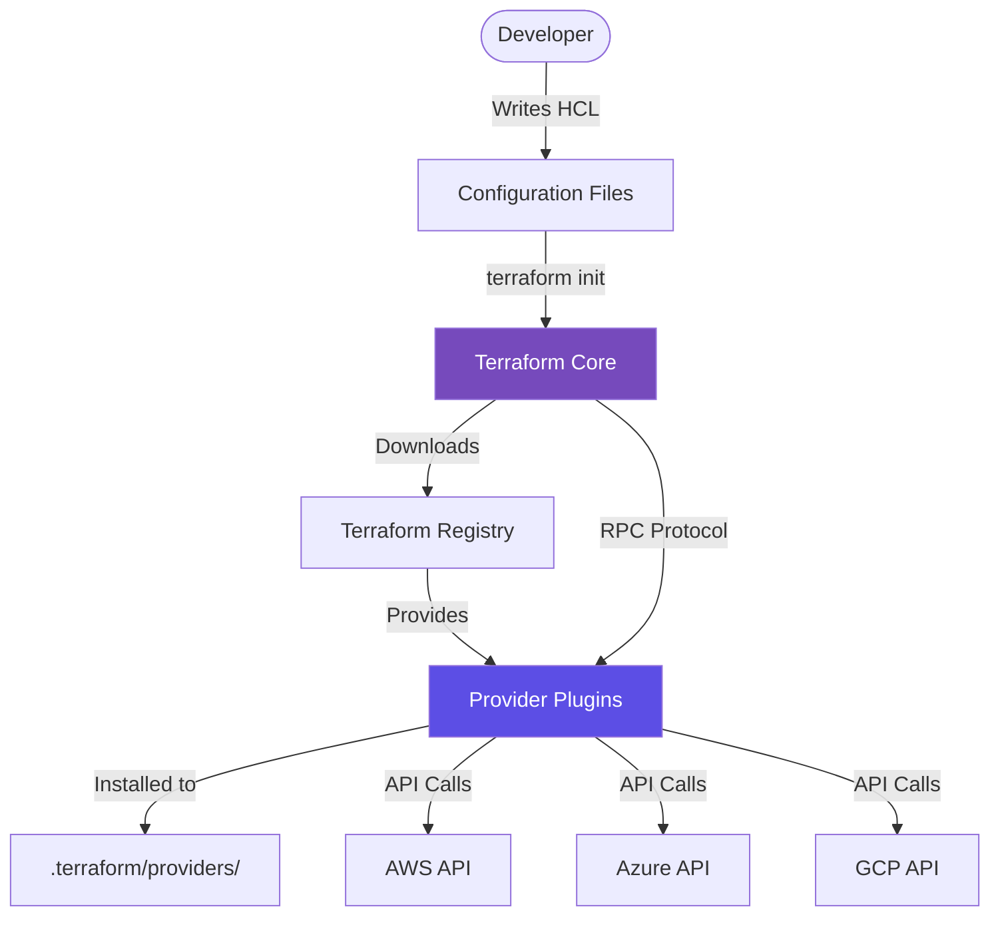

Providers are the heart of Terraform's extensibility. They translate HCL commands into API calls.

## How Providers Work
When you run `terraform init`, Terraform downloads a binary plugin for the providers specified in your code.

## Provider Configuration
```hcl
terraform {
  required_providers {
    aws = {
      source  = "hashicorp/aws"
      version = "~> 5.0"
    }
  }
}

provider "aws" {
  region = "us-east-1"
}
```

## Common Providers
- **Cloud**: AWS, Azure, GCP, DigitalOcean.
- **SaaS**: GitHub, Cloudflare, PagerDuty.
- **On-Prem**: VMware, OpenStack.
- **Logical**: Local, Random, TLS.

## Provider Plugin Architecture



---

## 🏗️ Real-Life Scenario: The Multi-Region Deployment
**Problem**: You need to create some resources in `us-east-1` and others in `eu-west-1`.
**Solution**: Use **Provider Aliases**.
```hcl
provider "aws" {
  alias  = "ireland"
  region = "eu-west-1"
}

resource "aws_instance" "euro_server" {
  provider = aws.ireland
  ...
}
```

---
## ❓ Interview Questions

1. **What happens during `terraform init` regarding providers?**
   - *Answer*: Terraform scans the configuration for provider blocks, goes to the Terraform Registry (by default), and downloads the required binaries into the `.terraform/` directory.

2. **What is a "Provider Alias"?**
   - *Answer*: It allows a single provider (like AWS) to be initialized with multiple configurations (like different regions or credentials) in the same project.

3. **How does Terraform know which provider version to download?**
   - *Answer*: It reads the `required_providers` block in the `terraform` configuration. The `version` constraint specifies which versions are acceptable (e.g., `~> 5.0` means `>= 5.0` and `< 6.0`).

4. **What is the difference between a provider source and a provider block?**
   - *Answer*: The `source` in `required_providers` specifies where to download the provider from (e.g., `hashicorp/aws` from Terraform Registry). The `provider` block configures the provider with authentication and settings.

5. **Can you use different versions of the same provider in one configuration?**
   - *Answer*: No, you can only specify one version constraint per provider. However, you can use different providers (e.g., `aws` and `google`) with their own versions.

6. **What is the provider lock file (.terraform.lock.hcl)?**
   - *Answer*: It records the exact provider versions and checksums used, ensuring consistent provider versions across team members and CI/CD pipelines.

7. **How do providers authenticate with cloud APIs?**
   - *Answer*: Through various methods: environment variables, credential files, instance profiles/managed identities, or explicitly configured authentication in the provider block.

8. **What happens if you don't specify a provider version?**
   - *Answer*: Terraform will download the latest version available, which could introduce breaking changes in future runs. It's best practice to always pin provider versions.

---

## 🧠 Comprehensive Quiz (25 Questions)

**1. Where can you find official Terraform providers?**
- A) GitHub only
- B) Terraform Registry
- C) npm repository
- D) Docker Hub


<details>
<summary>Show Answer</summary>

**Answer: B**

</details>

**2. Which block specifies the provider version constraint?**
- A) `provider`
- B) `version`
- C) `required_providers`
- D) `terraform_version`


<details>
<summary>Show Answer</summary>

**Answer: C**

</details>

**3. Do you need to download provider binaries from GitHub manually?**
- A) Yes, always
- B) No, `terraform init` does it automatically
- C) Only for custom providers
- D) Only on first use


<details>
<summary>Show Answer</summary>

**Answer: B**

</details>

**4. Can you use multiple providers in one configuration?**
- A) No, only one provider per project
- B) Yes, you can use multiple different providers
- C) Only in modules
- D) Only with Terraform Cloud


<details>
<summary>Show Answer</summary>

**Answer: B**

</details>

**5. What is the default provider source namespace?**
- A) `terraform/`
- B) `official/`
- C) `hashicorp/`
- D) `registry/`


<details>
<summary>Show Answer</summary>

**Answer: C**

</details>

**6. Where are provider plugins stored after `terraform init`?**
- A) `/usr/local/bin`
- B) `.terraform/providers/`
- C) `~/.terraform.d/`
- D) In system PATH


<details>
<summary>Show Answer</summary>

**Answer: B**

</details>

**7. What does the `~>` version constraint mean?**
- A) Exactly this version
- B) Any version
- C) Pessimistic constraint (allows rightmost version component to increment)
- D) Greater than or equal to


<details>
<summary>Show Answer</summary>

**Answer: C**

</details>

**8. How do you specify a provider alias?**
- A) `provider "aws" { name = "east" }`
- B) `provider "aws" { alias = "east" }`
- C) `provider "aws-east"`
- D) `provider "aws" as "east"`


<details>
<summary>Show Answer</summary>

**Answer: B**

</details>

**9. What file locks provider versions?**
- A) `terraform.lock`
- B) `.terraform.lock.hcl`
- C) `provider.lock`
- D) `versions.tf`


<details>
<summary>Show Answer</summary>

**Answer: B**

</details>

**10. Can you configure a provider without specifying it in required_providers?**
- A) Yes, but it's deprecated practice
- B) No, you must always declare it
- C) Only for hashicorp providers
- D) Only in Terraform 0.12 and earlier


<details>
<summary>Show Answer</summary>

**Answer: A**

</details>

**11. How do you use a provider alias in a resource?**
- A) `provider = "aws.east"`
- B) `provider = aws.east`
- C) `alias = "east"`
- D) `use_provider = "east"`


<details>
<summary>Show Answer</summary>

**Answer: B**

</details>

**12. What protocol do providers use to communicate with Terraform Core?**
- A) HTTP
- B) gRPC/Plugin Protocol
- C) REST API
- D) WebSocket


<details>
<summary>Show Answer</summary>

**Answer: B**

</details>

**13. Which environment variable prefix is used for provider authentication in AWS?**
- A) `TF_VAR_`
- B) `TERRAFORM_`
- C) `AWS_`
- D) `PROVIDER_`


<details>
<summary>Show Answer</summary>

**Answer: C**

</details>

**14. Can a provider configuration reference variables?**
- A) No, providers must be static
- B) Yes, but only for credentials
- C) Yes, you can use variables in provider blocks
- D) Only with Terraform 1.0+


<details>
<summary>Show Answer</summary>

**Answer: C**

</details>

**15. What is a "community provider"?**
- A) A provider built by HashiCorp
- B) A provider built and maintained by third parties
- C) A free provider
- D) A provider for social media


<details>
<summary>Show Answer</summary>

**Answer: B**

</details>

**16. How many provider configurations can you have for the same provider type?**
- A) Only one
- B) Maximum two
- C) Unlimited (using aliases)
- D) One per region


<details>
<summary>Show Answer</summary>

**Answer: C**

</details>

**17. What happens if the provider version constraint can't be satisfied?**
- A) Uses the latest version anyway
- B) Terraform init fails with an error
- C) Uses a cached version
- D) Prompts user to choose


<details>
<summary>Show Answer</summary>

**Answer: B**

</details>

**18. Where should you typically configure provider credentials?**
- A) Hardcoded in provider block
- B) In Git repository
- C) Environment variables or credential files
- D) In terraform.tfstate


<details>
<summary>Show Answer</summary>

**Answer: C**

</details>

**19. What is the purpose of the provider source attribute?**
- A) To specify authentication source
- B) To specify where to download the provider from
- C) To link to documentation
- D) To define the code repository


<details>
<summary>Show Answer</summary>

**Answer: B**

</details>

**20. Can you skip the provider block if using required_providers?**
- A) No, always needed
- B) Yes, if using default configuration
- C) Only for AWS
- D) Only in modules


<details>
<summary>Show Answer</summary>

**Answer: B**

</details>

**21. What format are provider plugins distributed in?**
- A) Docker containers
- B) Compiled binary executables
- C) Python packages
- D) JavaScript modules


<details>
<summary>Show Answer</summary>

**Answer: B**

</details>

**22. Which command updates the provider lock file?**
- A) `terraform update`
- B) `terraform init -upgrade`
- C) `terraform lock`
- D) `terraform refresh`


<details>
<summary>Show Answer</summary>

**Answer: B**

</details>

**23. Can you create a custom provider?**
- A) No, only HashiCorp can
- B) Yes, using the Terraform Plugin SDK
- C) Only with special license
- D) Only for internal use


<details>
<summary>Show Answer</summary>

**Answer: B**

</details>

**24. What does a provider do?**
- A) Stores state
- B) Translates Terraform calls to API calls
- C) Validates HCL syntax
- D) Manages backend storage


<details>
<summary>Show Answer</summary>

**Answer: B**

</details>

**25. What happens if you remove a provider that's still in use?**
- A) Terraform removes associated resources
- B) Terraform shows validation error
- C) Resources become orphaned
- D) Nothing, provider is optional


<details>
<summary>Show Answer</summary>

**Answer: B**

</details>
