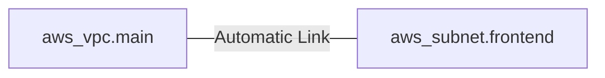
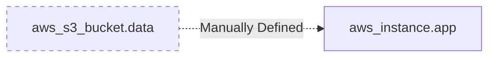

Resources are the most important element in the Terraform language. Each resource block describes one or more infrastructure objects.

## Basic Resource Syntax
```hcl
resource "aws_instance" "web_server" {
  ami           = "ami-0c02fb55956c7d316"
  instance_type = "t3.micro"
  
  tags = { Name = "Web" }
}
```

## Resource Meta-Arguments
Meta-arguments allow you to modify how Terraform handles resources:
- **count**: Creates multiple instances of the same resource.
- **for_each**: Creates multiple instances based on a map or set.
- **depends_on**: Explicitly defines the order of creation.
- **lifecycle**: Modifies behavior (e.g., `prevent_destroy`).

## Implicit vs Explicit Dependencies

### 1. Implicit Dependencies
The most common way to link resources. Terraform "reads" the code and automatically figures out the order when one resource references an attribute of another.

**Example**:
```hcl
resource "aws_vpc" "main" {
  cidr_block = "10.0.0.0/16"
}

resource "aws_subnet" "frontend" {
  vpc_id = aws_vpc.main.id # Reference creates implicit dependency
  cidr_block = "10.0.1.0/24"
}
```



### 2. Explicit Dependencies
Used when there is a dependency that Terraform *cannot* see through code references (e.g., an application requires an S3 bucket to exist before starting, but doesn't reference its ID in the config).

**Example**:
```hcl
resource "aws_instance" "app" {
  ami           = "ami-xyz"
  instance_type = "t3.micro"

  depends_on = [aws_s3_bucket.data] # Manual link
}
```



---

## 🏗️ Real-Life Scenario: Blue/Green Cleanup
**Problem**: You want to update an EC2 instance, but destroying the old one before the new one is ready causes downtime.
**Solution**: Use the `create_before_destroy` lifecycle meta-argument.
```hcl
lifecycle {
  create_before_destroy = true
}
```
Terraform will create the new instance first and only delete the old one once the new one is running successfully.

---

## ❓ Interview Questions
1. **What is the difference between an implicit and explicit dependency?**
   - *Answer*: Implicit dependencies are created automatically by Terraform when one resource references another. Explicit dependencies are manually defined using the `depends_on` meta-argument.
2. **When should you use `count` vs `for_each`?**
   - *Answer*: `count` is better for identical resources (e.g., 5 web servers). `for_each` is better when resources have unique attributes (e.g., 3 subnets with different CIDRs).

---

## 🧠 Quiz Snippet (5/20+)
1. **Which block defines a real-world object in Terraform?** (`resource`)
2. **What meta-argument handles multiple identical resources?** (`count`)
3. **True/False: Resources are provisioned exactly in the order they appear in the file.** (False - Terraform builds a dependency graph)
4. **Which meta-argument prevents resource deletion?** (`prevent_destroy`)
5. **What command lists all resources in the state?** (`terraform state list`)
